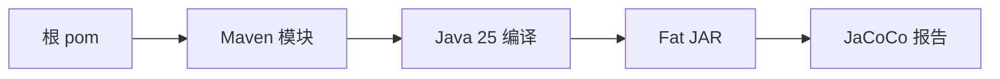

# 02 版本、模块与构建边界

认清当前后端的真实版本、Maven 多模块结构和可执行产物。

## 核心要点

- 素材中的当前后端基线是 Java 25 与 Spring Boot 3.5.14。
- Maven Wrapper 统一构建入口，根 pom 聚合主应用、模拟器和云函数示例。
- app/bms-app 是 Spring Boot 主应用，其他模块可分别编译但统一管理依赖。
- 主应用打包为可执行 Spring Boot Fat JAR。
- 部分旧说明仍写 Java 21，分析当前代码时应以 pom.xml 和 Dockerfile 的 Java 25 为准。

## 实现边界

- 版本结论来自所给素材描述的当前代码状态。
- 模块存在不代表每个云示例都已部署运行。

---

## 本章测验

本章共 5 道单项选择题。普通 Markdown 请先自行选择，再展开答案；互动播放器会在提交后判定。

### 第 1 题

关于“版本、模块与构建边界”的核心定位，哪项描述正确？

- A. 当前编译基线仍固定为 Java 21，pom.xml 不具参考价值。
- B. 素材中的当前后端基线是 Java 25 与 Spring Boot 3.5.14。
- C. 项目只能作为单一 Maven 模块一次性编译。
- D. JaCoCo 是生产数据库迁移工具。

选择完成后展开答案

正确答案：B. 素材中的当前后端基线是 Java 25 与 Spring Boot 3.5.14。

答案解析：素材中的当前后端基线是 Java 25 与 Spring Boot 3.5.14。 这与本章图示和核心要点一致；其余选项混淆了职责、顺序或实现边界。

### 第 2 题

按照本章图示，哪一条流程顺序正确？

- A. JaCoCo 报告 → Fat JAR → Java 25 编译 → Maven 模块 → 根 pom
- B. Maven 模块 → Java 25 编译 → Fat JAR → JaCoCo 报告 → 根 pom
- C. 根 pom → JaCoCo 报告 → Maven 模块 → Java 25 编译 → Fat JAR
- D. 根 pom → Maven 模块 → Java 25 编译 → Fat JAR → JaCoCo 报告

选择完成后展开答案

正确答案：D. 根 pom → Maven 模块 → Java 25 编译 → Fat JAR → JaCoCo 报告

答案解析：根 pom → Maven 模块 → Java 25 编译 → Fat JAR → JaCoCo 报告 这与本章图示和核心要点一致；其余选项混淆了职责、顺序或实现边界。

### 第 3 题

关于本章组件职责，哪项理解准确？

- A. app/bms-app 是 Spring Boot 主应用，其他模块可分别编译但统一管理依赖。
- B. 项目只能作为单一 Maven 模块一次性编译。
- C. JaCoCo 是生产数据库迁移工具。
- D. 当前编译基线仍固定为 Java 21，pom.xml 不具参考价值。

选择完成后展开答案

正确答案：A. app/bms-app 是 Spring Boot 主应用，其他模块可分别编译但统一管理依赖。

答案解析：app/bms-app 是 Spring Boot 主应用，其他模块可分别编译但统一管理依赖。 这与本章图示和核心要点一致；其余选项混淆了职责、顺序或实现边界。

### 第 4 题

在实际排查或实现时，哪项做法符合本章边界？

- A. JaCoCo 是生产数据库迁移工具。
- B. 当前编译基线仍固定为 Java 21，pom.xml 不具参考价值。
- C. 版本结论来自所给素材描述的当前代码状态。
- D. 项目只能作为单一 Maven 模块一次性编译。

选择完成后展开答案

正确答案：C. 版本结论来自所给素材描述的当前代码状态。

答案解析：版本结论来自所给素材描述的当前代码状态。 这与本章图示和核心要点一致；其余选项混淆了职责、顺序或实现边界。

### 第 5 题

下列哪项最能避免本章讨论的常见误区？

- A. 当前编译基线仍固定为 Java 21，pom.xml 不具参考价值。
- B. 部分旧说明仍写 Java 21，分析当前代码时应以 pom.xml 和 Dockerfile 的 Java 25 为准。
- C. JaCoCo 是生产数据库迁移工具。
- D. 项目只能作为单一 Maven 模块一次性编译。

选择完成后展开答案

正确答案：B. 部分旧说明仍写 Java 21，分析当前代码时应以 pom.xml 和 Dockerfile 的 Java 25 为准。

答案解析：部分旧说明仍写 Java 21，分析当前代码时应以 pom.xml 和 Dockerfile 的 Java 25 为准。 这与本章图示和核心要点一致；其余选项混淆了职责、顺序或实现边界。

<!-- QUIZ_DATA_START
{
  "chapter": "02",
  "questions": [
    {
      "id": 1,
      "question": "关于“版本、模块与构建边界”的核心定位，哪项描述正确？",
      "options": {
        "A": "当前编译基线仍固定为 Java 21，pom.xml 不具参考价值。",
        "B": "素材中的当前后端基线是 Java 25 与 Spring Boot 3.5.14。",
        "C": "项目只能作为单一 Maven 模块一次性编译。",
        "D": "JaCoCo 是生产数据库迁移工具。"
      },
      "answer": "B",
      "explanation": "素材中的当前后端基线是 Java 25 与 Spring Boot 3.5.14。 这与本章图示和核心要点一致；其余选项混淆了职责、顺序或实现边界。"
    },
    {
      "id": 2,
      "question": "按照本章图示，哪一条流程顺序正确？",
      "options": {
        "A": "JaCoCo 报告 → Fat JAR → Java 25 编译 → Maven 模块 → 根 pom",
        "B": "Maven 模块 → Java 25 编译 → Fat JAR → JaCoCo 报告 → 根 pom",
        "C": "根 pom → JaCoCo 报告 → Maven 模块 → Java 25 编译 → Fat JAR",
        "D": "根 pom → Maven 模块 → Java 25 编译 → Fat JAR → JaCoCo 报告"
      },
      "answer": "D",
      "explanation": "根 pom → Maven 模块 → Java 25 编译 → Fat JAR → JaCoCo 报告 这与本章图示和核心要点一致；其余选项混淆了职责、顺序或实现边界。"
    },
    {
      "id": 3,
      "question": "关于本章组件职责，哪项理解准确？",
      "options": {
        "A": "app/bms-app 是 Spring Boot 主应用，其他模块可分别编译但统一管理依赖。",
        "B": "项目只能作为单一 Maven 模块一次性编译。",
        "C": "JaCoCo 是生产数据库迁移工具。",
        "D": "当前编译基线仍固定为 Java 21，pom.xml 不具参考价值。"
      },
      "answer": "A",
      "explanation": "app/bms-app 是 Spring Boot 主应用，其他模块可分别编译但统一管理依赖。 这与本章图示和核心要点一致；其余选项混淆了职责、顺序或实现边界。"
    },
    {
      "id": 4,
      "question": "在实际排查或实现时，哪项做法符合本章边界？",
      "options": {
        "A": "JaCoCo 是生产数据库迁移工具。",
        "B": "当前编译基线仍固定为 Java 21，pom.xml 不具参考价值。",
        "C": "版本结论来自所给素材描述的当前代码状态。",
        "D": "项目只能作为单一 Maven 模块一次性编译。"
      },
      "answer": "C",
      "explanation": "版本结论来自所给素材描述的当前代码状态。 这与本章图示和核心要点一致；其余选项混淆了职责、顺序或实现边界。"
    },
    {
      "id": 5,
      "question": "下列哪项最能避免本章讨论的常见误区？",
      "options": {
        "A": "当前编译基线仍固定为 Java 21，pom.xml 不具参考价值。",
        "B": "部分旧说明仍写 Java 21，分析当前代码时应以 pom.xml 和 Dockerfile 的 Java 25 为准。",
        "C": "JaCoCo 是生产数据库迁移工具。",
        "D": "项目只能作为单一 Maven 模块一次性编译。"
      },
      "answer": "B",
      "explanation": "部分旧说明仍写 Java 21，分析当前代码时应以 pom.xml 和 Dockerfile 的 Java 25 为准。 这与本章图示和核心要点一致；其余选项混淆了职责、顺序或实现边界。"
    }
  ]
}
QUIZ_DATA_END -->
