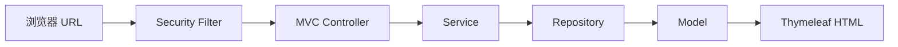

# 03 服务器端页面请求全链路

理解浏览器访问页面后，数据如何经过安全、业务和模板层返回 HTML。

## 核心要点

- 页面请求先经过 Spring Security Filter，再进入 Spring MVC Controller。
- Service 承担业务与事务边界，Repository 负责数据库访问。
- Controller 把页面数据放进 Model，并返回模板逻辑名。
- Thymeleaf 在服务器端把 Model 数据合成完整 HTML。
- 浏览器收到的是已生成的页面，而不是必须再组装页面的 Vue 或 React 数据包。

## 实现边界

- 返回字符串 dashboard 表示模板名，不是直接响应正文。
- SSR 不意味着页面完全不能使用 JavaScript。

---

## 本章测验

本章共 5 道单项选择题。普通 Markdown 请先自行选择，再展开答案；互动播放器会在提交后判定。

### 第 1 题

关于“服务器端页面请求全链路”的核心定位，哪项描述正确？

- A. Controller 返回 dashboard 时会把该单词直接显示给用户。
- B. 页面请求先经过 Spring Security Filter，再进入 Spring MVC Controller。
- C. 浏览器必须运行 Vue 才能把 Model 转换成页面。
- D. Repository 应直接负责 HTML 模板渲染。

选择完成后展开答案

正确答案：B. 页面请求先经过 Spring Security Filter，再进入 Spring MVC Controller。

答案解析：页面请求先经过 Spring Security Filter，再进入 Spring MVC Controller。 这与本章图示和核心要点一致；其余选项混淆了职责、顺序或实现边界。

### 第 2 题

按照本章图示，哪一条流程顺序正确？

- A. Thymeleaf HTML → Model → Repository → Service → MVC Controller → Security Filter → 浏览器 URL
- B. Security Filter → MVC Controller → Service → Repository → Model → Thymeleaf HTML → 浏览器 URL
- C. 浏览器 URL → Thymeleaf HTML → Security Filter → MVC Controller → Service → Repository → Model
- D. 浏览器 URL → Security Filter → MVC Controller → Service → Repository → Model → Thymeleaf HTML

选择完成后展开答案

正确答案：D. 浏览器 URL → Security Filter → MVC Controller → Service → Repository → Model → Thymeleaf HTML

答案解析：浏览器 URL → Security Filter → MVC Controller → Service → Repository → Model → Thymeleaf HTML 这与本章图示和核心要点一致；其余选项混淆了职责、顺序或实现边界。

### 第 3 题

关于本章组件职责，哪项理解准确？

- A. Controller 把页面数据放进 Model，并返回模板逻辑名。
- B. 浏览器必须运行 Vue 才能把 Model 转换成页面。
- C. Repository 应直接负责 HTML 模板渲染。
- D. Controller 返回 dashboard 时会把该单词直接显示给用户。

选择完成后展开答案

正确答案：A. Controller 把页面数据放进 Model，并返回模板逻辑名。

答案解析：Controller 把页面数据放进 Model，并返回模板逻辑名。 这与本章图示和核心要点一致；其余选项混淆了职责、顺序或实现边界。

### 第 4 题

在实际排查或实现时，哪项做法符合本章边界？

- A. Repository 应直接负责 HTML 模板渲染。
- B. Controller 返回 dashboard 时会把该单词直接显示给用户。
- C. 返回字符串 dashboard 表示模板名，不是直接响应正文。
- D. 浏览器必须运行 Vue 才能把 Model 转换成页面。

选择完成后展开答案

正确答案：C. 返回字符串 dashboard 表示模板名，不是直接响应正文。

答案解析：返回字符串 dashboard 表示模板名，不是直接响应正文。 这与本章图示和核心要点一致；其余选项混淆了职责、顺序或实现边界。

### 第 5 题

下列哪项最能避免本章讨论的常见误区？

- A. Controller 返回 dashboard 时会把该单词直接显示给用户。
- B. 浏览器收到的是已生成的页面，而不是必须再组装页面的 Vue 或 React 数据包。
- C. Repository 应直接负责 HTML 模板渲染。
- D. 浏览器必须运行 Vue 才能把 Model 转换成页面。

选择完成后展开答案

正确答案：B. 浏览器收到的是已生成的页面，而不是必须再组装页面的 Vue 或 React 数据包。

答案解析：浏览器收到的是已生成的页面，而不是必须再组装页面的 Vue 或 React 数据包。 这与本章图示和核心要点一致；其余选项混淆了职责、顺序或实现边界。

<!-- QUIZ_DATA_START
{
  "chapter": "03",
  "questions": [
    {
      "id": 1,
      "question": "关于“服务器端页面请求全链路”的核心定位，哪项描述正确？",
      "options": {
        "A": "Controller 返回 dashboard 时会把该单词直接显示给用户。",
        "B": "页面请求先经过 Spring Security Filter，再进入 Spring MVC Controller。",
        "C": "浏览器必须运行 Vue 才能把 Model 转换成页面。",
        "D": "Repository 应直接负责 HTML 模板渲染。"
      },
      "answer": "B",
      "explanation": "页面请求先经过 Spring Security Filter，再进入 Spring MVC Controller。 这与本章图示和核心要点一致；其余选项混淆了职责、顺序或实现边界。"
    },
    {
      "id": 2,
      "question": "按照本章图示，哪一条流程顺序正确？",
      "options": {
        "A": "Thymeleaf HTML → Model → Repository → Service → MVC Controller → Security Filter → 浏览器 URL",
        "B": "Security Filter → MVC Controller → Service → Repository → Model → Thymeleaf HTML → 浏览器 URL",
        "C": "浏览器 URL → Thymeleaf HTML → Security Filter → MVC Controller → Service → Repository → Model",
        "D": "浏览器 URL → Security Filter → MVC Controller → Service → Repository → Model → Thymeleaf HTML"
      },
      "answer": "D",
      "explanation": "浏览器 URL → Security Filter → MVC Controller → Service → Repository → Model → Thymeleaf HTML 这与本章图示和核心要点一致；其余选项混淆了职责、顺序或实现边界。"
    },
    {
      "id": 3,
      "question": "关于本章组件职责，哪项理解准确？",
      "options": {
        "A": "Controller 把页面数据放进 Model，并返回模板逻辑名。",
        "B": "浏览器必须运行 Vue 才能把 Model 转换成页面。",
        "C": "Repository 应直接负责 HTML 模板渲染。",
        "D": "Controller 返回 dashboard 时会把该单词直接显示给用户。"
      },
      "answer": "A",
      "explanation": "Controller 把页面数据放进 Model，并返回模板逻辑名。 这与本章图示和核心要点一致；其余选项混淆了职责、顺序或实现边界。"
    },
    {
      "id": 4,
      "question": "在实际排查或实现时，哪项做法符合本章边界？",
      "options": {
        "A": "Repository 应直接负责 HTML 模板渲染。",
        "B": "Controller 返回 dashboard 时会把该单词直接显示给用户。",
        "C": "返回字符串 dashboard 表示模板名，不是直接响应正文。",
        "D": "浏览器必须运行 Vue 才能把 Model 转换成页面。"
      },
      "answer": "C",
      "explanation": "返回字符串 dashboard 表示模板名，不是直接响应正文。 这与本章图示和核心要点一致；其余选项混淆了职责、顺序或实现边界。"
    },
    {
      "id": 5,
      "question": "下列哪项最能避免本章讨论的常见误区？",
      "options": {
        "A": "Controller 返回 dashboard 时会把该单词直接显示给用户。",
        "B": "浏览器收到的是已生成的页面，而不是必须再组装页面的 Vue 或 React 数据包。",
        "C": "Repository 应直接负责 HTML 模板渲染。",
        "D": "浏览器必须运行 Vue 才能把 Model 转换成页面。"
      },
      "answer": "B",
      "explanation": "浏览器收到的是已生成的页面，而不是必须再组装页面的 Vue 或 React 数据包。 这与本章图示和核心要点一致；其余选项混淆了职责、顺序或实现边界。"
    }
  ]
}
QUIZ_DATA_END -->
