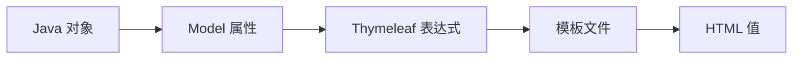

# 04 Thymeleaf 数据绑定与模板目录

掌握模板引擎怎样读取 Model，以及页面文件如何组织。

## 核心要点

- Thymeleaf 使用 th:text 等属性把 Java 对象值写入 HTML。
- 表达式如 ${dashboard.totalDevices} 在服务端渲染时求值。
- 页面模板位于 resources/templates，静态资源通常位于 resources/static。
- th:each 用于集合迭代，th:if 用于条件显示。
- 模板中的占位文本有利于直接查看 HTML，但运行时会被真实值替换。

## 实现边界

- Thymeleaf 表达式不是浏览器端 Vue 模板语法。
- 模板只能读取 Controller 放入 Model 或可访问上下文的数据。

---

## 本章测验

本章共 5 道单项选择题。普通 Markdown 请先自行选择，再展开答案；互动播放器会在提交后判定。

### 第 1 题

关于“Thymeleaf 数据绑定与模板目录”的核心定位，哪项描述正确？

- A. th:text 会在浏览器端向数据库直接发起 SQL。
- B. Thymeleaf 使用 th:text 等属性把 Java 对象值写入 HTML。
- C. resources/static 是保存 JPA Entity 的目录。
- D. 模板不需要 Model 就能自动发现任意 Service 对象。

选择完成后展开答案

正确答案：B. Thymeleaf 使用 th:text 等属性把 Java 对象值写入 HTML。

答案解析：Thymeleaf 使用 th:text 等属性把 Java 对象值写入 HTML。 这与本章图示和核心要点一致；其余选项混淆了职责、顺序或实现边界。

### 第 2 题

按照本章图示，哪一条流程顺序正确？

- A. HTML 值 → 模板文件 → Thymeleaf 表达式 → Model 属性 → Java 对象
- B. Model 属性 → Thymeleaf 表达式 → 模板文件 → HTML 值 → Java 对象
- C. Java 对象 → HTML 值 → Model 属性 → Thymeleaf 表达式 → 模板文件
- D. Java 对象 → Model 属性 → Thymeleaf 表达式 → 模板文件 → HTML 值

选择完成后展开答案

正确答案：D. Java 对象 → Model 属性 → Thymeleaf 表达式 → 模板文件 → HTML 值

答案解析：Java 对象 → Model 属性 → Thymeleaf 表达式 → 模板文件 → HTML 值 这与本章图示和核心要点一致；其余选项混淆了职责、顺序或实现边界。

### 第 3 题

关于本章组件职责，哪项理解准确？

- A. 页面模板位于 resources/templates，静态资源通常位于 resources/static。
- B. resources/static 是保存 JPA Entity 的目录。
- C. 模板不需要 Model 就能自动发现任意 Service 对象。
- D. th:text 会在浏览器端向数据库直接发起 SQL。

选择完成后展开答案

正确答案：A. 页面模板位于 resources/templates，静态资源通常位于 resources/static。

答案解析：页面模板位于 resources/templates，静态资源通常位于 resources/static。 这与本章图示和核心要点一致；其余选项混淆了职责、顺序或实现边界。

### 第 4 题

在实际排查或实现时，哪项做法符合本章边界？

- A. 模板不需要 Model 就能自动发现任意 Service 对象。
- B. th:text 会在浏览器端向数据库直接发起 SQL。
- C. Thymeleaf 表达式不是浏览器端 Vue 模板语法。
- D. resources/static 是保存 JPA Entity 的目录。

选择完成后展开答案

正确答案：C. Thymeleaf 表达式不是浏览器端 Vue 模板语法。

答案解析：Thymeleaf 表达式不是浏览器端 Vue 模板语法。 这与本章图示和核心要点一致；其余选项混淆了职责、顺序或实现边界。

### 第 5 题

下列哪项最能避免本章讨论的常见误区？

- A. th:text 会在浏览器端向数据库直接发起 SQL。
- B. 模板中的占位文本有利于直接查看 HTML，但运行时会被真实值替换。
- C. 模板不需要 Model 就能自动发现任意 Service 对象。
- D. resources/static 是保存 JPA Entity 的目录。

选择完成后展开答案

正确答案：B. 模板中的占位文本有利于直接查看 HTML，但运行时会被真实值替换。

答案解析：模板中的占位文本有利于直接查看 HTML，但运行时会被真实值替换。 这与本章图示和核心要点一致；其余选项混淆了职责、顺序或实现边界。

<!-- QUIZ_DATA_START
{
  "chapter": "04",
  "questions": [
    {
      "id": 1,
      "question": "关于“Thymeleaf 数据绑定与模板目录”的核心定位，哪项描述正确？",
      "options": {
        "A": "th:text 会在浏览器端向数据库直接发起 SQL。",
        "B": "Thymeleaf 使用 th:text 等属性把 Java 对象值写入 HTML。",
        "C": "resources/static 是保存 JPA Entity 的目录。",
        "D": "模板不需要 Model 就能自动发现任意 Service 对象。"
      },
      "answer": "B",
      "explanation": "Thymeleaf 使用 th:text 等属性把 Java 对象值写入 HTML。 这与本章图示和核心要点一致；其余选项混淆了职责、顺序或实现边界。"
    },
    {
      "id": 2,
      "question": "按照本章图示，哪一条流程顺序正确？",
      "options": {
        "A": "HTML 值 → 模板文件 → Thymeleaf 表达式 → Model 属性 → Java 对象",
        "B": "Model 属性 → Thymeleaf 表达式 → 模板文件 → HTML 值 → Java 对象",
        "C": "Java 对象 → HTML 值 → Model 属性 → Thymeleaf 表达式 → 模板文件",
        "D": "Java 对象 → Model 属性 → Thymeleaf 表达式 → 模板文件 → HTML 值"
      },
      "answer": "D",
      "explanation": "Java 对象 → Model 属性 → Thymeleaf 表达式 → 模板文件 → HTML 值 这与本章图示和核心要点一致；其余选项混淆了职责、顺序或实现边界。"
    },
    {
      "id": 3,
      "question": "关于本章组件职责，哪项理解准确？",
      "options": {
        "A": "页面模板位于 resources/templates，静态资源通常位于 resources/static。",
        "B": "resources/static 是保存 JPA Entity 的目录。",
        "C": "模板不需要 Model 就能自动发现任意 Service 对象。",
        "D": "th:text 会在浏览器端向数据库直接发起 SQL。"
      },
      "answer": "A",
      "explanation": "页面模板位于 resources/templates，静态资源通常位于 resources/static。 这与本章图示和核心要点一致；其余选项混淆了职责、顺序或实现边界。"
    },
    {
      "id": 4,
      "question": "在实际排查或实现时，哪项做法符合本章边界？",
      "options": {
        "A": "模板不需要 Model 就能自动发现任意 Service 对象。",
        "B": "th:text 会在浏览器端向数据库直接发起 SQL。",
        "C": "Thymeleaf 表达式不是浏览器端 Vue 模板语法。",
        "D": "resources/static 是保存 JPA Entity 的目录。"
      },
      "answer": "C",
      "explanation": "Thymeleaf 表达式不是浏览器端 Vue 模板语法。 这与本章图示和核心要点一致；其余选项混淆了职责、顺序或实现边界。"
    },
    {
      "id": 5,
      "question": "下列哪项最能避免本章讨论的常见误区？",
      "options": {
        "A": "th:text 会在浏览器端向数据库直接发起 SQL。",
        "B": "模板中的占位文本有利于直接查看 HTML，但运行时会被真实值替换。",
        "C": "模板不需要 Model 就能自动发现任意 Service 对象。",
        "D": "resources/static 是保存 JPA Entity 的目录。"
      },
      "answer": "B",
      "explanation": "模板中的占位文本有利于直接查看 HTML，但运行时会被真实值替换。 这与本章图示和核心要点一致；其余选项混淆了职责、顺序或实现边界。"
    }
  ]
}
QUIZ_DATA_END -->
