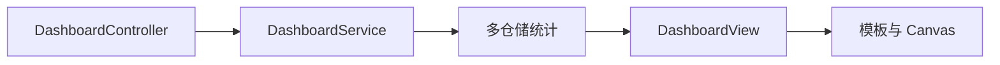

# 06 Dashboard 组装与演示趋势边界

看懂仪表盘数据如何汇总，并识别演示趋势与生产统计的区别。

## 核心要点

- DashboardController 调用 DashboardService.getDashboard 并把 DashboardView 放入 Model。
- Service 汇总设备、事件、告警和 TCP Ping 数据。
- 模板展示统计卡片，少量原生 JavaScript 或 Canvas 绘制趋势。
- 当前近 24 小时趋势由事件总量和稳定权重生成，是学习演示数据。
- 生产统计应按 occurred_at 做真实的逐小时数据库聚合。

## 实现边界

- 演示趋势不能用于生产容量或故障分析结论。
- Canvas 只负责展示，不应被误解为统计数据来源。

---

## 本章测验

本章共 5 道单项选择题。普通 Markdown 请先自行选择，再展开答案；互动播放器会在提交后判定。

### 第 1 题

关于“Dashboard 组装与演示趋势边界”的核心定位，哪项描述正确？

- A. 当前趋势已经执行 24 次严格的按小时 SQL 聚合。
- B. DashboardController 调用 DashboardService.getDashboard 并把 DashboardView 放入 Model。
- C. DashboardController 应逐个直接查询所有 Repository。
- D. Canvas 会自动纠正数据库中缺失的事件。

选择完成后展开答案

正确答案：B. DashboardController 调用 DashboardService.getDashboard 并把 DashboardView 放入 Model。

答案解析：DashboardController 调用 DashboardService.getDashboard 并把 DashboardView 放入 Model。 这与本章图示和核心要点一致；其余选项混淆了职责、顺序或实现边界。

### 第 2 题

按照本章图示，哪一条流程顺序正确？

- A. 模板与 Canvas → DashboardView → 多仓储统计 → DashboardService → DashboardController
- B. DashboardService → 多仓储统计 → DashboardView → 模板与 Canvas → DashboardController
- C. DashboardController → 模板与 Canvas → DashboardService → 多仓储统计 → DashboardView
- D. DashboardController → DashboardService → 多仓储统计 → DashboardView → 模板与 Canvas

选择完成后展开答案

正确答案：D. DashboardController → DashboardService → 多仓储统计 → DashboardView → 模板与 Canvas

答案解析：DashboardController → DashboardService → 多仓储统计 → DashboardView → 模板与 Canvas 这与本章图示和核心要点一致；其余选项混淆了职责、顺序或实现边界。

### 第 3 题

关于本章组件职责，哪项理解准确？

- A. 模板展示统计卡片，少量原生 JavaScript 或 Canvas 绘制趋势。
- B. DashboardController 应逐个直接查询所有 Repository。
- C. Canvas 会自动纠正数据库中缺失的事件。
- D. 当前趋势已经执行 24 次严格的按小时 SQL 聚合。

选择完成后展开答案

正确答案：A. 模板展示统计卡片，少量原生 JavaScript 或 Canvas 绘制趋势。

答案解析：模板展示统计卡片，少量原生 JavaScript 或 Canvas 绘制趋势。 这与本章图示和核心要点一致；其余选项混淆了职责、顺序或实现边界。

### 第 4 题

在实际排查或实现时，哪项做法符合本章边界？

- A. Canvas 会自动纠正数据库中缺失的事件。
- B. 当前趋势已经执行 24 次严格的按小时 SQL 聚合。
- C. 演示趋势不能用于生产容量或故障分析结论。
- D. DashboardController 应逐个直接查询所有 Repository。

选择完成后展开答案

正确答案：C. 演示趋势不能用于生产容量或故障分析结论。

答案解析：演示趋势不能用于生产容量或故障分析结论。 这与本章图示和核心要点一致；其余选项混淆了职责、顺序或实现边界。

### 第 5 题

下列哪项最能避免本章讨论的常见误区？

- A. 当前趋势已经执行 24 次严格的按小时 SQL 聚合。
- B. 生产统计应按 occurred_at 做真实的逐小时数据库聚合。
- C. Canvas 会自动纠正数据库中缺失的事件。
- D. DashboardController 应逐个直接查询所有 Repository。

选择完成后展开答案

正确答案：B. 生产统计应按 occurred_at 做真实的逐小时数据库聚合。

答案解析：生产统计应按 occurred_at 做真实的逐小时数据库聚合。 这与本章图示和核心要点一致；其余选项混淆了职责、顺序或实现边界。

<!-- QUIZ_DATA_START
{
  "chapter": "06",
  "questions": [
    {
      "id": 1,
      "question": "关于“Dashboard 组装与演示趋势边界”的核心定位，哪项描述正确？",
      "options": {
        "A": "当前趋势已经执行 24 次严格的按小时 SQL 聚合。",
        "B": "DashboardController 调用 DashboardService.getDashboard 并把 DashboardView 放入 Model。",
        "C": "DashboardController 应逐个直接查询所有 Repository。",
        "D": "Canvas 会自动纠正数据库中缺失的事件。"
      },
      "answer": "B",
      "explanation": "DashboardController 调用 DashboardService.getDashboard 并把 DashboardView 放入 Model。 这与本章图示和核心要点一致；其余选项混淆了职责、顺序或实现边界。"
    },
    {
      "id": 2,
      "question": "按照本章图示，哪一条流程顺序正确？",
      "options": {
        "A": "模板与 Canvas → DashboardView → 多仓储统计 → DashboardService → DashboardController",
        "B": "DashboardService → 多仓储统计 → DashboardView → 模板与 Canvas → DashboardController",
        "C": "DashboardController → 模板与 Canvas → DashboardService → 多仓储统计 → DashboardView",
        "D": "DashboardController → DashboardService → 多仓储统计 → DashboardView → 模板与 Canvas"
      },
      "answer": "D",
      "explanation": "DashboardController → DashboardService → 多仓储统计 → DashboardView → 模板与 Canvas 这与本章图示和核心要点一致；其余选项混淆了职责、顺序或实现边界。"
    },
    {
      "id": 3,
      "question": "关于本章组件职责，哪项理解准确？",
      "options": {
        "A": "模板展示统计卡片，少量原生 JavaScript 或 Canvas 绘制趋势。",
        "B": "DashboardController 应逐个直接查询所有 Repository。",
        "C": "Canvas 会自动纠正数据库中缺失的事件。",
        "D": "当前趋势已经执行 24 次严格的按小时 SQL 聚合。"
      },
      "answer": "A",
      "explanation": "模板展示统计卡片，少量原生 JavaScript 或 Canvas 绘制趋势。 这与本章图示和核心要点一致；其余选项混淆了职责、顺序或实现边界。"
    },
    {
      "id": 4,
      "question": "在实际排查或实现时，哪项做法符合本章边界？",
      "options": {
        "A": "Canvas 会自动纠正数据库中缺失的事件。",
        "B": "当前趋势已经执行 24 次严格的按小时 SQL 聚合。",
        "C": "演示趋势不能用于生产容量或故障分析结论。",
        "D": "DashboardController 应逐个直接查询所有 Repository。"
      },
      "answer": "C",
      "explanation": "演示趋势不能用于生产容量或故障分析结论。 这与本章图示和核心要点一致；其余选项混淆了职责、顺序或实现边界。"
    },
    {
      "id": 5,
      "question": "下列哪项最能避免本章讨论的常见误区？",
      "options": {
        "A": "当前趋势已经执行 24 次严格的按小时 SQL 聚合。",
        "B": "生产统计应按 occurred_at 做真实的逐小时数据库聚合。",
        "C": "Canvas 会自动纠正数据库中缺失的事件。",
        "D": "DashboardController 应逐个直接查询所有 Repository。"
      },
      "answer": "B",
      "explanation": "生产统计应按 occurred_at 做真实的逐小时数据库聚合。 这与本章图示和核心要点一致；其余选项混淆了职责、顺序或实现边界。"
    }
  ]
}
QUIZ_DATA_END -->
