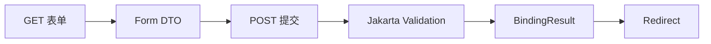

# 08 表单绑定、验证与 PRG

掌握新增编辑页面从显示到校验再到重定向的完整闭环。

## 核心要点

- GET 请求准备 Form DTO，Thymeleaf 用 th:field 绑定输入控件。
- POST 使用 @Valid 触发 Jakarta Validation，BindingResult 保存错误。
- 存在验证错误时返回原表单并显示字段级提示。
- 成功保存后采用 Post/Redirect/Get，避免刷新导致重复提交。
- Service 只把 Form DTO 允许的字段复制到 Entity，控制可修改范围。

## 实现边界

- 客户端校验不能替代服务端 Jakarta Validation。
- BindingResult 必须紧跟被验证的表单参数。

---

## 本章测验

本章共 5 道单项选择题。普通 Markdown 请先自行选择，再展开答案；互动播放器会在提交后判定。

### 第 1 题

关于“表单绑定、验证与 PRG”的核心定位，哪项描述正确？

- A. 验证失败后也应立即保存 Entity 再显示错误。
- B. GET 请求准备 Form DTO，Thymeleaf 用 th:field 绑定输入控件。
- C. PRG 要求成功后直接重复渲染 POST 响应。
- D. 把浏览器提交内容直接绑定所有 Entity 字段最安全。

选择完成后展开答案

正确答案：B. GET 请求准备 Form DTO，Thymeleaf 用 th:field 绑定输入控件。

答案解析：GET 请求准备 Form DTO，Thymeleaf 用 th:field 绑定输入控件。 这与本章图示和核心要点一致；其余选项混淆了职责、顺序或实现边界。

### 第 2 题

按照本章图示，哪一条流程顺序正确？

- A. Redirect → BindingResult → Jakarta Validation → POST 提交 → Form DTO → GET 表单
- B. Form DTO → POST 提交 → Jakarta Validation → BindingResult → Redirect → GET 表单
- C. GET 表单 → Redirect → Form DTO → POST 提交 → Jakarta Validation → BindingResult
- D. GET 表单 → Form DTO → POST 提交 → Jakarta Validation → BindingResult → Redirect

选择完成后展开答案

正确答案：D. GET 表单 → Form DTO → POST 提交 → Jakarta Validation → BindingResult → Redirect

答案解析：GET 表单 → Form DTO → POST 提交 → Jakarta Validation → BindingResult → Redirect 这与本章图示和核心要点一致；其余选项混淆了职责、顺序或实现边界。

### 第 3 题

关于本章组件职责，哪项理解准确？

- A. 存在验证错误时返回原表单并显示字段级提示。
- B. PRG 要求成功后直接重复渲染 POST 响应。
- C. 把浏览器提交内容直接绑定所有 Entity 字段最安全。
- D. 验证失败后也应立即保存 Entity 再显示错误。

选择完成后展开答案

正确答案：A. 存在验证错误时返回原表单并显示字段级提示。

答案解析：存在验证错误时返回原表单并显示字段级提示。 这与本章图示和核心要点一致；其余选项混淆了职责、顺序或实现边界。

### 第 4 题

在实际排查或实现时，哪项做法符合本章边界？

- A. 把浏览器提交内容直接绑定所有 Entity 字段最安全。
- B. 验证失败后也应立即保存 Entity 再显示错误。
- C. 客户端校验不能替代服务端 Jakarta Validation。
- D. PRG 要求成功后直接重复渲染 POST 响应。

选择完成后展开答案

正确答案：C. 客户端校验不能替代服务端 Jakarta Validation。

答案解析：客户端校验不能替代服务端 Jakarta Validation。 这与本章图示和核心要点一致；其余选项混淆了职责、顺序或实现边界。

### 第 5 题

下列哪项最能避免本章讨论的常见误区？

- A. 验证失败后也应立即保存 Entity 再显示错误。
- B. Service 只把 Form DTO 允许的字段复制到 Entity，控制可修改范围。
- C. 把浏览器提交内容直接绑定所有 Entity 字段最安全。
- D. PRG 要求成功后直接重复渲染 POST 响应。

选择完成后展开答案

正确答案：B. Service 只把 Form DTO 允许的字段复制到 Entity，控制可修改范围。

答案解析：Service 只把 Form DTO 允许的字段复制到 Entity，控制可修改范围。 这与本章图示和核心要点一致；其余选项混淆了职责、顺序或实现边界。

<!-- QUIZ_DATA_START
{
  "chapter": "08",
  "questions": [
    {
      "id": 1,
      "question": "关于“表单绑定、验证与 PRG”的核心定位，哪项描述正确？",
      "options": {
        "A": "验证失败后也应立即保存 Entity 再显示错误。",
        "B": "GET 请求准备 Form DTO，Thymeleaf 用 th:field 绑定输入控件。",
        "C": "PRG 要求成功后直接重复渲染 POST 响应。",
        "D": "把浏览器提交内容直接绑定所有 Entity 字段最安全。"
      },
      "answer": "B",
      "explanation": "GET 请求准备 Form DTO，Thymeleaf 用 th:field 绑定输入控件。 这与本章图示和核心要点一致；其余选项混淆了职责、顺序或实现边界。"
    },
    {
      "id": 2,
      "question": "按照本章图示，哪一条流程顺序正确？",
      "options": {
        "A": "Redirect → BindingResult → Jakarta Validation → POST 提交 → Form DTO → GET 表单",
        "B": "Form DTO → POST 提交 → Jakarta Validation → BindingResult → Redirect → GET 表单",
        "C": "GET 表单 → Redirect → Form DTO → POST 提交 → Jakarta Validation → BindingResult",
        "D": "GET 表单 → Form DTO → POST 提交 → Jakarta Validation → BindingResult → Redirect"
      },
      "answer": "D",
      "explanation": "GET 表单 → Form DTO → POST 提交 → Jakarta Validation → BindingResult → Redirect 这与本章图示和核心要点一致；其余选项混淆了职责、顺序或实现边界。"
    },
    {
      "id": 3,
      "question": "关于本章组件职责，哪项理解准确？",
      "options": {
        "A": "存在验证错误时返回原表单并显示字段级提示。",
        "B": "PRG 要求成功后直接重复渲染 POST 响应。",
        "C": "把浏览器提交内容直接绑定所有 Entity 字段最安全。",
        "D": "验证失败后也应立即保存 Entity 再显示错误。"
      },
      "answer": "A",
      "explanation": "存在验证错误时返回原表单并显示字段级提示。 这与本章图示和核心要点一致；其余选项混淆了职责、顺序或实现边界。"
    },
    {
      "id": 4,
      "question": "在实际排查或实现时，哪项做法符合本章边界？",
      "options": {
        "A": "把浏览器提交内容直接绑定所有 Entity 字段最安全。",
        "B": "验证失败后也应立即保存 Entity 再显示错误。",
        "C": "客户端校验不能替代服务端 Jakarta Validation。",
        "D": "PRG 要求成功后直接重复渲染 POST 响应。"
      },
      "answer": "C",
      "explanation": "客户端校验不能替代服务端 Jakarta Validation。 这与本章图示和核心要点一致；其余选项混淆了职责、顺序或实现边界。"
    },
    {
      "id": 5,
      "question": "下列哪项最能避免本章讨论的常见误区？",
      "options": {
        "A": "验证失败后也应立即保存 Entity 再显示错误。",
        "B": "Service 只把 Form DTO 允许的字段复制到 Entity，控制可修改范围。",
        "C": "把浏览器提交内容直接绑定所有 Entity 字段最安全。",
        "D": "PRG 要求成功后直接重复渲染 POST 响应。"
      },
      "answer": "B",
      "explanation": "Service 只把 Form DTO 允许的字段复制到 Entity，控制可修改范围。 这与本章图示和核心要点一致；其余选项混淆了职责、顺序或实现边界。"
    }
  ]
}
QUIZ_DATA_END -->
