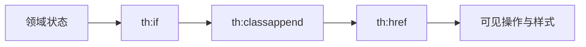

# 09 URL、条件样式与页面状态表达

看懂模板如何生成链接、按条件显示内容并映射业务状态。

## 核心要点

- th:href 使用 Spring URL 表达式生成带上下文路径和参数的链接。
- th:if 与 th:unless 根据页面数据决定元素是否渲染。
- th:classappend 可把告警状态映射为不同 CSS class。
- 分页和排序链接必须保留必要查询参数。
- 页面隐藏按钮只是体验控制，真正授权仍必须在服务器端执行。

## 实现边界

- CSS 颜色不是告警状态的唯一事实来源。
- 条件隐藏不能替代 URL 和方法级权限检查。

---

## 本章测验

本章共 5 道单项选择题。普通 Markdown 请先自行选择，再展开答案；互动播放器会在提交后判定。

### 第 1 题

关于“URL、条件样式与页面状态表达”的核心定位，哪项描述正确？

- A. 只要按钮在 HTML 中隐藏，后端接口就不需要授权。
- B. th:href 使用 Spring URL 表达式生成带上下文路径和参数的链接。
- C. th:href 会绕过 Spring MVC 路由直接访问数据库。
- D. 排序切换时应无条件丢弃所有分页参数。

选择完成后展开答案

正确答案：B. th:href 使用 Spring URL 表达式生成带上下文路径和参数的链接。

答案解析：th:href 使用 Spring URL 表达式生成带上下文路径和参数的链接。 这与本章图示和核心要点一致；其余选项混淆了职责、顺序或实现边界。

### 第 2 题

按照本章图示，哪一条流程顺序正确？

- A. 可见操作与样式 → th:href → th:classappend → th:if → 领域状态
- B. th:if → th:classappend → th:href → 可见操作与样式 → 领域状态
- C. 领域状态 → 可见操作与样式 → th:if → th:classappend → th:href
- D. 领域状态 → th:if → th:classappend → th:href → 可见操作与样式

选择完成后展开答案

正确答案：D. 领域状态 → th:if → th:classappend → th:href → 可见操作与样式

答案解析：领域状态 → th:if → th:classappend → th:href → 可见操作与样式 这与本章图示和核心要点一致；其余选项混淆了职责、顺序或实现边界。

### 第 3 题

关于本章组件职责，哪项理解准确？

- A. th:classappend 可把告警状态映射为不同 CSS class。
- B. th:href 会绕过 Spring MVC 路由直接访问数据库。
- C. 排序切换时应无条件丢弃所有分页参数。
- D. 只要按钮在 HTML 中隐藏，后端接口就不需要授权。

选择完成后展开答案

正确答案：A. th:classappend 可把告警状态映射为不同 CSS class。

答案解析：th:classappend 可把告警状态映射为不同 CSS class。 这与本章图示和核心要点一致；其余选项混淆了职责、顺序或实现边界。

### 第 4 题

在实际排查或实现时，哪项做法符合本章边界？

- A. 排序切换时应无条件丢弃所有分页参数。
- B. 只要按钮在 HTML 中隐藏，后端接口就不需要授权。
- C. CSS 颜色不是告警状态的唯一事实来源。
- D. th:href 会绕过 Spring MVC 路由直接访问数据库。

选择完成后展开答案

正确答案：C. CSS 颜色不是告警状态的唯一事实来源。

答案解析：CSS 颜色不是告警状态的唯一事实来源。 这与本章图示和核心要点一致；其余选项混淆了职责、顺序或实现边界。

### 第 5 题

下列哪项最能避免本章讨论的常见误区？

- A. 只要按钮在 HTML 中隐藏，后端接口就不需要授权。
- B. 页面隐藏按钮只是体验控制，真正授权仍必须在服务器端执行。
- C. 排序切换时应无条件丢弃所有分页参数。
- D. th:href 会绕过 Spring MVC 路由直接访问数据库。

选择完成后展开答案

正确答案：B. 页面隐藏按钮只是体验控制，真正授权仍必须在服务器端执行。

答案解析：页面隐藏按钮只是体验控制，真正授权仍必须在服务器端执行。 这与本章图示和核心要点一致；其余选项混淆了职责、顺序或实现边界。

<!-- QUIZ_DATA_START
{
  "chapter": "09",
  "questions": [
    {
      "id": 1,
      "question": "关于“URL、条件样式与页面状态表达”的核心定位，哪项描述正确？",
      "options": {
        "A": "只要按钮在 HTML 中隐藏，后端接口就不需要授权。",
        "B": "th:href 使用 Spring URL 表达式生成带上下文路径和参数的链接。",
        "C": "th:href 会绕过 Spring MVC 路由直接访问数据库。",
        "D": "排序切换时应无条件丢弃所有分页参数。"
      },
      "answer": "B",
      "explanation": "th:href 使用 Spring URL 表达式生成带上下文路径和参数的链接。 这与本章图示和核心要点一致；其余选项混淆了职责、顺序或实现边界。"
    },
    {
      "id": 2,
      "question": "按照本章图示，哪一条流程顺序正确？",
      "options": {
        "A": "可见操作与样式 → th:href → th:classappend → th:if → 领域状态",
        "B": "th:if → th:classappend → th:href → 可见操作与样式 → 领域状态",
        "C": "领域状态 → 可见操作与样式 → th:if → th:classappend → th:href",
        "D": "领域状态 → th:if → th:classappend → th:href → 可见操作与样式"
      },
      "answer": "D",
      "explanation": "领域状态 → th:if → th:classappend → th:href → 可见操作与样式 这与本章图示和核心要点一致；其余选项混淆了职责、顺序或实现边界。"
    },
    {
      "id": 3,
      "question": "关于本章组件职责，哪项理解准确？",
      "options": {
        "A": "th:classappend 可把告警状态映射为不同 CSS class。",
        "B": "th:href 会绕过 Spring MVC 路由直接访问数据库。",
        "C": "排序切换时应无条件丢弃所有分页参数。",
        "D": "只要按钮在 HTML 中隐藏，后端接口就不需要授权。"
      },
      "answer": "A",
      "explanation": "th:classappend 可把告警状态映射为不同 CSS class。 这与本章图示和核心要点一致；其余选项混淆了职责、顺序或实现边界。"
    },
    {
      "id": 4,
      "question": "在实际排查或实现时，哪项做法符合本章边界？",
      "options": {
        "A": "排序切换时应无条件丢弃所有分页参数。",
        "B": "只要按钮在 HTML 中隐藏，后端接口就不需要授权。",
        "C": "CSS 颜色不是告警状态的唯一事实来源。",
        "D": "th:href 会绕过 Spring MVC 路由直接访问数据库。"
      },
      "answer": "C",
      "explanation": "CSS 颜色不是告警状态的唯一事实来源。 这与本章图示和核心要点一致；其余选项混淆了职责、顺序或实现边界。"
    },
    {
      "id": 5,
      "question": "下列哪项最能避免本章讨论的常见误区？",
      "options": {
        "A": "只要按钮在 HTML 中隐藏，后端接口就不需要授权。",
        "B": "页面隐藏按钮只是体验控制，真正授权仍必须在服务器端执行。",
        "C": "排序切换时应无条件丢弃所有分页参数。",
        "D": "th:href 会绕过 Spring MVC 路由直接访问数据库。"
      },
      "answer": "B",
      "explanation": "页面隐藏按钮只是体验控制，真正授权仍必须在服务器端执行。 这与本章图示和核心要点一致；其余选项混淆了职责、顺序或实现边界。"
    }
  ]
}
QUIZ_DATA_END -->
