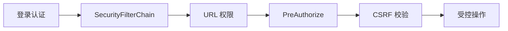

# 10 认证、角色权限与 CSRF

建立从登录到 URL、方法和表单三层保护的安全模型。

## 核心要点

- Spring Security 6 通过 SecurityFilterChain 配置请求安全。
- 本地学习实现使用 ADMIN、OPERATOR、VIEWER 三类内存账号。
- 管理路径使用 URL 规则，并通过 @PreAuthorize 做方法级二次保护。
- 表单 POST 带 CSRF Token，防止跨站请求伪造。
- InMemoryUserDetailsManager 与 API Key 适合学习边界，生产应接企业身份与更强 API 安全。

## 实现边界

- @sec:authorize 控制页面可见性，不替代服务端授权。
- /api/** 忽略 CSRF 后仍需要独立、可靠的 API 认证与防护。

---

## 本章测验

本章共 5 道单项选择题。普通 Markdown 请先自行选择，再展开答案；互动播放器会在提交后判定。

### 第 1 题

关于“认证、角色权限与 CSRF”的核心定位，哪项描述正确？

- A. 页面不显示管理按钮就足以保护管理接口。
- B. Spring Security 6 通过 SecurityFilterChain 配置请求安全。
- C. CSRF Token 的作用是替代用户身份认证。
- D. 内存账号天然适合多实例生产身份治理。

选择完成后展开答案

正确答案：B. Spring Security 6 通过 SecurityFilterChain 配置请求安全。

答案解析：Spring Security 6 通过 SecurityFilterChain 配置请求安全。 这与本章图示和核心要点一致；其余选项混淆了职责、顺序或实现边界。

### 第 2 题

按照本章图示，哪一条流程顺序正确？

- A. 受控操作 → CSRF 校验 → PreAuthorize → URL 权限 → SecurityFilterChain → 登录认证
- B. SecurityFilterChain → URL 权限 → PreAuthorize → CSRF 校验 → 受控操作 → 登录认证
- C. 登录认证 → 受控操作 → SecurityFilterChain → URL 权限 → PreAuthorize → CSRF 校验
- D. 登录认证 → SecurityFilterChain → URL 权限 → PreAuthorize → CSRF 校验 → 受控操作

选择完成后展开答案

正确答案：D. 登录认证 → SecurityFilterChain → URL 权限 → PreAuthorize → CSRF 校验 → 受控操作

答案解析：登录认证 → SecurityFilterChain → URL 权限 → PreAuthorize → CSRF 校验 → 受控操作 这与本章图示和核心要点一致；其余选项混淆了职责、顺序或实现边界。

### 第 3 题

关于本章组件职责，哪项理解准确？

- A. 管理路径使用 URL 规则，并通过 @PreAuthorize 做方法级二次保护。
- B. CSRF Token 的作用是替代用户身份认证。
- C. 内存账号天然适合多实例生产身份治理。
- D. 页面不显示管理按钮就足以保护管理接口。

选择完成后展开答案

正确答案：A. 管理路径使用 URL 规则，并通过 @PreAuthorize 做方法级二次保护。

答案解析：管理路径使用 URL 规则，并通过 @PreAuthorize 做方法级二次保护。 这与本章图示和核心要点一致；其余选项混淆了职责、顺序或实现边界。

### 第 4 题

在实际排查或实现时，哪项做法符合本章边界？

- A. 内存账号天然适合多实例生产身份治理。
- B. 页面不显示管理按钮就足以保护管理接口。
- C. @sec:authorize 控制页面可见性，不替代服务端授权。
- D. CSRF Token 的作用是替代用户身份认证。

选择完成后展开答案

正确答案：C. @sec:authorize 控制页面可见性，不替代服务端授权。

答案解析：@sec:authorize 控制页面可见性，不替代服务端授权。 这与本章图示和核心要点一致；其余选项混淆了职责、顺序或实现边界。

### 第 5 题

下列哪项最能避免本章讨论的常见误区？

- A. 页面不显示管理按钮就足以保护管理接口。
- B. InMemoryUserDetailsManager 与 API Key 适合学习边界，生产应接企业身份与更强 API 安全。
- C. 内存账号天然适合多实例生产身份治理。
- D. CSRF Token 的作用是替代用户身份认证。

选择完成后展开答案

正确答案：B. InMemoryUserDetailsManager 与 API Key 适合学习边界，生产应接企业身份与更强 API 安全。

答案解析：InMemoryUserDetailsManager 与 API Key 适合学习边界，生产应接企业身份与更强 API 安全。 这与本章图示和核心要点一致；其余选项混淆了职责、顺序或实现边界。

<!-- QUIZ_DATA_START
{
  "chapter": "10",
  "questions": [
    {
      "id": 1,
      "question": "关于“认证、角色权限与 CSRF”的核心定位，哪项描述正确？",
      "options": {
        "A": "页面不显示管理按钮就足以保护管理接口。",
        "B": "Spring Security 6 通过 SecurityFilterChain 配置请求安全。",
        "C": "CSRF Token 的作用是替代用户身份认证。",
        "D": "内存账号天然适合多实例生产身份治理。"
      },
      "answer": "B",
      "explanation": "Spring Security 6 通过 SecurityFilterChain 配置请求安全。 这与本章图示和核心要点一致；其余选项混淆了职责、顺序或实现边界。"
    },
    {
      "id": 2,
      "question": "按照本章图示，哪一条流程顺序正确？",
      "options": {
        "A": "受控操作 → CSRF 校验 → PreAuthorize → URL 权限 → SecurityFilterChain → 登录认证",
        "B": "SecurityFilterChain → URL 权限 → PreAuthorize → CSRF 校验 → 受控操作 → 登录认证",
        "C": "登录认证 → 受控操作 → SecurityFilterChain → URL 权限 → PreAuthorize → CSRF 校验",
        "D": "登录认证 → SecurityFilterChain → URL 权限 → PreAuthorize → CSRF 校验 → 受控操作"
      },
      "answer": "D",
      "explanation": "登录认证 → SecurityFilterChain → URL 权限 → PreAuthorize → CSRF 校验 → 受控操作 这与本章图示和核心要点一致；其余选项混淆了职责、顺序或实现边界。"
    },
    {
      "id": 3,
      "question": "关于本章组件职责，哪项理解准确？",
      "options": {
        "A": "管理路径使用 URL 规则，并通过 @PreAuthorize 做方法级二次保护。",
        "B": "CSRF Token 的作用是替代用户身份认证。",
        "C": "内存账号天然适合多实例生产身份治理。",
        "D": "页面不显示管理按钮就足以保护管理接口。"
      },
      "answer": "A",
      "explanation": "管理路径使用 URL 规则，并通过 @PreAuthorize 做方法级二次保护。 这与本章图示和核心要点一致；其余选项混淆了职责、顺序或实现边界。"
    },
    {
      "id": 4,
      "question": "在实际排查或实现时，哪项做法符合本章边界？",
      "options": {
        "A": "内存账号天然适合多实例生产身份治理。",
        "B": "页面不显示管理按钮就足以保护管理接口。",
        "C": "@sec:authorize 控制页面可见性，不替代服务端授权。",
        "D": "CSRF Token 的作用是替代用户身份认证。"
      },
      "answer": "C",
      "explanation": "@sec:authorize 控制页面可见性，不替代服务端授权。 这与本章图示和核心要点一致；其余选项混淆了职责、顺序或实现边界。"
    },
    {
      "id": 5,
      "question": "下列哪项最能避免本章讨论的常见误区？",
      "options": {
        "A": "页面不显示管理按钮就足以保护管理接口。",
        "B": "InMemoryUserDetailsManager 与 API Key 适合学习边界，生产应接企业身份与更强 API 安全。",
        "C": "内存账号天然适合多实例生产身份治理。",
        "D": "CSRF Token 的作用是替代用户身份认证。"
      },
      "answer": "B",
      "explanation": "InMemoryUserDetailsManager 与 API Key 适合学习边界，生产应接企业身份与更强 API 安全。 这与本章图示和核心要点一致；其余选项混淆了职责、顺序或实现边界。"
    }
  ]
}
QUIZ_DATA_END -->
