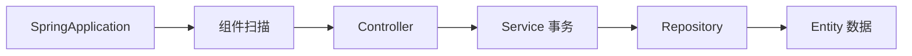

# 12 应用入口与经典分层

理解 Spring Boot 如何启动，以及 Controller、Service、Repository、Entity、DTO 如何协作。

## 核心要点

- @SpringBootApplication 组合自动配置、组件扫描和配置入口。
- @EnableScheduling 启用项目中的定时任务能力。
- Controller 处理 HTTP 与页面跳转，Service 处理业务和事务。
- Repository 负责持久化，Entity 表达领域数据，Form 或 DTO 接收外部输入。
- 分层避免 Controller 直接操纵 Repository 和 JPA Entity 的全部字段。

## 实现边界

- 分层是职责边界，不要求为每个方法建立新模块。
- 定时能力启用不等于所有任务都应在每个实例同时运行。

---

## 本章测验

本章共 5 道单项选择题。普通 Markdown 请先自行选择，再展开答案；互动播放器会在提交后判定。

### 第 1 题

关于“应用入口与经典分层”的核心定位，哪项描述正确？

- A. Controller 应同时负责 SQL、事务和模板 CSS。
- B. @SpringBootApplication 组合自动配置、组件扫描和配置入口。
- C. @EnableScheduling 会把单体自动拆成微服务。
- D. Form DTO 与数据库 Entity 必须永远是同一个对象。

选择完成后展开答案

正确答案：B. @SpringBootApplication 组合自动配置、组件扫描和配置入口。

答案解析：@SpringBootApplication 组合自动配置、组件扫描和配置入口。 这与本章图示和核心要点一致；其余选项混淆了职责、顺序或实现边界。

### 第 2 题

按照本章图示，哪一条流程顺序正确？

- A. Entity 数据 → Repository → Service 事务 → Controller → 组件扫描 → SpringApplication
- B. 组件扫描 → Controller → Service 事务 → Repository → Entity 数据 → SpringApplication
- C. SpringApplication → Entity 数据 → 组件扫描 → Controller → Service 事务 → Repository
- D. SpringApplication → 组件扫描 → Controller → Service 事务 → Repository → Entity 数据

选择完成后展开答案

正确答案：D. SpringApplication → 组件扫描 → Controller → Service 事务 → Repository → Entity 数据

答案解析：SpringApplication → 组件扫描 → Controller → Service 事务 → Repository → Entity 数据 这与本章图示和核心要点一致；其余选项混淆了职责、顺序或实现边界。

### 第 3 题

关于本章组件职责，哪项理解准确？

- A. Controller 处理 HTTP 与页面跳转，Service 处理业务和事务。
- B. @EnableScheduling 会把单体自动拆成微服务。
- C. Form DTO 与数据库 Entity 必须永远是同一个对象。
- D. Controller 应同时负责 SQL、事务和模板 CSS。

选择完成后展开答案

正确答案：A. Controller 处理 HTTP 与页面跳转，Service 处理业务和事务。

答案解析：Controller 处理 HTTP 与页面跳转，Service 处理业务和事务。 这与本章图示和核心要点一致；其余选项混淆了职责、顺序或实现边界。

### 第 4 题

在实际排查或实现时，哪项做法符合本章边界？

- A. Form DTO 与数据库 Entity 必须永远是同一个对象。
- B. Controller 应同时负责 SQL、事务和模板 CSS。
- C. 分层是职责边界，不要求为每个方法建立新模块。
- D. @EnableScheduling 会把单体自动拆成微服务。

选择完成后展开答案

正确答案：C. 分层是职责边界，不要求为每个方法建立新模块。

答案解析：分层是职责边界，不要求为每个方法建立新模块。 这与本章图示和核心要点一致；其余选项混淆了职责、顺序或实现边界。

### 第 5 题

下列哪项最能避免本章讨论的常见误区？

- A. Controller 应同时负责 SQL、事务和模板 CSS。
- B. 分层避免 Controller 直接操纵 Repository 和 JPA Entity 的全部字段。
- C. Form DTO 与数据库 Entity 必须永远是同一个对象。
- D. @EnableScheduling 会把单体自动拆成微服务。

选择完成后展开答案

正确答案：B. 分层避免 Controller 直接操纵 Repository 和 JPA Entity 的全部字段。

答案解析：分层避免 Controller 直接操纵 Repository 和 JPA Entity 的全部字段。 这与本章图示和核心要点一致；其余选项混淆了职责、顺序或实现边界。

<!-- QUIZ_DATA_START
{
  "chapter": "12",
  "questions": [
    {
      "id": 1,
      "question": "关于“应用入口与经典分层”的核心定位，哪项描述正确？",
      "options": {
        "A": "Controller 应同时负责 SQL、事务和模板 CSS。",
        "B": "@SpringBootApplication 组合自动配置、组件扫描和配置入口。",
        "C": "@EnableScheduling 会把单体自动拆成微服务。",
        "D": "Form DTO 与数据库 Entity 必须永远是同一个对象。"
      },
      "answer": "B",
      "explanation": "@SpringBootApplication 组合自动配置、组件扫描和配置入口。 这与本章图示和核心要点一致；其余选项混淆了职责、顺序或实现边界。"
    },
    {
      "id": 2,
      "question": "按照本章图示，哪一条流程顺序正确？",
      "options": {
        "A": "Entity 数据 → Repository → Service 事务 → Controller → 组件扫描 → SpringApplication",
        "B": "组件扫描 → Controller → Service 事务 → Repository → Entity 数据 → SpringApplication",
        "C": "SpringApplication → Entity 数据 → 组件扫描 → Controller → Service 事务 → Repository",
        "D": "SpringApplication → 组件扫描 → Controller → Service 事务 → Repository → Entity 数据"
      },
      "answer": "D",
      "explanation": "SpringApplication → 组件扫描 → Controller → Service 事务 → Repository → Entity 数据 这与本章图示和核心要点一致；其余选项混淆了职责、顺序或实现边界。"
    },
    {
      "id": 3,
      "question": "关于本章组件职责，哪项理解准确？",
      "options": {
        "A": "Controller 处理 HTTP 与页面跳转，Service 处理业务和事务。",
        "B": "@EnableScheduling 会把单体自动拆成微服务。",
        "C": "Form DTO 与数据库 Entity 必须永远是同一个对象。",
        "D": "Controller 应同时负责 SQL、事务和模板 CSS。"
      },
      "answer": "A",
      "explanation": "Controller 处理 HTTP 与页面跳转，Service 处理业务和事务。 这与本章图示和核心要点一致；其余选项混淆了职责、顺序或实现边界。"
    },
    {
      "id": 4,
      "question": "在实际排查或实现时，哪项做法符合本章边界？",
      "options": {
        "A": "Form DTO 与数据库 Entity 必须永远是同一个对象。",
        "B": "Controller 应同时负责 SQL、事务和模板 CSS。",
        "C": "分层是职责边界，不要求为每个方法建立新模块。",
        "D": "@EnableScheduling 会把单体自动拆成微服务。"
      },
      "answer": "C",
      "explanation": "分层是职责边界，不要求为每个方法建立新模块。 这与本章图示和核心要点一致；其余选项混淆了职责、顺序或实现边界。"
    },
    {
      "id": 5,
      "question": "下列哪项最能避免本章讨论的常见误区？",
      "options": {
        "A": "Controller 应同时负责 SQL、事务和模板 CSS。",
        "B": "分层避免 Controller 直接操纵 Repository 和 JPA Entity 的全部字段。",
        "C": "Form DTO 与数据库 Entity 必须永远是同一个对象。",
        "D": "@EnableScheduling 会把单体自动拆成微服务。"
      },
      "answer": "B",
      "explanation": "分层避免 Controller 直接操纵 Repository 和 JPA Entity 的全部字段。 这与本章图示和核心要点一致；其余选项混淆了职责、顺序或实现边界。"
    }
  ]
}
QUIZ_DATA_END -->
