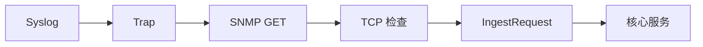

# 13 统一入口 IngestRequest

理解多协议输入怎样被标准化为同一个核心业务契约。

## 核心要点

- 四类协议适配器都会转换为统一的 IngestRequest。
- 记录包含 source、host、eventKey、消息、严重度、状态、指标和时间等字段。
- Jakarta Validation 用 @NotNull、@NotBlank、@Size 等约束入口数据。
- 协议层负责接收、解析和转换，核心层负责事件与告警业务。
- 新增协议只需完成标准化适配，后续核心流程原则上可以复用。

## 实现边界

- 统一模型不代表所有协议字段完全相同，原始报文仍可保留。
- 通过校验只证明输入结构合规，不证明来源可信。

---

## 本章测验

本章共 5 道单项选择题。普通 Markdown 请先自行选择，再展开答案；互动播放器会在提交后判定。

### 第 1 题

关于“统一入口 IngestRequest”的核心定位，哪项描述正确？

- A. 每种协议都应直接创建 Alert 并绕过核心服务。
- B. 四类协议适配器都会转换为统一的 IngestRequest。
- C. IngestRequest 只允许保存一段 message，不能记录来源信息。
- D. Jakarta Validation 可以替代网络来源认证。

选择完成后展开答案

正确答案：B. 四类协议适配器都会转换为统一的 IngestRequest。

答案解析：四类协议适配器都会转换为统一的 IngestRequest。 这与本章图示和核心要点一致；其余选项混淆了职责、顺序或实现边界。

### 第 2 题

按照本章图示，哪一条流程顺序正确？

- A. 核心服务 → IngestRequest → TCP 检查 → SNMP GET → Trap → Syslog
- B. Trap → SNMP GET → TCP 检查 → IngestRequest → 核心服务 → Syslog
- C. Syslog → 核心服务 → Trap → SNMP GET → TCP 检查 → IngestRequest
- D. Syslog → Trap → SNMP GET → TCP 检查 → IngestRequest → 核心服务

选择完成后展开答案

正确答案：D. Syslog → Trap → SNMP GET → TCP 检查 → IngestRequest → 核心服务

答案解析：Syslog → Trap → SNMP GET → TCP 检查 → IngestRequest → 核心服务 这与本章图示和核心要点一致；其余选项混淆了职责、顺序或实现边界。

### 第 3 题

关于本章组件职责，哪项理解准确？

- A. Jakarta Validation 用 @NotNull、@NotBlank、@Size 等约束入口数据。
- B. IngestRequest 只允许保存一段 message，不能记录来源信息。
- C. Jakarta Validation 可以替代网络来源认证。
- D. 每种协议都应直接创建 Alert 并绕过核心服务。

选择完成后展开答案

正确答案：A. Jakarta Validation 用 @NotNull、@NotBlank、@Size 等约束入口数据。

答案解析：Jakarta Validation 用 @NotNull、@NotBlank、@Size 等约束入口数据。 这与本章图示和核心要点一致；其余选项混淆了职责、顺序或实现边界。

### 第 4 题

在实际排查或实现时，哪项做法符合本章边界？

- A. Jakarta Validation 可以替代网络来源认证。
- B. 每种协议都应直接创建 Alert 并绕过核心服务。
- C. 统一模型不代表所有协议字段完全相同，原始报文仍可保留。
- D. IngestRequest 只允许保存一段 message，不能记录来源信息。

选择完成后展开答案

正确答案：C. 统一模型不代表所有协议字段完全相同，原始报文仍可保留。

答案解析：统一模型不代表所有协议字段完全相同，原始报文仍可保留。 这与本章图示和核心要点一致；其余选项混淆了职责、顺序或实现边界。

### 第 5 题

下列哪项最能避免本章讨论的常见误区？

- A. 每种协议都应直接创建 Alert 并绕过核心服务。
- B. 新增协议只需完成标准化适配，后续核心流程原则上可以复用。
- C. Jakarta Validation 可以替代网络来源认证。
- D. IngestRequest 只允许保存一段 message，不能记录来源信息。

选择完成后展开答案

正确答案：B. 新增协议只需完成标准化适配，后续核心流程原则上可以复用。

答案解析：新增协议只需完成标准化适配，后续核心流程原则上可以复用。 这与本章图示和核心要点一致；其余选项混淆了职责、顺序或实现边界。

<!-- QUIZ_DATA_START
{
  "chapter": "13",
  "questions": [
    {
      "id": 1,
      "question": "关于“统一入口 IngestRequest”的核心定位，哪项描述正确？",
      "options": {
        "A": "每种协议都应直接创建 Alert 并绕过核心服务。",
        "B": "四类协议适配器都会转换为统一的 IngestRequest。",
        "C": "IngestRequest 只允许保存一段 message，不能记录来源信息。",
        "D": "Jakarta Validation 可以替代网络来源认证。"
      },
      "answer": "B",
      "explanation": "四类协议适配器都会转换为统一的 IngestRequest。 这与本章图示和核心要点一致；其余选项混淆了职责、顺序或实现边界。"
    },
    {
      "id": 2,
      "question": "按照本章图示，哪一条流程顺序正确？",
      "options": {
        "A": "核心服务 → IngestRequest → TCP 检查 → SNMP GET → Trap → Syslog",
        "B": "Trap → SNMP GET → TCP 检查 → IngestRequest → 核心服务 → Syslog",
        "C": "Syslog → 核心服务 → Trap → SNMP GET → TCP 检查 → IngestRequest",
        "D": "Syslog → Trap → SNMP GET → TCP 检查 → IngestRequest → 核心服务"
      },
      "answer": "D",
      "explanation": "Syslog → Trap → SNMP GET → TCP 检查 → IngestRequest → 核心服务 这与本章图示和核心要点一致；其余选项混淆了职责、顺序或实现边界。"
    },
    {
      "id": 3,
      "question": "关于本章组件职责，哪项理解准确？",
      "options": {
        "A": "Jakarta Validation 用 @NotNull、@NotBlank、@Size 等约束入口数据。",
        "B": "IngestRequest 只允许保存一段 message，不能记录来源信息。",
        "C": "Jakarta Validation 可以替代网络来源认证。",
        "D": "每种协议都应直接创建 Alert 并绕过核心服务。"
      },
      "answer": "A",
      "explanation": "Jakarta Validation 用 @NotNull、@NotBlank、@Size 等约束入口数据。 这与本章图示和核心要点一致；其余选项混淆了职责、顺序或实现边界。"
    },
    {
      "id": 4,
      "question": "在实际排查或实现时，哪项做法符合本章边界？",
      "options": {
        "A": "Jakarta Validation 可以替代网络来源认证。",
        "B": "每种协议都应直接创建 Alert 并绕过核心服务。",
        "C": "统一模型不代表所有协议字段完全相同，原始报文仍可保留。",
        "D": "IngestRequest 只允许保存一段 message，不能记录来源信息。"
      },
      "answer": "C",
      "explanation": "统一模型不代表所有协议字段完全相同，原始报文仍可保留。 这与本章图示和核心要点一致；其余选项混淆了职责、顺序或实现边界。"
    },
    {
      "id": 5,
      "question": "下列哪项最能避免本章讨论的常见误区？",
      "options": {
        "A": "每种协议都应直接创建 Alert 并绕过核心服务。",
        "B": "新增协议只需完成标准化适配，后续核心流程原则上可以复用。",
        "C": "Jakarta Validation 可以替代网络来源认证。",
        "D": "IngestRequest 只允许保存一段 message，不能记录来源信息。"
      },
      "answer": "B",
      "explanation": "新增协议只需完成标准化适配，后续核心流程原则上可以复用。 这与本章图示和核心要点一致；其余选项混淆了职责、顺序或实现边界。"
    }
  ]
}
QUIZ_DATA_END -->
