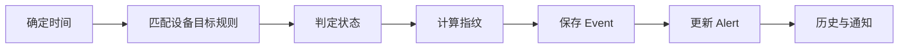

# 14 EventProcessingService 十步主流程

沿着一次输入追踪状态判定、去重、持久化、告警和通知。

## 核心要点

- 事务方法 process 先确定发生时间，再匹配设备、目标和规则。
- 状态优先考虑显式 status、主动检查失败、指标阈值和 severity。
- source、host、eventKey 和 message 参与 SHA-256 fingerprint 计算。
- 重复事件仍保存为 MonitoringEvent，但在抑制窗口内不重复通知。
- 同一事务更新 Alert、AlertHistory、设备状态并记录通知处理。

## 实现边界

- 重复抑制不是丢弃事实，Event 仍需保存。
- 事务内同步发邮件会延长事务，是后续改进点。

---

## 本章测验

本章共 5 道单项选择题。普通 Markdown 请先自行选择，再展开答案；互动播放器会在提交后判定。

### 第 1 题

关于“EventProcessingService 十步主流程”的核心定位，哪项描述正确？

- A. 发现重复事件后应立即删除此前 Event。
- B. 事务方法 process 先确定发生时间，再匹配设备、目标和规则。
- C. 状态判定完全由页面 CSS 颜色决定。
- D. 每次输入都必须无条件创建一个全新 Alert。

选择完成后展开答案

正确答案：B. 事务方法 process 先确定发生时间，再匹配设备、目标和规则。

答案解析：事务方法 process 先确定发生时间，再匹配设备、目标和规则。 这与本章图示和核心要点一致；其余选项混淆了职责、顺序或实现边界。

### 第 2 题

按照本章图示，哪一条流程顺序正确？

- A. 历史与通知 → 更新 Alert → 保存 Event → 计算指纹 → 判定状态 → 匹配设备目标规则 → 确定时间
- B. 匹配设备目标规则 → 判定状态 → 计算指纹 → 保存 Event → 更新 Alert → 历史与通知 → 确定时间
- C. 确定时间 → 历史与通知 → 匹配设备目标规则 → 判定状态 → 计算指纹 → 保存 Event → 更新 Alert
- D. 确定时间 → 匹配设备目标规则 → 判定状态 → 计算指纹 → 保存 Event → 更新 Alert → 历史与通知

选择完成后展开答案

正确答案：D. 确定时间 → 匹配设备目标规则 → 判定状态 → 计算指纹 → 保存 Event → 更新 Alert → 历史与通知

答案解析：确定时间 → 匹配设备目标规则 → 判定状态 → 计算指纹 → 保存 Event → 更新 Alert → 历史与通知 这与本章图示和核心要点一致；其余选项混淆了职责、顺序或实现边界。

### 第 3 题

关于本章组件职责，哪项理解准确？

- A. source、host、eventKey 和 message 参与 SHA-256 fingerprint 计算。
- B. 状态判定完全由页面 CSS 颜色决定。
- C. 每次输入都必须无条件创建一个全新 Alert。
- D. 发现重复事件后应立即删除此前 Event。

选择完成后展开答案

正确答案：A. source、host、eventKey 和 message 参与 SHA-256 fingerprint 计算。

答案解析：source、host、eventKey 和 message 参与 SHA-256 fingerprint 计算。 这与本章图示和核心要点一致；其余选项混淆了职责、顺序或实现边界。

### 第 4 题

在实际排查或实现时，哪项做法符合本章边界？

- A. 每次输入都必须无条件创建一个全新 Alert。
- B. 发现重复事件后应立即删除此前 Event。
- C. 重复抑制不是丢弃事实，Event 仍需保存。
- D. 状态判定完全由页面 CSS 颜色决定。

选择完成后展开答案

正确答案：C. 重复抑制不是丢弃事实，Event 仍需保存。

答案解析：重复抑制不是丢弃事实，Event 仍需保存。 这与本章图示和核心要点一致；其余选项混淆了职责、顺序或实现边界。

### 第 5 题

下列哪项最能避免本章讨论的常见误区？

- A. 发现重复事件后应立即删除此前 Event。
- B. 同一事务更新 Alert、AlertHistory、设备状态并记录通知处理。
- C. 每次输入都必须无条件创建一个全新 Alert。
- D. 状态判定完全由页面 CSS 颜色决定。

选择完成后展开答案

正确答案：B. 同一事务更新 Alert、AlertHistory、设备状态并记录通知处理。

答案解析：同一事务更新 Alert、AlertHistory、设备状态并记录通知处理。 这与本章图示和核心要点一致；其余选项混淆了职责、顺序或实现边界。

<!-- QUIZ_DATA_START
{
  "chapter": "14",
  "questions": [
    {
      "id": 1,
      "question": "关于“EventProcessingService 十步主流程”的核心定位，哪项描述正确？",
      "options": {
        "A": "发现重复事件后应立即删除此前 Event。",
        "B": "事务方法 process 先确定发生时间，再匹配设备、目标和规则。",
        "C": "状态判定完全由页面 CSS 颜色决定。",
        "D": "每次输入都必须无条件创建一个全新 Alert。"
      },
      "answer": "B",
      "explanation": "事务方法 process 先确定发生时间，再匹配设备、目标和规则。 这与本章图示和核心要点一致；其余选项混淆了职责、顺序或实现边界。"
    },
    {
      "id": 2,
      "question": "按照本章图示，哪一条流程顺序正确？",
      "options": {
        "A": "历史与通知 → 更新 Alert → 保存 Event → 计算指纹 → 判定状态 → 匹配设备目标规则 → 确定时间",
        "B": "匹配设备目标规则 → 判定状态 → 计算指纹 → 保存 Event → 更新 Alert → 历史与通知 → 确定时间",
        "C": "确定时间 → 历史与通知 → 匹配设备目标规则 → 判定状态 → 计算指纹 → 保存 Event → 更新 Alert",
        "D": "确定时间 → 匹配设备目标规则 → 判定状态 → 计算指纹 → 保存 Event → 更新 Alert → 历史与通知"
      },
      "answer": "D",
      "explanation": "确定时间 → 匹配设备目标规则 → 判定状态 → 计算指纹 → 保存 Event → 更新 Alert → 历史与通知 这与本章图示和核心要点一致；其余选项混淆了职责、顺序或实现边界。"
    },
    {
      "id": 3,
      "question": "关于本章组件职责，哪项理解准确？",
      "options": {
        "A": "source、host、eventKey 和 message 参与 SHA-256 fingerprint 计算。",
        "B": "状态判定完全由页面 CSS 颜色决定。",
        "C": "每次输入都必须无条件创建一个全新 Alert。",
        "D": "发现重复事件后应立即删除此前 Event。"
      },
      "answer": "A",
      "explanation": "source、host、eventKey 和 message 参与 SHA-256 fingerprint 计算。 这与本章图示和核心要点一致；其余选项混淆了职责、顺序或实现边界。"
    },
    {
      "id": 4,
      "question": "在实际排查或实现时，哪项做法符合本章边界？",
      "options": {
        "A": "每次输入都必须无条件创建一个全新 Alert。",
        "B": "发现重复事件后应立即删除此前 Event。",
        "C": "重复抑制不是丢弃事实，Event 仍需保存。",
        "D": "状态判定完全由页面 CSS 颜色决定。"
      },
      "answer": "C",
      "explanation": "重复抑制不是丢弃事实，Event 仍需保存。 这与本章图示和核心要点一致；其余选项混淆了职责、顺序或实现边界。"
    },
    {
      "id": 5,
      "question": "下列哪项最能避免本章讨论的常见误区？",
      "options": {
        "A": "发现重复事件后应立即删除此前 Event。",
        "B": "同一事务更新 Alert、AlertHistory、设备状态并记录通知处理。",
        "C": "每次输入都必须无条件创建一个全新 Alert。",
        "D": "状态判定完全由页面 CSS 颜色决定。"
      },
      "answer": "B",
      "explanation": "同一事务更新 Alert、AlertHistory、设备状态并记录通知处理。 这与本章图示和核心要点一致；其余选项混淆了职责、顺序或实现边界。"
    }
  ]
}
QUIZ_DATA_END -->
