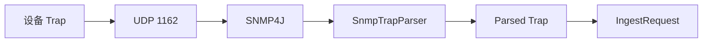

# 17 SNMP Trap 被动接收

掌握 SNMP v2c Trap 从监听端口进入统一业务的路径。

## 核心要点

- SNMP Trap 使用 SNMP4J，并由 SmartLifecycle 组件管理启动停止。
- 默认监听 0.0.0.0:1162 UDP，生产可将标准 162 映射到容器端口。
- CommandResponderEvent 经解析后转换为 IngestRequest。
- 当前实现明确支持 SNMP v2c Trap。
- Trap 是设备主动推送的被动监控输入，与 SNMP GET 主动查询不同。

## 实现边界

- 监听 1162 是非特权本地或容器端口，不是生产外部端口规范本身。
- v2c community 缺少 SNMPv3 authPriv 的认证与加密强度。

---

## 本章测验

本章共 5 道单项选择题。普通 Markdown 请先自行选择，再展开答案；互动播放器会在提交后判定。

### 第 1 题

关于“SNMP Trap 被动接收”的核心定位，哪项描述正确？

- A. Trap 接收器会定时向设备发送 PDU.GET。
- B. SNMP Trap 使用 SNMP4J，并由 SmartLifecycle 组件管理启动停止。
- C. 当前实现已经完整提供 SNMPv3 authPriv。
- D. UDP 1162 必须直接暴露为公网管理接口。

选择完成后展开答案

正确答案：B. SNMP Trap 使用 SNMP4J，并由 SmartLifecycle 组件管理启动停止。

答案解析：SNMP Trap 使用 SNMP4J，并由 SmartLifecycle 组件管理启动停止。 这与本章图示和核心要点一致；其余选项混淆了职责、顺序或实现边界。

### 第 2 题

按照本章图示，哪一条流程顺序正确？

- A. IngestRequest → Parsed Trap → SnmpTrapParser → SNMP4J → UDP 1162 → 设备 Trap
- B. UDP 1162 → SNMP4J → SnmpTrapParser → Parsed Trap → IngestRequest → 设备 Trap
- C. 设备 Trap → IngestRequest → UDP 1162 → SNMP4J → SnmpTrapParser → Parsed Trap
- D. 设备 Trap → UDP 1162 → SNMP4J → SnmpTrapParser → Parsed Trap → IngestRequest

选择完成后展开答案

正确答案：D. 设备 Trap → UDP 1162 → SNMP4J → SnmpTrapParser → Parsed Trap → IngestRequest

答案解析：设备 Trap → UDP 1162 → SNMP4J → SnmpTrapParser → Parsed Trap → IngestRequest 这与本章图示和核心要点一致；其余选项混淆了职责、顺序或实现边界。

### 第 3 题

关于本章组件职责，哪项理解准确？

- A. CommandResponderEvent 经解析后转换为 IngestRequest。
- B. 当前实现已经完整提供 SNMPv3 authPriv。
- C. UDP 1162 必须直接暴露为公网管理接口。
- D. Trap 接收器会定时向设备发送 PDU.GET。

选择完成后展开答案

正确答案：A. CommandResponderEvent 经解析后转换为 IngestRequest。

答案解析：CommandResponderEvent 经解析后转换为 IngestRequest。 这与本章图示和核心要点一致；其余选项混淆了职责、顺序或实现边界。

### 第 4 题

在实际排查或实现时，哪项做法符合本章边界？

- A. UDP 1162 必须直接暴露为公网管理接口。
- B. Trap 接收器会定时向设备发送 PDU.GET。
- C. 监听 1162 是非特权本地或容器端口，不是生产外部端口规范本身。
- D. 当前实现已经完整提供 SNMPv3 authPriv。

选择完成后展开答案

正确答案：C. 监听 1162 是非特权本地或容器端口，不是生产外部端口规范本身。

答案解析：监听 1162 是非特权本地或容器端口，不是生产外部端口规范本身。 这与本章图示和核心要点一致；其余选项混淆了职责、顺序或实现边界。

### 第 5 题

下列哪项最能避免本章讨论的常见误区？

- A. Trap 接收器会定时向设备发送 PDU.GET。
- B. Trap 是设备主动推送的被动监控输入，与 SNMP GET 主动查询不同。
- C. UDP 1162 必须直接暴露为公网管理接口。
- D. 当前实现已经完整提供 SNMPv3 authPriv。

选择完成后展开答案

正确答案：B. Trap 是设备主动推送的被动监控输入，与 SNMP GET 主动查询不同。

答案解析：Trap 是设备主动推送的被动监控输入，与 SNMP GET 主动查询不同。 这与本章图示和核心要点一致；其余选项混淆了职责、顺序或实现边界。

<!-- QUIZ_DATA_START
{
  "chapter": "17",
  "questions": [
    {
      "id": 1,
      "question": "关于“SNMP Trap 被动接收”的核心定位，哪项描述正确？",
      "options": {
        "A": "Trap 接收器会定时向设备发送 PDU.GET。",
        "B": "SNMP Trap 使用 SNMP4J，并由 SmartLifecycle 组件管理启动停止。",
        "C": "当前实现已经完整提供 SNMPv3 authPriv。",
        "D": "UDP 1162 必须直接暴露为公网管理接口。"
      },
      "answer": "B",
      "explanation": "SNMP Trap 使用 SNMP4J，并由 SmartLifecycle 组件管理启动停止。 这与本章图示和核心要点一致；其余选项混淆了职责、顺序或实现边界。"
    },
    {
      "id": 2,
      "question": "按照本章图示，哪一条流程顺序正确？",
      "options": {
        "A": "IngestRequest → Parsed Trap → SnmpTrapParser → SNMP4J → UDP 1162 → 设备 Trap",
        "B": "UDP 1162 → SNMP4J → SnmpTrapParser → Parsed Trap → IngestRequest → 设备 Trap",
        "C": "设备 Trap → IngestRequest → UDP 1162 → SNMP4J → SnmpTrapParser → Parsed Trap",
        "D": "设备 Trap → UDP 1162 → SNMP4J → SnmpTrapParser → Parsed Trap → IngestRequest"
      },
      "answer": "D",
      "explanation": "设备 Trap → UDP 1162 → SNMP4J → SnmpTrapParser → Parsed Trap → IngestRequest 这与本章图示和核心要点一致；其余选项混淆了职责、顺序或实现边界。"
    },
    {
      "id": 3,
      "question": "关于本章组件职责，哪项理解准确？",
      "options": {
        "A": "CommandResponderEvent 经解析后转换为 IngestRequest。",
        "B": "当前实现已经完整提供 SNMPv3 authPriv。",
        "C": "UDP 1162 必须直接暴露为公网管理接口。",
        "D": "Trap 接收器会定时向设备发送 PDU.GET。"
      },
      "answer": "A",
      "explanation": "CommandResponderEvent 经解析后转换为 IngestRequest。 这与本章图示和核心要点一致；其余选项混淆了职责、顺序或实现边界。"
    },
    {
      "id": 4,
      "question": "在实际排查或实现时，哪项做法符合本章边界？",
      "options": {
        "A": "UDP 1162 必须直接暴露为公网管理接口。",
        "B": "Trap 接收器会定时向设备发送 PDU.GET。",
        "C": "监听 1162 是非特权本地或容器端口，不是生产外部端口规范本身。",
        "D": "当前实现已经完整提供 SNMPv3 authPriv。"
      },
      "answer": "C",
      "explanation": "监听 1162 是非特权本地或容器端口，不是生产外部端口规范本身。 这与本章图示和核心要点一致；其余选项混淆了职责、顺序或实现边界。"
    },
    {
      "id": 5,
      "question": "下列哪项最能避免本章讨论的常见误区？",
      "options": {
        "A": "Trap 接收器会定时向设备发送 PDU.GET。",
        "B": "Trap 是设备主动推送的被动监控输入，与 SNMP GET 主动查询不同。",
        "C": "UDP 1162 必须直接暴露为公网管理接口。",
        "D": "当前实现已经完整提供 SNMPv3 authPriv。"
      },
      "answer": "B",
      "explanation": "Trap 是设备主动推送的被动监控输入，与 SNMP GET 主动查询不同。 这与本章图示和核心要点一致；其余选项混淆了职责、顺序或实现边界。"
    }
  ]
}
QUIZ_DATA_END -->
