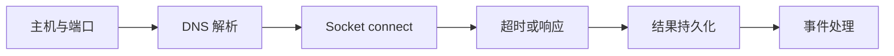

# 19 TCP Ping 其实是端口连接检查

区分 ICMP 可达性和应用端口可连接性。

## 核心要点

- 项目中的 TCP Ping 调用 socket.connect 检查指定主机和端口。
- 它不发送 ICMP Echo Request，因此不是传统网络 Ping。
- 错误分类包括 DNS_ERROR、TIMEOUT、CONNECTION_REFUSED 和 IO_ERROR。
- 检查支持有限重试，并把结果保存到 tcp_ping_results。
- 主机能响应 ICMP 不代表 PostgreSQL 5432、HTTPS 443 或 SSH 22 可连接。

## 实现边界

- TCP connect 成功只证明端口可建立连接，不证明完整业务协议健康。
- 重试应受次数和超时约束。

---

## 本章测验

本章共 5 道单项选择题。普通 Markdown 请先自行选择，再展开答案；互动播放器会在提交后判定。

### 第 1 题

关于“TCP Ping 其实是端口连接检查”的核心定位，哪项描述正确？

- A. TCP Ping 的唯一目标是发送 ICMP Echo Request。
- B. 项目中的 TCP Ping 调用 socket.connect 检查指定主机和端口。
- C. 端口连接成功就能证明数据库查询一定正确。
- D. 连接拒绝与 DNS 解析失败没有必要区分。

选择完成后展开答案

正确答案：B. 项目中的 TCP Ping 调用 socket.connect 检查指定主机和端口。

答案解析：项目中的 TCP Ping 调用 socket.connect 检查指定主机和端口。 这与本章图示和核心要点一致；其余选项混淆了职责、顺序或实现边界。

### 第 2 题

按照本章图示，哪一条流程顺序正确？

- A. 事件处理 → 结果持久化 → 超时或响应 → Socket connect → DNS 解析 → 主机与端口
- B. DNS 解析 → Socket connect → 超时或响应 → 结果持久化 → 事件处理 → 主机与端口
- C. 主机与端口 → 事件处理 → DNS 解析 → Socket connect → 超时或响应 → 结果持久化
- D. 主机与端口 → DNS 解析 → Socket connect → 超时或响应 → 结果持久化 → 事件处理

选择完成后展开答案

正确答案：D. 主机与端口 → DNS 解析 → Socket connect → 超时或响应 → 结果持久化 → 事件处理

答案解析：主机与端口 → DNS 解析 → Socket connect → 超时或响应 → 结果持久化 → 事件处理 这与本章图示和核心要点一致；其余选项混淆了职责、顺序或实现边界。

### 第 3 题

关于本章组件职责，哪项理解准确？

- A. 错误分类包括 DNS_ERROR、TIMEOUT、CONNECTION_REFUSED 和 IO_ERROR。
- B. 端口连接成功就能证明数据库查询一定正确。
- C. 连接拒绝与 DNS 解析失败没有必要区分。
- D. TCP Ping 的唯一目标是发送 ICMP Echo Request。

选择完成后展开答案

正确答案：A. 错误分类包括 DNS_ERROR、TIMEOUT、CONNECTION_REFUSED 和 IO_ERROR。

答案解析：错误分类包括 DNS_ERROR、TIMEOUT、CONNECTION_REFUSED 和 IO_ERROR。 这与本章图示和核心要点一致；其余选项混淆了职责、顺序或实现边界。

### 第 4 题

在实际排查或实现时，哪项做法符合本章边界？

- A. 连接拒绝与 DNS 解析失败没有必要区分。
- B. TCP Ping 的唯一目标是发送 ICMP Echo Request。
- C. TCP connect 成功只证明端口可建立连接，不证明完整业务协议健康。
- D. 端口连接成功就能证明数据库查询一定正确。

选择完成后展开答案

正确答案：C. TCP connect 成功只证明端口可建立连接，不证明完整业务协议健康。

答案解析：TCP connect 成功只证明端口可建立连接，不证明完整业务协议健康。 这与本章图示和核心要点一致；其余选项混淆了职责、顺序或实现边界。

### 第 5 题

下列哪项最能避免本章讨论的常见误区？

- A. TCP Ping 的唯一目标是发送 ICMP Echo Request。
- B. 主机能响应 ICMP 不代表 PostgreSQL 5432、HTTPS 443 或 SSH 22 可连接。
- C. 连接拒绝与 DNS 解析失败没有必要区分。
- D. 端口连接成功就能证明数据库查询一定正确。

选择完成后展开答案

正确答案：B. 主机能响应 ICMP 不代表 PostgreSQL 5432、HTTPS 443 或 SSH 22 可连接。

答案解析：主机能响应 ICMP 不代表 PostgreSQL 5432、HTTPS 443 或 SSH 22 可连接。 这与本章图示和核心要点一致；其余选项混淆了职责、顺序或实现边界。

<!-- QUIZ_DATA_START
{
  "chapter": "19",
  "questions": [
    {
      "id": 1,
      "question": "关于“TCP Ping 其实是端口连接检查”的核心定位，哪项描述正确？",
      "options": {
        "A": "TCP Ping 的唯一目标是发送 ICMP Echo Request。",
        "B": "项目中的 TCP Ping 调用 socket.connect 检查指定主机和端口。",
        "C": "端口连接成功就能证明数据库查询一定正确。",
        "D": "连接拒绝与 DNS 解析失败没有必要区分。"
      },
      "answer": "B",
      "explanation": "项目中的 TCP Ping 调用 socket.connect 检查指定主机和端口。 这与本章图示和核心要点一致；其余选项混淆了职责、顺序或实现边界。"
    },
    {
      "id": 2,
      "question": "按照本章图示，哪一条流程顺序正确？",
      "options": {
        "A": "事件处理 → 结果持久化 → 超时或响应 → Socket connect → DNS 解析 → 主机与端口",
        "B": "DNS 解析 → Socket connect → 超时或响应 → 结果持久化 → 事件处理 → 主机与端口",
        "C": "主机与端口 → 事件处理 → DNS 解析 → Socket connect → 超时或响应 → 结果持久化",
        "D": "主机与端口 → DNS 解析 → Socket connect → 超时或响应 → 结果持久化 → 事件处理"
      },
      "answer": "D",
      "explanation": "主机与端口 → DNS 解析 → Socket connect → 超时或响应 → 结果持久化 → 事件处理 这与本章图示和核心要点一致；其余选项混淆了职责、顺序或实现边界。"
    },
    {
      "id": 3,
      "question": "关于本章组件职责，哪项理解准确？",
      "options": {
        "A": "错误分类包括 DNS_ERROR、TIMEOUT、CONNECTION_REFUSED 和 IO_ERROR。",
        "B": "端口连接成功就能证明数据库查询一定正确。",
        "C": "连接拒绝与 DNS 解析失败没有必要区分。",
        "D": "TCP Ping 的唯一目标是发送 ICMP Echo Request。"
      },
      "answer": "A",
      "explanation": "错误分类包括 DNS_ERROR、TIMEOUT、CONNECTION_REFUSED 和 IO_ERROR。 这与本章图示和核心要点一致；其余选项混淆了职责、顺序或实现边界。"
    },
    {
      "id": 4,
      "question": "在实际排查或实现时，哪项做法符合本章边界？",
      "options": {
        "A": "连接拒绝与 DNS 解析失败没有必要区分。",
        "B": "TCP Ping 的唯一目标是发送 ICMP Echo Request。",
        "C": "TCP connect 成功只证明端口可建立连接，不证明完整业务协议健康。",
        "D": "端口连接成功就能证明数据库查询一定正确。"
      },
      "answer": "C",
      "explanation": "TCP connect 成功只证明端口可建立连接，不证明完整业务协议健康。 这与本章图示和核心要点一致；其余选项混淆了职责、顺序或实现边界。"
    },
    {
      "id": 5,
      "question": "下列哪项最能避免本章讨论的常见误区？",
      "options": {
        "A": "TCP Ping 的唯一目标是发送 ICMP Echo Request。",
        "B": "主机能响应 ICMP 不代表 PostgreSQL 5432、HTTPS 443 或 SSH 22 可连接。",
        "C": "连接拒绝与 DNS 解析失败没有必要区分。",
        "D": "端口连接成功就能证明数据库查询一定正确。"
      },
      "answer": "B",
      "explanation": "主机能响应 ICMP 不代表 PostgreSQL 5432、HTTPS 443 或 SSH 22 可连接。 这与本章图示和核心要点一致；其余选项混淆了职责、顺序或实现边界。"
    }
  ]
}
QUIZ_DATA_END -->
