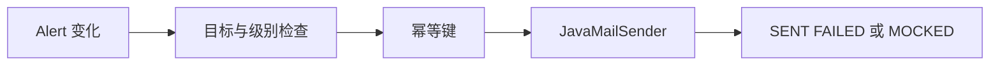

# 22 通知、幂等记录与事务风险

理解告警通知的筛选、幂等键、失败记录及生产改进方向。

## 核心要点

- 通知先检查目标启用状态、最低级别和是否已有相同发送记录。
- 幂等键由 alertId、eventCount、targetId 组成。
- 本地默认可发往 MailHog，关闭真实通知时记录 MOCKED Delivery。
- 发送失败会记录 FAILED 和异常类型，不应破坏已经形成的告警事实。
- 当前同步邮件位于数据库事务路径中，生产可采用 Outbox 或 AFTER_COMMIT 异步发送。

## 实现边界

- 先查后发后存的应用级幂等在多实例并发下仍可能竞争。
- 异步化必须保留可追踪的投递状态与重试策略。

---

## 本章测验

本章共 5 道单项选择题。普通 Markdown 请先自行选择，再展开答案；互动播放器会在提交后判定。

### 第 1 题

关于“通知、幂等记录与事务风险”的核心定位，哪项描述正确？

- A. SMTP 失败时应回滚并删除已经接收的原始 Event。
- B. 通知先检查目标启用状态、最低级别和是否已有相同发送记录。
- C. MOCKED 表示邮件已经真实投递给外部收件人。
- D. 幂等键可以省略目标标识而保持同样语义。

选择完成后展开答案

正确答案：B. 通知先检查目标启用状态、最低级别和是否已有相同发送记录。

答案解析：通知先检查目标启用状态、最低级别和是否已有相同发送记录。 这与本章图示和核心要点一致；其余选项混淆了职责、顺序或实现边界。

### 第 2 题

按照本章图示，哪一条流程顺序正确？

- A. SENT FAILED 或 MOCKED → JavaMailSender → 幂等键 → 目标与级别检查 → Alert 变化
- B. 目标与级别检查 → 幂等键 → JavaMailSender → SENT FAILED 或 MOCKED → Alert 变化
- C. Alert 变化 → SENT FAILED 或 MOCKED → 目标与级别检查 → 幂等键 → JavaMailSender
- D. Alert 变化 → 目标与级别检查 → 幂等键 → JavaMailSender → SENT FAILED 或 MOCKED

选择完成后展开答案

正确答案：D. Alert 变化 → 目标与级别检查 → 幂等键 → JavaMailSender → SENT FAILED 或 MOCKED

答案解析：Alert 变化 → 目标与级别检查 → 幂等键 → JavaMailSender → SENT FAILED 或 MOCKED 这与本章图示和核心要点一致；其余选项混淆了职责、顺序或实现边界。

### 第 3 题

关于本章组件职责，哪项理解准确？

- A. 本地默认可发往 MailHog，关闭真实通知时记录 MOCKED Delivery。
- B. MOCKED 表示邮件已经真实投递给外部收件人。
- C. 幂等键可以省略目标标识而保持同样语义。
- D. SMTP 失败时应回滚并删除已经接收的原始 Event。

选择完成后展开答案

正确答案：A. 本地默认可发往 MailHog，关闭真实通知时记录 MOCKED Delivery。

答案解析：本地默认可发往 MailHog，关闭真实通知时记录 MOCKED Delivery。 这与本章图示和核心要点一致；其余选项混淆了职责、顺序或实现边界。

### 第 4 题

在实际排查或实现时，哪项做法符合本章边界？

- A. 幂等键可以省略目标标识而保持同样语义。
- B. SMTP 失败时应回滚并删除已经接收的原始 Event。
- C. 先查后发后存的应用级幂等在多实例并发下仍可能竞争。
- D. MOCKED 表示邮件已经真实投递给外部收件人。

选择完成后展开答案

正确答案：C. 先查后发后存的应用级幂等在多实例并发下仍可能竞争。

答案解析：先查后发后存的应用级幂等在多实例并发下仍可能竞争。 这与本章图示和核心要点一致；其余选项混淆了职责、顺序或实现边界。

### 第 5 题

下列哪项最能避免本章讨论的常见误区？

- A. SMTP 失败时应回滚并删除已经接收的原始 Event。
- B. 当前同步邮件位于数据库事务路径中，生产可采用 Outbox 或 AFTER_COMMIT 异步发送。
- C. 幂等键可以省略目标标识而保持同样语义。
- D. MOCKED 表示邮件已经真实投递给外部收件人。

选择完成后展开答案

正确答案：B. 当前同步邮件位于数据库事务路径中，生产可采用 Outbox 或 AFTER_COMMIT 异步发送。

答案解析：当前同步邮件位于数据库事务路径中，生产可采用 Outbox 或 AFTER_COMMIT 异步发送。 这与本章图示和核心要点一致；其余选项混淆了职责、顺序或实现边界。

<!-- QUIZ_DATA_START
{
  "chapter": "22",
  "questions": [
    {
      "id": 1,
      "question": "关于“通知、幂等记录与事务风险”的核心定位，哪项描述正确？",
      "options": {
        "A": "SMTP 失败时应回滚并删除已经接收的原始 Event。",
        "B": "通知先检查目标启用状态、最低级别和是否已有相同发送记录。",
        "C": "MOCKED 表示邮件已经真实投递给外部收件人。",
        "D": "幂等键可以省略目标标识而保持同样语义。"
      },
      "answer": "B",
      "explanation": "通知先检查目标启用状态、最低级别和是否已有相同发送记录。 这与本章图示和核心要点一致；其余选项混淆了职责、顺序或实现边界。"
    },
    {
      "id": 2,
      "question": "按照本章图示，哪一条流程顺序正确？",
      "options": {
        "A": "SENT FAILED 或 MOCKED → JavaMailSender → 幂等键 → 目标与级别检查 → Alert 变化",
        "B": "目标与级别检查 → 幂等键 → JavaMailSender → SENT FAILED 或 MOCKED → Alert 变化",
        "C": "Alert 变化 → SENT FAILED 或 MOCKED → 目标与级别检查 → 幂等键 → JavaMailSender",
        "D": "Alert 变化 → 目标与级别检查 → 幂等键 → JavaMailSender → SENT FAILED 或 MOCKED"
      },
      "answer": "D",
      "explanation": "Alert 变化 → 目标与级别检查 → 幂等键 → JavaMailSender → SENT FAILED 或 MOCKED 这与本章图示和核心要点一致；其余选项混淆了职责、顺序或实现边界。"
    },
    {
      "id": 3,
      "question": "关于本章组件职责，哪项理解准确？",
      "options": {
        "A": "本地默认可发往 MailHog，关闭真实通知时记录 MOCKED Delivery。",
        "B": "MOCKED 表示邮件已经真实投递给外部收件人。",
        "C": "幂等键可以省略目标标识而保持同样语义。",
        "D": "SMTP 失败时应回滚并删除已经接收的原始 Event。"
      },
      "answer": "A",
      "explanation": "本地默认可发往 MailHog，关闭真实通知时记录 MOCKED Delivery。 这与本章图示和核心要点一致；其余选项混淆了职责、顺序或实现边界。"
    },
    {
      "id": 4,
      "question": "在实际排查或实现时，哪项做法符合本章边界？",
      "options": {
        "A": "幂等键可以省略目标标识而保持同样语义。",
        "B": "SMTP 失败时应回滚并删除已经接收的原始 Event。",
        "C": "先查后发后存的应用级幂等在多实例并发下仍可能竞争。",
        "D": "MOCKED 表示邮件已经真实投递给外部收件人。"
      },
      "answer": "C",
      "explanation": "先查后发后存的应用级幂等在多实例并发下仍可能竞争。 这与本章图示和核心要点一致；其余选项混淆了职责、顺序或实现边界。"
    },
    {
      "id": 5,
      "question": "下列哪项最能避免本章讨论的常见误区？",
      "options": {
        "A": "SMTP 失败时应回滚并删除已经接收的原始 Event。",
        "B": "当前同步邮件位于数据库事务路径中，生产可采用 Outbox 或 AFTER_COMMIT 异步发送。",
        "C": "幂等键可以省略目标标识而保持同样语义。",
        "D": "MOCKED 表示邮件已经真实投递给外部收件人。"
      },
      "answer": "B",
      "explanation": "当前同步邮件位于数据库事务路径中，生产可采用 Outbox 或 AFTER_COMMIT 异步发送。 这与本章图示和核心要点一致；其余选项混淆了职责、顺序或实现边界。"
    }
  ]
}
QUIZ_DATA_END -->
