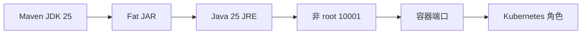

# 24 Docker、Kubernetes 端口与运行角色

理解镜像构建、非 root 运行、健康检查和协议端口映射。

## 核心要点

- Dockerfile 使用 Maven 加 JDK 25 构建，再用 Java 25 JRE Alpine 运行。
- 运行镜像不包含 Maven，并使用非 root 用户 10001。
- 容器暴露 Web 8080、Syslog TCP/UDP 5514 与 Trap UDP 1162。
- Docker Healthcheck 使用 Actuator readiness。
- 同一应用镜像可通过运行参数承担 Web、接收器或 Worker 等逻辑角色。

## 实现边界

- 镜像和 YAML 存在不证明真实集群已经成功部署。
- 生产外部 514、162、443 需通过合适的负载均衡与服务映射。

---

## 本章测验

本章共 5 道单项选择题。普通 Markdown 请先自行选择，再展开答案；互动播放器会在提交后判定。

### 第 1 题

关于“Docker、Kubernetes 端口与运行角色”的核心定位，哪项描述正确？

- A. 运行镜像必须保留 Maven 和完整 JDK 才能启动 Fat JAR。
- B. Dockerfile 使用 Maven 加 JDK 25 构建，再用 Java 25 JRE Alpine 运行。
- C. UDP 协议可以只靠普通 HTTP Ingress 完成全部转发。
- D. 容器以 root 运行是项目既定的安全要求。

选择完成后展开答案

正确答案：B. Dockerfile 使用 Maven 加 JDK 25 构建，再用 Java 25 JRE Alpine 运行。

答案解析：Dockerfile 使用 Maven 加 JDK 25 构建，再用 Java 25 JRE Alpine 运行。 这与本章图示和核心要点一致；其余选项混淆了职责、顺序或实现边界。

### 第 2 题

按照本章图示，哪一条流程顺序正确？

- A. Kubernetes 角色 → 容器端口 → 非 root 10001 → Java 25 JRE → Fat JAR → Maven JDK 25
- B. Fat JAR → Java 25 JRE → 非 root 10001 → 容器端口 → Kubernetes 角色 → Maven JDK 25
- C. Maven JDK 25 → Kubernetes 角色 → Fat JAR → Java 25 JRE → 非 root 10001 → 容器端口
- D. Maven JDK 25 → Fat JAR → Java 25 JRE → 非 root 10001 → 容器端口 → Kubernetes 角色

选择完成后展开答案

正确答案：D. Maven JDK 25 → Fat JAR → Java 25 JRE → 非 root 10001 → 容器端口 → Kubernetes 角色

答案解析：Maven JDK 25 → Fat JAR → Java 25 JRE → 非 root 10001 → 容器端口 → Kubernetes 角色 这与本章图示和核心要点一致；其余选项混淆了职责、顺序或实现边界。

### 第 3 题

关于本章组件职责，哪项理解准确？

- A. 容器暴露 Web 8080、Syslog TCP/UDP 5514 与 Trap UDP 1162。
- B. UDP 协议可以只靠普通 HTTP Ingress 完成全部转发。
- C. 容器以 root 运行是项目既定的安全要求。
- D. 运行镜像必须保留 Maven 和完整 JDK 才能启动 Fat JAR。

选择完成后展开答案

正确答案：A. 容器暴露 Web 8080、Syslog TCP/UDP 5514 与 Trap UDP 1162。

答案解析：容器暴露 Web 8080、Syslog TCP/UDP 5514 与 Trap UDP 1162。 这与本章图示和核心要点一致；其余选项混淆了职责、顺序或实现边界。

### 第 4 题

在实际排查或实现时，哪项做法符合本章边界？

- A. 容器以 root 运行是项目既定的安全要求。
- B. 运行镜像必须保留 Maven 和完整 JDK 才能启动 Fat JAR。
- C. 镜像和 YAML 存在不证明真实集群已经成功部署。
- D. UDP 协议可以只靠普通 HTTP Ingress 完成全部转发。

选择完成后展开答案

正确答案：C. 镜像和 YAML 存在不证明真实集群已经成功部署。

答案解析：镜像和 YAML 存在不证明真实集群已经成功部署。 这与本章图示和核心要点一致；其余选项混淆了职责、顺序或实现边界。

### 第 5 题

下列哪项最能避免本章讨论的常见误区？

- A. 运行镜像必须保留 Maven 和完整 JDK 才能启动 Fat JAR。
- B. 同一应用镜像可通过运行参数承担 Web、接收器或 Worker 等逻辑角色。
- C. 容器以 root 运行是项目既定的安全要求。
- D. UDP 协议可以只靠普通 HTTP Ingress 完成全部转发。

选择完成后展开答案

正确答案：B. 同一应用镜像可通过运行参数承担 Web、接收器或 Worker 等逻辑角色。

答案解析：同一应用镜像可通过运行参数承担 Web、接收器或 Worker 等逻辑角色。 这与本章图示和核心要点一致；其余选项混淆了职责、顺序或实现边界。

<!-- QUIZ_DATA_START
{
  "chapter": "24",
  "questions": [
    {
      "id": 1,
      "question": "关于“Docker、Kubernetes 端口与运行角色”的核心定位，哪项描述正确？",
      "options": {
        "A": "运行镜像必须保留 Maven 和完整 JDK 才能启动 Fat JAR。",
        "B": "Dockerfile 使用 Maven 加 JDK 25 构建，再用 Java 25 JRE Alpine 运行。",
        "C": "UDP 协议可以只靠普通 HTTP Ingress 完成全部转发。",
        "D": "容器以 root 运行是项目既定的安全要求。"
      },
      "answer": "B",
      "explanation": "Dockerfile 使用 Maven 加 JDK 25 构建，再用 Java 25 JRE Alpine 运行。 这与本章图示和核心要点一致；其余选项混淆了职责、顺序或实现边界。"
    },
    {
      "id": 2,
      "question": "按照本章图示，哪一条流程顺序正确？",
      "options": {
        "A": "Kubernetes 角色 → 容器端口 → 非 root 10001 → Java 25 JRE → Fat JAR → Maven JDK 25",
        "B": "Fat JAR → Java 25 JRE → 非 root 10001 → 容器端口 → Kubernetes 角色 → Maven JDK 25",
        "C": "Maven JDK 25 → Kubernetes 角色 → Fat JAR → Java 25 JRE → 非 root 10001 → 容器端口",
        "D": "Maven JDK 25 → Fat JAR → Java 25 JRE → 非 root 10001 → 容器端口 → Kubernetes 角色"
      },
      "answer": "D",
      "explanation": "Maven JDK 25 → Fat JAR → Java 25 JRE → 非 root 10001 → 容器端口 → Kubernetes 角色 这与本章图示和核心要点一致；其余选项混淆了职责、顺序或实现边界。"
    },
    {
      "id": 3,
      "question": "关于本章组件职责，哪项理解准确？",
      "options": {
        "A": "容器暴露 Web 8080、Syslog TCP/UDP 5514 与 Trap UDP 1162。",
        "B": "UDP 协议可以只靠普通 HTTP Ingress 完成全部转发。",
        "C": "容器以 root 运行是项目既定的安全要求。",
        "D": "运行镜像必须保留 Maven 和完整 JDK 才能启动 Fat JAR。"
      },
      "answer": "A",
      "explanation": "容器暴露 Web 8080、Syslog TCP/UDP 5514 与 Trap UDP 1162。 这与本章图示和核心要点一致；其余选项混淆了职责、顺序或实现边界。"
    },
    {
      "id": 4,
      "question": "在实际排查或实现时，哪项做法符合本章边界？",
      "options": {
        "A": "容器以 root 运行是项目既定的安全要求。",
        "B": "运行镜像必须保留 Maven 和完整 JDK 才能启动 Fat JAR。",
        "C": "镜像和 YAML 存在不证明真实集群已经成功部署。",
        "D": "UDP 协议可以只靠普通 HTTP Ingress 完成全部转发。"
      },
      "answer": "C",
      "explanation": "镜像和 YAML 存在不证明真实集群已经成功部署。 这与本章图示和核心要点一致；其余选项混淆了职责、顺序或实现边界。"
    },
    {
      "id": 5,
      "question": "下列哪项最能避免本章讨论的常见误区？",
      "options": {
        "A": "运行镜像必须保留 Maven 和完整 JDK 才能启动 Fat JAR。",
        "B": "同一应用镜像可通过运行参数承担 Web、接收器或 Worker 等逻辑角色。",
        "C": "容器以 root 运行是项目既定的安全要求。",
        "D": "UDP 协议可以只靠普通 HTTP Ingress 完成全部转发。"
      },
      "answer": "B",
      "explanation": "同一应用镜像可通过运行参数承担 Web、接收器或 Worker 等逻辑角色。 这与本章图示和核心要点一致；其余选项混淆了职责、顺序或实现边界。"
    }
  ]
}
QUIZ_DATA_END -->
