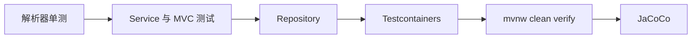

# 25 测试金字塔与验证边界

知道不同测试证明什么，并避免把配置检查说成生产部署成功。

## 核心要点

- 测试技术包括 JUnit 5、Mockito、Spring Boot Test、MockMvc 和 Security Test。
- 解析器、业务服务、MVC、安全、调度器和云函数边界都有对应测试设计。
- Testcontainers PostgreSQL 用于靠近真实驱动和数据库行为的验证。
- 完整 Maven 验证命令是 ./mvnw clean verify。
- JaCoCo 报告位于 app/bms-app/target/site/jacoco/index.html。

## 实现边界

- 若 Docker Engine 不可用，Testcontainers 跳过不能算该边界通过。
- compose config 或清单渲染通过只证明配置结构，不证明容器和集群运行。

---

## 本章测验

本章共 5 道单项选择题。普通 Markdown 请先自行选择，再展开答案；互动播放器会在提交后判定。

### 第 1 题

关于“测试金字塔与验证边界”的核心定位，哪项描述正确？

- A. 单元测试通过即可证明真实云网络和设备全部可达。
- B. 测试技术包括 JUnit 5、Mockito、Spring Boot Test、MockMvc 和 Security Test。
- C. Testcontainers 不需要任何容器运行时。
- D. JaCoCo 报告负责执行生产数据库迁移。

选择完成后展开答案

正确答案：B. 测试技术包括 JUnit 5、Mockito、Spring Boot Test、MockMvc 和 Security Test。

答案解析：测试技术包括 JUnit 5、Mockito、Spring Boot Test、MockMvc 和 Security Test。 这与本章图示和核心要点一致；其余选项混淆了职责、顺序或实现边界。

### 第 2 题

按照本章图示，哪一条流程顺序正确？

- A. JaCoCo → mvnw clean verify → Testcontainers → Repository → Service 与 MVC 测试 → 解析器单测
- B. Service 与 MVC 测试 → Repository → Testcontainers → mvnw clean verify → JaCoCo → 解析器单测
- C. 解析器单测 → JaCoCo → Service 与 MVC 测试 → Repository → Testcontainers → mvnw clean verify
- D. 解析器单测 → Service 与 MVC 测试 → Repository → Testcontainers → mvnw clean verify → JaCoCo

选择完成后展开答案

正确答案：D. 解析器单测 → Service 与 MVC 测试 → Repository → Testcontainers → mvnw clean verify → JaCoCo

答案解析：解析器单测 → Service 与 MVC 测试 → Repository → Testcontainers → mvnw clean verify → JaCoCo 这与本章图示和核心要点一致；其余选项混淆了职责、顺序或实现边界。

### 第 3 题

关于本章组件职责，哪项理解准确？

- A. Testcontainers PostgreSQL 用于靠近真实驱动和数据库行为的验证。
- B. Testcontainers 不需要任何容器运行时。
- C. JaCoCo 报告负责执行生产数据库迁移。
- D. 单元测试通过即可证明真实云网络和设备全部可达。

选择完成后展开答案

正确答案：A. Testcontainers PostgreSQL 用于靠近真实驱动和数据库行为的验证。

答案解析：Testcontainers PostgreSQL 用于靠近真实驱动和数据库行为的验证。 这与本章图示和核心要点一致；其余选项混淆了职责、顺序或实现边界。

### 第 4 题

在实际排查或实现时，哪项做法符合本章边界？

- A. JaCoCo 报告负责执行生产数据库迁移。
- B. 单元测试通过即可证明真实云网络和设备全部可达。
- C. 若 Docker Engine 不可用，Testcontainers 跳过不能算该边界通过。
- D. Testcontainers 不需要任何容器运行时。

选择完成后展开答案

正确答案：C. 若 Docker Engine 不可用，Testcontainers 跳过不能算该边界通过。

答案解析：若 Docker Engine 不可用，Testcontainers 跳过不能算该边界通过。 这与本章图示和核心要点一致；其余选项混淆了职责、顺序或实现边界。

### 第 5 题

下列哪项最能避免本章讨论的常见误区？

- A. 单元测试通过即可证明真实云网络和设备全部可达。
- B. JaCoCo 报告位于 app/bms-app/target/site/jacoco/index.html。
- C. JaCoCo 报告负责执行生产数据库迁移。
- D. Testcontainers 不需要任何容器运行时。

选择完成后展开答案

正确答案：B. JaCoCo 报告位于 app/bms-app/target/site/jacoco/index.html。

答案解析：JaCoCo 报告位于 app/bms-app/target/site/jacoco/index.html。 这与本章图示和核心要点一致；其余选项混淆了职责、顺序或实现边界。

<!-- QUIZ_DATA_START
{
  "chapter": "25",
  "questions": [
    {
      "id": 1,
      "question": "关于“测试金字塔与验证边界”的核心定位，哪项描述正确？",
      "options": {
        "A": "单元测试通过即可证明真实云网络和设备全部可达。",
        "B": "测试技术包括 JUnit 5、Mockito、Spring Boot Test、MockMvc 和 Security Test。",
        "C": "Testcontainers 不需要任何容器运行时。",
        "D": "JaCoCo 报告负责执行生产数据库迁移。"
      },
      "answer": "B",
      "explanation": "测试技术包括 JUnit 5、Mockito、Spring Boot Test、MockMvc 和 Security Test。 这与本章图示和核心要点一致；其余选项混淆了职责、顺序或实现边界。"
    },
    {
      "id": 2,
      "question": "按照本章图示，哪一条流程顺序正确？",
      "options": {
        "A": "JaCoCo → mvnw clean verify → Testcontainers → Repository → Service 与 MVC 测试 → 解析器单测",
        "B": "Service 与 MVC 测试 → Repository → Testcontainers → mvnw clean verify → JaCoCo → 解析器单测",
        "C": "解析器单测 → JaCoCo → Service 与 MVC 测试 → Repository → Testcontainers → mvnw clean verify",
        "D": "解析器单测 → Service 与 MVC 测试 → Repository → Testcontainers → mvnw clean verify → JaCoCo"
      },
      "answer": "D",
      "explanation": "解析器单测 → Service 与 MVC 测试 → Repository → Testcontainers → mvnw clean verify → JaCoCo 这与本章图示和核心要点一致；其余选项混淆了职责、顺序或实现边界。"
    },
    {
      "id": 3,
      "question": "关于本章组件职责，哪项理解准确？",
      "options": {
        "A": "Testcontainers PostgreSQL 用于靠近真实驱动和数据库行为的验证。",
        "B": "Testcontainers 不需要任何容器运行时。",
        "C": "JaCoCo 报告负责执行生产数据库迁移。",
        "D": "单元测试通过即可证明真实云网络和设备全部可达。"
      },
      "answer": "A",
      "explanation": "Testcontainers PostgreSQL 用于靠近真实驱动和数据库行为的验证。 这与本章图示和核心要点一致；其余选项混淆了职责、顺序或实现边界。"
    },
    {
      "id": 4,
      "question": "在实际排查或实现时，哪项做法符合本章边界？",
      "options": {
        "A": "JaCoCo 报告负责执行生产数据库迁移。",
        "B": "单元测试通过即可证明真实云网络和设备全部可达。",
        "C": "若 Docker Engine 不可用，Testcontainers 跳过不能算该边界通过。",
        "D": "Testcontainers 不需要任何容器运行时。"
      },
      "answer": "C",
      "explanation": "若 Docker Engine 不可用，Testcontainers 跳过不能算该边界通过。 这与本章图示和核心要点一致；其余选项混淆了职责、顺序或实现边界。"
    },
    {
      "id": 5,
      "question": "下列哪项最能避免本章讨论的常见误区？",
      "options": {
        "A": "单元测试通过即可证明真实云网络和设备全部可达。",
        "B": "JaCoCo 报告位于 app/bms-app/target/site/jacoco/index.html。",
        "C": "JaCoCo 报告负责执行生产数据库迁移。",
        "D": "Testcontainers 不需要任何容器运行时。"
      },
      "answer": "B",
      "explanation": "JaCoCo 报告位于 app/bms-app/target/site/jacoco/index.html。 这与本章图示和核心要点一致；其余选项混淆了职责、顺序或实现边界。"
    }
  ]
}
QUIZ_DATA_END -->
