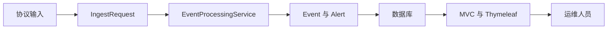

# 27 课程总结：两条链路与一个核心

把页面链路、监控链路、领域模型和验证边界重新连成一张图。

## 核心要点

- 监控链路把多协议输入统一为 IngestRequest，再由核心事务服务处理。
- Event 保存事实，Alert 聚合持续故障，确认、恢复和关闭含义不同。
- 页面链路经 Security、MVC、Service、Repository、Model 和 Thymeleaf 返回 HTML。
- Actuator、测试和容器配置提供可验证基础，但不等于生产部署已经完成。
- 继续学习可聚焦 Outbox、并发幂等、SNMPv3、企业身份和真实时序聚合。

## 实现边界

- 始终区分当前实现、浏览器模拟、配置脚手架与生产建议。
- 最终判断应以实际代码、配置和已执行验证为依据。

---

## 本章测验

本章共 5 道单项选择题。普通 Markdown 请先自行选择，再展开答案；互动播放器会在提交后判定。

### 第 1 题

关于“课程总结：两条链路与一个核心”的核心定位，哪项描述正确？

- A. Visual Explorer 的浏览器模拟就是后端生产环境。
- B. 监控链路把多协议输入统一为 IngestRequest，再由核心事务服务处理。
- C. Alert 与 Event 可以无差别合并且不影响语义。
- D. 配置文件存在即可证明云端和 Kubernetes 已部署成功。

选择完成后展开答案

正确答案：B. 监控链路把多协议输入统一为 IngestRequest，再由核心事务服务处理。

答案解析：监控链路把多协议输入统一为 IngestRequest，再由核心事务服务处理。 这与本章图示和核心要点一致；其余选项混淆了职责、顺序或实现边界。

### 第 2 题

按照本章图示，哪一条流程顺序正确？

- A. 运维人员 → MVC 与 Thymeleaf → 数据库 → Event 与 Alert → EventProcessingService → IngestRequest → 协议输入
- B. IngestRequest → EventProcessingService → Event 与 Alert → 数据库 → MVC 与 Thymeleaf → 运维人员 → 协议输入
- C. 协议输入 → 运维人员 → IngestRequest → EventProcessingService → Event 与 Alert → 数据库 → MVC 与 Thymeleaf
- D. 协议输入 → IngestRequest → EventProcessingService → Event 与 Alert → 数据库 → MVC 与 Thymeleaf → 运维人员

选择完成后展开答案

正确答案：D. 协议输入 → IngestRequest → EventProcessingService → Event 与 Alert → 数据库 → MVC 与 Thymeleaf → 运维人员

答案解析：协议输入 → IngestRequest → EventProcessingService → Event 与 Alert → 数据库 → MVC 与 Thymeleaf → 运维人员 这与本章图示和核心要点一致；其余选项混淆了职责、顺序或实现边界。

### 第 3 题

关于本章组件职责，哪项理解准确？

- A. 页面链路经 Security、MVC、Service、Repository、Model 和 Thymeleaf 返回 HTML。
- B. Alert 与 Event 可以无差别合并且不影响语义。
- C. 配置文件存在即可证明云端和 Kubernetes 已部署成功。
- D. Visual Explorer 的浏览器模拟就是后端生产环境。

选择完成后展开答案

正确答案：A. 页面链路经 Security、MVC、Service、Repository、Model 和 Thymeleaf 返回 HTML。

答案解析：页面链路经 Security、MVC、Service、Repository、Model 和 Thymeleaf 返回 HTML。 这与本章图示和核心要点一致；其余选项混淆了职责、顺序或实现边界。

### 第 4 题

在实际排查或实现时，哪项做法符合本章边界？

- A. 配置文件存在即可证明云端和 Kubernetes 已部署成功。
- B. Visual Explorer 的浏览器模拟就是后端生产环境。
- C. 始终区分当前实现、浏览器模拟、配置脚手架与生产建议。
- D. Alert 与 Event 可以无差别合并且不影响语义。

选择完成后展开答案

正确答案：C. 始终区分当前实现、浏览器模拟、配置脚手架与生产建议。

答案解析：始终区分当前实现、浏览器模拟、配置脚手架与生产建议。 这与本章图示和核心要点一致；其余选项混淆了职责、顺序或实现边界。

### 第 5 题

下列哪项最能避免本章讨论的常见误区？

- A. Visual Explorer 的浏览器模拟就是后端生产环境。
- B. 继续学习可聚焦 Outbox、并发幂等、SNMPv3、企业身份和真实时序聚合。
- C. 配置文件存在即可证明云端和 Kubernetes 已部署成功。
- D. Alert 与 Event 可以无差别合并且不影响语义。

选择完成后展开答案

正确答案：B. 继续学习可聚焦 Outbox、并发幂等、SNMPv3、企业身份和真实时序聚合。

答案解析：继续学习可聚焦 Outbox、并发幂等、SNMPv3、企业身份和真实时序聚合。 这与本章图示和核心要点一致；其余选项混淆了职责、顺序或实现边界。

<!-- QUIZ_DATA_START
{
  "chapter": "27",
  "questions": [
    {
      "id": 1,
      "question": "关于“课程总结：两条链路与一个核心”的核心定位，哪项描述正确？",
      "options": {
        "A": "Visual Explorer 的浏览器模拟就是后端生产环境。",
        "B": "监控链路把多协议输入统一为 IngestRequest，再由核心事务服务处理。",
        "C": "Alert 与 Event 可以无差别合并且不影响语义。",
        "D": "配置文件存在即可证明云端和 Kubernetes 已部署成功。"
      },
      "answer": "B",
      "explanation": "监控链路把多协议输入统一为 IngestRequest，再由核心事务服务处理。 这与本章图示和核心要点一致；其余选项混淆了职责、顺序或实现边界。"
    },
    {
      "id": 2,
      "question": "按照本章图示，哪一条流程顺序正确？",
      "options": {
        "A": "运维人员 → MVC 与 Thymeleaf → 数据库 → Event 与 Alert → EventProcessingService → IngestRequest → 协议输入",
        "B": "IngestRequest → EventProcessingService → Event 与 Alert → 数据库 → MVC 与 Thymeleaf → 运维人员 → 协议输入",
        "C": "协议输入 → 运维人员 → IngestRequest → EventProcessingService → Event 与 Alert → 数据库 → MVC 与 Thymeleaf",
        "D": "协议输入 → IngestRequest → EventProcessingService → Event 与 Alert → 数据库 → MVC 与 Thymeleaf → 运维人员"
      },
      "answer": "D",
      "explanation": "协议输入 → IngestRequest → EventProcessingService → Event 与 Alert → 数据库 → MVC 与 Thymeleaf → 运维人员 这与本章图示和核心要点一致；其余选项混淆了职责、顺序或实现边界。"
    },
    {
      "id": 3,
      "question": "关于本章组件职责，哪项理解准确？",
      "options": {
        "A": "页面链路经 Security、MVC、Service、Repository、Model 和 Thymeleaf 返回 HTML。",
        "B": "Alert 与 Event 可以无差别合并且不影响语义。",
        "C": "配置文件存在即可证明云端和 Kubernetes 已部署成功。",
        "D": "Visual Explorer 的浏览器模拟就是后端生产环境。"
      },
      "answer": "A",
      "explanation": "页面链路经 Security、MVC、Service、Repository、Model 和 Thymeleaf 返回 HTML。 这与本章图示和核心要点一致；其余选项混淆了职责、顺序或实现边界。"
    },
    {
      "id": 4,
      "question": "在实际排查或实现时，哪项做法符合本章边界？",
      "options": {
        "A": "配置文件存在即可证明云端和 Kubernetes 已部署成功。",
        "B": "Visual Explorer 的浏览器模拟就是后端生产环境。",
        "C": "始终区分当前实现、浏览器模拟、配置脚手架与生产建议。",
        "D": "Alert 与 Event 可以无差别合并且不影响语义。"
      },
      "answer": "C",
      "explanation": "始终区分当前实现、浏览器模拟、配置脚手架与生产建议。 这与本章图示和核心要点一致；其余选项混淆了职责、顺序或实现边界。"
    },
    {
      "id": 5,
      "question": "下列哪项最能避免本章讨论的常见误区？",
      "options": {
        "A": "Visual Explorer 的浏览器模拟就是后端生产环境。",
        "B": "继续学习可聚焦 Outbox、并发幂等、SNMPv3、企业身份和真实时序聚合。",
        "C": "配置文件存在即可证明云端和 Kubernetes 已部署成功。",
        "D": "Alert 与 Event 可以无差别合并且不影响语义。"
      },
      "answer": "B",
      "explanation": "继续学习可聚焦 Outbox、并发幂等、SNMPv3、企业身份和真实时序聚合。 这与本章图示和核心要点一致；其余选项混淆了职责、顺序或实现边界。"
    }
  ]
}
QUIZ_DATA_END -->
