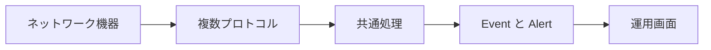

# 01 監視課題からモジュラーモノリスへ

システムが解決する課題と、マイクロサービスではない理由を把握します。

## 重要ポイント

- バックエンドは Spring Boot によるサーバーサイドレンダリング型のモジュラーモノリスです。
- 主な入力は Syslog、SNMP Trap、SNMP GET、TCP ポートチェックです。
- 各プロトコルは個別のアラートロジックを持たず、共通の業務処理へ合流します。
- 主要アプリケーション、共通データベース、共通ドメインモデルで動作します。
- Visual Explorer は独立した Vue 教材であり、ブラウザー内のシミュレーションは実運用を意味しません。

## 実装上の境界

- 現在の実装、教材内シミュレーション、本番向け改善案を区別します。
- 図や設定ファイルの存在だけで、実環境への導入完了とは判断しません。

---

## 章末クイズ

全 5 問の単一選択問題です。通常の Markdown では先に自分で選び、その後で折りたたみを開いてください。

### 第 1 問

「監視課題からモジュラーモノリスへ」の中心的な説明として正しいものはどれですか。

- A. 提供資料における現在の基準は Java 25 と Spring Boot 3.5.14 です。
- B. バックエンドは Spring Boot によるサーバーサイドレンダリング型のモジュラーモノリスです。
- C. 画面要求は Spring Security Filter を通ってから Controller に入ります。
- D. th:text などの属性が Java オブジェクトの値を HTML に反映します。

回答後に解答を開く

正解：B. バックエンドは Spring Boot によるサーバーサイドレンダリング型のモジュラーモノリスです。

解説：バックエンドは Spring Boot によるサーバーサイドレンダリング型のモジュラーモノリスです。 これは本章の図と要点に一致します。他の選択肢は別章の事実、誤った順序、または検証境界の混同です。

### 第 2 問

章の図に沿った処理順序はどれですか。

- A. 運用画面 → Event と Alert → 共通処理 → 複数プロトコル → ネットワーク機器
- B. 複数プロトコル → 共通処理 → Event と Alert → 運用画面 → ネットワーク機器
- C. ネットワーク機器 → 運用画面 → 複数プロトコル → 共通処理 → Event と Alert
- D. ネットワーク機器 → 複数プロトコル → 共通処理 → Event と Alert → 運用画面

回答後に解答を開く

正解：D. ネットワーク機器 → 複数プロトコル → 共通処理 → Event と Alert → 運用画面

解説：ネットワーク機器 → 複数プロトコル → 共通処理 → Event と Alert → 運用画面 これは本章の図と要点に一致します。他の選択肢は別章の事実、誤った順序、または検証境界の混同です。

### 第 3 問

この章で説明したコンポーネントの責務として正しいものはどれですか。

- A. 各プロトコルは個別のアラートロジックを持たず、共通の業務処理へ合流します。
- B. app/bms-app が Spring Boot の主アプリケーションです。
- C. Controller は Model にデータを格納し、テンプレートの論理名を返します。
- D. テンプレートは resources/templates、静的リソースは resources/static に置かれます。

回答後に解答を開く

正解：A. 各プロトコルは個別のアラートロジックを持たず、共通の業務処理へ合流します。

解説：各プロトコルは個別のアラートロジックを持たず、共通の業務処理へ合流します。 これは本章の図と要点に一致します。他の選択肢は別章の事実、誤った順序、または検証境界の混同です。

### 第 4 問

実装や調査を行う際、最も適切な判断はどれですか。

- A. 図に要素があれば、本番導入済みと判断します。
- B. 未実行またはスキップされた検証も成功として報告します。
- C. 現在の実装、教材内のシミュレーション、本番向け提案を区別して確認します。
- D. 画面でボタンを隠せば、サーバー側認可は不要です。

回答後に解答を開く

正解：C. 現在の実装、教材内のシミュレーション、本番向け提案を区別して確認します。

解説：現在の実装、教材内のシミュレーション、本番向け提案を区別して確認します。 これは本章の図と要点に一致します。他の選択肢は別章の事実、誤った順序、または検証境界の混同です。

### 第 5 問

この章の代表的な誤解を避ける説明はどれですか。

- A. 古い Java 21 表記より、現在の pom.xml と Dockerfile にある Java 25 を優先します。
- B. Visual Explorer は独立した Vue 教材であり、ブラウザー内のシミュレーションは実運用を意味しません。
- C. ブラウザーが受け取るのは、サーバーで組み立てられた HTML です。
- D. HTML の仮テキストは実行時に Model の実際の値へ置き換わります。

回答後に解答を開く

正解：B. Visual Explorer は独立した Vue 教材であり、ブラウザー内のシミュレーションは実運用を意味しません。

解説：Visual Explorer は独立した Vue 教材であり、ブラウザー内のシミュレーションは実運用を意味しません。 これは本章の図と要点に一致します。他の選択肢は別章の事実、誤った順序、または検証境界の混同です。

<!-- QUIZ_DATA_START
{
  "chapter": "01",
  "questions": [
    {
      "id": 1,
      "question": "「監視課題からモジュラーモノリスへ」の中心的な説明として正しいものはどれですか。",
      "options": {
        "A": "提供資料における現在の基準は Java 25 と Spring Boot 3.5.14 です。",
        "B": "バックエンドは Spring Boot によるサーバーサイドレンダリング型のモジュラーモノリスです。",
        "C": "画面要求は Spring Security Filter を通ってから Controller に入ります。",
        "D": "th:text などの属性が Java オブジェクトの値を HTML に反映します。"
      },
      "answer": "B",
      "explanation": "バックエンドは Spring Boot によるサーバーサイドレンダリング型のモジュラーモノリスです。 これは本章の図と要点に一致します。他の選択肢は別章の事実、誤った順序、または検証境界の混同です。"
    },
    {
      "id": 2,
      "question": "章の図に沿った処理順序はどれですか。",
      "options": {
        "A": "運用画面 → Event と Alert → 共通処理 → 複数プロトコル → ネットワーク機器",
        "B": "複数プロトコル → 共通処理 → Event と Alert → 運用画面 → ネットワーク機器",
        "C": "ネットワーク機器 → 運用画面 → 複数プロトコル → 共通処理 → Event と Alert",
        "D": "ネットワーク機器 → 複数プロトコル → 共通処理 → Event と Alert → 運用画面"
      },
      "answer": "D",
      "explanation": "ネットワーク機器 → 複数プロトコル → 共通処理 → Event と Alert → 運用画面 これは本章の図と要点に一致します。他の選択肢は別章の事実、誤った順序、または検証境界の混同です。"
    },
    {
      "id": 3,
      "question": "この章で説明したコンポーネントの責務として正しいものはどれですか。",
      "options": {
        "A": "各プロトコルは個別のアラートロジックを持たず、共通の業務処理へ合流します。",
        "B": "app/bms-app が Spring Boot の主アプリケーションです。",
        "C": "Controller は Model にデータを格納し、テンプレートの論理名を返します。",
        "D": "テンプレートは resources/templates、静的リソースは resources/static に置かれます。"
      },
      "answer": "A",
      "explanation": "各プロトコルは個別のアラートロジックを持たず、共通の業務処理へ合流します。 これは本章の図と要点に一致します。他の選択肢は別章の事実、誤った順序、または検証境界の混同です。"
    },
    {
      "id": 4,
      "question": "実装や調査を行う際、最も適切な判断はどれですか。",
      "options": {
        "A": "図に要素があれば、本番導入済みと判断します。",
        "B": "未実行またはスキップされた検証も成功として報告します。",
        "C": "現在の実装、教材内のシミュレーション、本番向け提案を区別して確認します。",
        "D": "画面でボタンを隠せば、サーバー側認可は不要です。"
      },
      "answer": "C",
      "explanation": "現在の実装、教材内のシミュレーション、本番向け提案を区別して確認します。 これは本章の図と要点に一致します。他の選択肢は別章の事実、誤った順序、または検証境界の混同です。"
    },
    {
      "id": 5,
      "question": "この章の代表的な誤解を避ける説明はどれですか。",
      "options": {
        "A": "古い Java 21 表記より、現在の pom.xml と Dockerfile にある Java 25 を優先します。",
        "B": "Visual Explorer は独立した Vue 教材であり、ブラウザー内のシミュレーションは実運用を意味しません。",
        "C": "ブラウザーが受け取るのは、サーバーで組み立てられた HTML です。",
        "D": "HTML の仮テキストは実行時に Model の実際の値へ置き換わります。"
      },
      "answer": "B",
      "explanation": "Visual Explorer は独立した Vue 教材であり、ブラウザー内のシミュレーションは実運用を意味しません。 これは本章の図と要点に一致します。他の選択肢は別章の事実、誤った順序、または検証境界の混同です。"
    }
  ]
}
QUIZ_DATA_END -->
