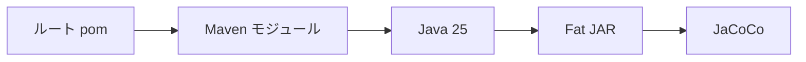

# 02 バージョン、モジュール、ビルド境界

現在の技術基準、Maven マルチモジュール構成、生成物を確認します。

## 重要ポイント

- 提供資料における現在の基準は Java 25 と Spring Boot 3.5.14 です。
- Maven Wrapper とルート pom が主アプリ、シミュレーター、クラウド関数例を統合します。
- app/bms-app が Spring Boot の主アプリケーションです。
- 主アプリは実行可能な Spring Boot Fat JAR としてパッケージ化されます。
- 古い Java 21 表記より、現在の pom.xml と Dockerfile にある Java 25 を優先します。

## 実装上の境界

- 現在の実装、教材内シミュレーション、本番向け改善案を区別します。
- 図や設定ファイルの存在だけで、実環境への導入完了とは判断しません。

---

## 章末クイズ

全 5 問の単一選択問題です。通常の Markdown では先に自分で選び、その後で折りたたみを開いてください。

### 第 1 問

「バージョン、モジュール、ビルド境界」の中心的な説明として正しいものはどれですか。

- A. 画面要求は Spring Security Filter を通ってから Controller に入ります。
- B. 提供資料における現在の基準は Java 25 と Spring Boot 3.5.14 です。
- C. th:text などの属性が Java オブジェクトの値を HTML に反映します。
- D. Thymeleaf Fragment はヘッダー、ナビゲーション、メッセージ領域を再利用します。

回答後に解答を開く

正解：B. 提供資料における現在の基準は Java 25 と Spring Boot 3.5.14 です。

解説：提供資料における現在の基準は Java 25 と Spring Boot 3.5.14 です。 これは本章の図と要点に一致します。他の選択肢は別章の事実、誤った順序、または検証境界の混同です。

### 第 2 問

章の図に沿った処理順序はどれですか。

- A. JaCoCo → Fat JAR → Java 25 → Maven モジュール → ルート pom
- B. Maven モジュール → Java 25 → Fat JAR → JaCoCo → ルート pom
- C. ルート pom → JaCoCo → Maven モジュール → Java 25 → Fat JAR
- D. ルート pom → Maven モジュール → Java 25 → Fat JAR → JaCoCo

回答後に解答を開く

正解：D. ルート pom → Maven モジュール → Java 25 → Fat JAR → JaCoCo

解説：ルート pom → Maven モジュール → Java 25 → Fat JAR → JaCoCo これは本章の図と要点に一致します。他の選択肢は別章の事実、誤った順序、または検証境界の混同です。

### 第 3 問

この章で説明したコンポーネントの責務として正しいものはどれですか。

- A. app/bms-app が Spring Boot の主アプリケーションです。
- B. Controller は Model にデータを格納し、テンプレートの論理名を返します。
- C. テンプレートは resources/templates、静的リソースは resources/static に置かれます。
- D. 共通レイアウトにより権限別ナビゲーションとスタイル入口を一元管理できます。

回答後に解答を開く

正解：A. app/bms-app が Spring Boot の主アプリケーションです。

解説：app/bms-app が Spring Boot の主アプリケーションです。 これは本章の図と要点に一致します。他の選択肢は別章の事実、誤った順序、または検証境界の混同です。

### 第 4 問

実装や調査を行う際、最も適切な判断はどれですか。

- A. 図に要素があれば、本番導入済みと判断します。
- B. 未実行またはスキップされた検証も成功として報告します。
- C. 現在の実装、教材内のシミュレーション、本番向け提案を区別して確認します。
- D. 画面でボタンを隠せば、サーバー側認可は不要です。

回答後に解答を開く

正解：C. 現在の実装、教材内のシミュレーション、本番向け提案を区別して確認します。

解説：現在の実装、教材内のシミュレーション、本番向け提案を区別して確認します。 これは本章の図と要点に一致します。他の選択肢は別章の事実、誤った順序、または検証境界の混同です。

### 第 5 問

この章の代表的な誤解を避ける説明はどれですか。

- A. ブラウザーが受け取るのは、サーバーで組み立てられた HTML です。
- B. 古い Java 21 表記より、現在の pom.xml と Dockerfile にある Java 25 を優先します。
- C. HTML の仮テキストは実行時に Model の実際の値へ置き換わります。
- D. 共通骨格の変更は多数のページに影響するため、画面回帰確認が必要です。

回答後に解答を開く

正解：B. 古い Java 21 表記より、現在の pom.xml と Dockerfile にある Java 25 を優先します。

解説：古い Java 21 表記より、現在の pom.xml と Dockerfile にある Java 25 を優先します。 これは本章の図と要点に一致します。他の選択肢は別章の事実、誤った順序、または検証境界の混同です。

<!-- QUIZ_DATA_START
{
  "chapter": "02",
  "questions": [
    {
      "id": 1,
      "question": "「バージョン、モジュール、ビルド境界」の中心的な説明として正しいものはどれですか。",
      "options": {
        "A": "画面要求は Spring Security Filter を通ってから Controller に入ります。",
        "B": "提供資料における現在の基準は Java 25 と Spring Boot 3.5.14 です。",
        "C": "th:text などの属性が Java オブジェクトの値を HTML に反映します。",
        "D": "Thymeleaf Fragment はヘッダー、ナビゲーション、メッセージ領域を再利用します。"
      },
      "answer": "B",
      "explanation": "提供資料における現在の基準は Java 25 と Spring Boot 3.5.14 です。 これは本章の図と要点に一致します。他の選択肢は別章の事実、誤った順序、または検証境界の混同です。"
    },
    {
      "id": 2,
      "question": "章の図に沿った処理順序はどれですか。",
      "options": {
        "A": "JaCoCo → Fat JAR → Java 25 → Maven モジュール → ルート pom",
        "B": "Maven モジュール → Java 25 → Fat JAR → JaCoCo → ルート pom",
        "C": "ルート pom → JaCoCo → Maven モジュール → Java 25 → Fat JAR",
        "D": "ルート pom → Maven モジュール → Java 25 → Fat JAR → JaCoCo"
      },
      "answer": "D",
      "explanation": "ルート pom → Maven モジュール → Java 25 → Fat JAR → JaCoCo これは本章の図と要点に一致します。他の選択肢は別章の事実、誤った順序、または検証境界の混同です。"
    },
    {
      "id": 3,
      "question": "この章で説明したコンポーネントの責務として正しいものはどれですか。",
      "options": {
        "A": "app/bms-app が Spring Boot の主アプリケーションです。",
        "B": "Controller は Model にデータを格納し、テンプレートの論理名を返します。",
        "C": "テンプレートは resources/templates、静的リソースは resources/static に置かれます。",
        "D": "共通レイアウトにより権限別ナビゲーションとスタイル入口を一元管理できます。"
      },
      "answer": "A",
      "explanation": "app/bms-app が Spring Boot の主アプリケーションです。 これは本章の図と要点に一致します。他の選択肢は別章の事実、誤った順序、または検証境界の混同です。"
    },
    {
      "id": 4,
      "question": "実装や調査を行う際、最も適切な判断はどれですか。",
      "options": {
        "A": "図に要素があれば、本番導入済みと判断します。",
        "B": "未実行またはスキップされた検証も成功として報告します。",
        "C": "現在の実装、教材内のシミュレーション、本番向け提案を区別して確認します。",
        "D": "画面でボタンを隠せば、サーバー側認可は不要です。"
      },
      "answer": "C",
      "explanation": "現在の実装、教材内のシミュレーション、本番向け提案を区別して確認します。 これは本章の図と要点に一致します。他の選択肢は別章の事実、誤った順序、または検証境界の混同です。"
    },
    {
      "id": 5,
      "question": "この章の代表的な誤解を避ける説明はどれですか。",
      "options": {
        "A": "ブラウザーが受け取るのは、サーバーで組み立てられた HTML です。",
        "B": "古い Java 21 表記より、現在の pom.xml と Dockerfile にある Java 25 を優先します。",
        "C": "HTML の仮テキストは実行時に Model の実際の値へ置き換わります。",
        "D": "共通骨格の変更は多数のページに影響するため、画面回帰確認が必要です。"
      },
      "answer": "B",
      "explanation": "古い Java 21 表記より、現在の pom.xml と Dockerfile にある Java 25 を優先します。 これは本章の図と要点に一致します。他の選択肢は別章の事実、誤った順序、または検証境界の混同です。"
    }
  ]
}
QUIZ_DATA_END -->
