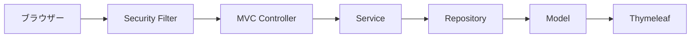

# 03 サーバーサイド画面の要求経路

URL へのアクセスが、認証、業務処理、HTML 応答へ進む流れを理解します。

## 重要ポイント

- 画面要求は Spring Security Filter を通ってから Controller に入ります。
- Service は業務処理とトランザクション、Repository はデータアクセスを担当します。
- Controller は Model にデータを格納し、テンプレートの論理名を返します。
- Thymeleaf はサーバー上で Model とテンプレートから完全な HTML を生成します。
- ブラウザーが受け取るのは、サーバーで組み立てられた HTML です。

## 実装上の境界

- 現在の実装、教材内シミュレーション、本番向け改善案を区別します。
- 図や設定ファイルの存在だけで、実環境への導入完了とは判断しません。

---

## 章末クイズ

全 5 問の単一選択問題です。通常の Markdown では先に自分で選び、その後で折りたたみを開いてください。

### 第 1 問

「サーバーサイド画面の要求経路」の中心的な説明として正しいものはどれですか。

- A. th:text などの属性が Java オブジェクトの値を HTML に反映します。
- B. 画面要求は Spring Security Filter を通ってから Controller に入ります。
- C. Thymeleaf Fragment はヘッダー、ナビゲーション、メッセージ領域を再利用します。
- D. Controller は DashboardService.getDashboard の結果を Model に格納します。

回答後に解答を開く

正解：B. 画面要求は Spring Security Filter を通ってから Controller に入ります。

解説：画面要求は Spring Security Filter を通ってから Controller に入ります。 これは本章の図と要点に一致します。他の選択肢は別章の事実、誤った順序、または検証境界の混同です。

### 第 2 問

章の図に沿った処理順序はどれですか。

- A. Thymeleaf → Model → Repository → Service → MVC Controller → Security Filter → ブラウザー
- B. Security Filter → MVC Controller → Service → Repository → Model → Thymeleaf → ブラウザー
- C. ブラウザー → Thymeleaf → Security Filter → MVC Controller → Service → Repository → Model
- D. ブラウザー → Security Filter → MVC Controller → Service → Repository → Model → Thymeleaf

回答後に解答を開く

正解：D. ブラウザー → Security Filter → MVC Controller → Service → Repository → Model → Thymeleaf

解説：ブラウザー → Security Filter → MVC Controller → Service → Repository → Model → Thymeleaf これは本章の図と要点に一致します。他の選択肢は別章の事実、誤った順序、または検証境界の混同です。

### 第 3 問

この章で説明したコンポーネントの責務として正しいものはどれですか。

- A. Controller は Model にデータを格納し、テンプレートの論理名を返します。
- B. テンプレートは resources/templates、静的リソースは resources/static に置かれます。
- C. 共通レイアウトにより権限別ナビゲーションとスタイル入口を一元管理できます。
- D. テンプレートは統計カードを表示し、少量の JavaScript または Canvas がグラフを描画します。

回答後に解答を開く

正解：A. Controller は Model にデータを格納し、テンプレートの論理名を返します。

解説：Controller は Model にデータを格納し、テンプレートの論理名を返します。 これは本章の図と要点に一致します。他の選択肢は別章の事実、誤った順序、または検証境界の混同です。

### 第 4 問

実装や調査を行う際、最も適切な判断はどれですか。

- A. 図に要素があれば、本番導入済みと判断します。
- B. 未実行またはスキップされた検証も成功として報告します。
- C. 現在の実装、教材内のシミュレーション、本番向け提案を区別して確認します。
- D. 画面でボタンを隠せば、サーバー側認可は不要です。

回答後に解答を開く

正解：C. 現在の実装、教材内のシミュレーション、本番向け提案を区別して確認します。

解説：現在の実装、教材内のシミュレーション、本番向け提案を区別して確認します。 これは本章の図と要点に一致します。他の選択肢は別章の事実、誤った順序、または検証境界の混同です。

### 第 5 問

この章の代表的な誤解を避ける説明はどれですか。

- A. HTML の仮テキストは実行時に Model の実際の値へ置き換わります。
- B. ブラウザーが受け取るのは、サーバーで組み立てられた HTML です。
- C. 共通骨格の変更は多数のページに影響するため、画面回帰確認が必要です。
- D. 本番統計では occurred_at を基準に時間単位の SQL 集約が必要です。

回答後に解答を開く

正解：B. ブラウザーが受け取るのは、サーバーで組み立てられた HTML です。

解説：ブラウザーが受け取るのは、サーバーで組み立てられた HTML です。 これは本章の図と要点に一致します。他の選択肢は別章の事実、誤った順序、または検証境界の混同です。

<!-- QUIZ_DATA_START
{
  "chapter": "03",
  "questions": [
    {
      "id": 1,
      "question": "「サーバーサイド画面の要求経路」の中心的な説明として正しいものはどれですか。",
      "options": {
        "A": "th:text などの属性が Java オブジェクトの値を HTML に反映します。",
        "B": "画面要求は Spring Security Filter を通ってから Controller に入ります。",
        "C": "Thymeleaf Fragment はヘッダー、ナビゲーション、メッセージ領域を再利用します。",
        "D": "Controller は DashboardService.getDashboard の結果を Model に格納します。"
      },
      "answer": "B",
      "explanation": "画面要求は Spring Security Filter を通ってから Controller に入ります。 これは本章の図と要点に一致します。他の選択肢は別章の事実、誤った順序、または検証境界の混同です。"
    },
    {
      "id": 2,
      "question": "章の図に沿った処理順序はどれですか。",
      "options": {
        "A": "Thymeleaf → Model → Repository → Service → MVC Controller → Security Filter → ブラウザー",
        "B": "Security Filter → MVC Controller → Service → Repository → Model → Thymeleaf → ブラウザー",
        "C": "ブラウザー → Thymeleaf → Security Filter → MVC Controller → Service → Repository → Model",
        "D": "ブラウザー → Security Filter → MVC Controller → Service → Repository → Model → Thymeleaf"
      },
      "answer": "D",
      "explanation": "ブラウザー → Security Filter → MVC Controller → Service → Repository → Model → Thymeleaf これは本章の図と要点に一致します。他の選択肢は別章の事実、誤った順序、または検証境界の混同です。"
    },
    {
      "id": 3,
      "question": "この章で説明したコンポーネントの責務として正しいものはどれですか。",
      "options": {
        "A": "Controller は Model にデータを格納し、テンプレートの論理名を返します。",
        "B": "テンプレートは resources/templates、静的リソースは resources/static に置かれます。",
        "C": "共通レイアウトにより権限別ナビゲーションとスタイル入口を一元管理できます。",
        "D": "テンプレートは統計カードを表示し、少量の JavaScript または Canvas がグラフを描画します。"
      },
      "answer": "A",
      "explanation": "Controller は Model にデータを格納し、テンプレートの論理名を返します。 これは本章の図と要点に一致します。他の選択肢は別章の事実、誤った順序、または検証境界の混同です。"
    },
    {
      "id": 4,
      "question": "実装や調査を行う際、最も適切な判断はどれですか。",
      "options": {
        "A": "図に要素があれば、本番導入済みと判断します。",
        "B": "未実行またはスキップされた検証も成功として報告します。",
        "C": "現在の実装、教材内のシミュレーション、本番向け提案を区別して確認します。",
        "D": "画面でボタンを隠せば、サーバー側認可は不要です。"
      },
      "answer": "C",
      "explanation": "現在の実装、教材内のシミュレーション、本番向け提案を区別して確認します。 これは本章の図と要点に一致します。他の選択肢は別章の事実、誤った順序、または検証境界の混同です。"
    },
    {
      "id": 5,
      "question": "この章の代表的な誤解を避ける説明はどれですか。",
      "options": {
        "A": "HTML の仮テキストは実行時に Model の実際の値へ置き換わります。",
        "B": "ブラウザーが受け取るのは、サーバーで組み立てられた HTML です。",
        "C": "共通骨格の変更は多数のページに影響するため、画面回帰確認が必要です。",
        "D": "本番統計では occurred_at を基準に時間単位の SQL 集約が必要です。"
      },
      "answer": "B",
      "explanation": "ブラウザーが受け取るのは、サーバーで組み立てられた HTML です。 これは本章の図と要点に一致します。他の選択肢は別章の事実、誤った順序、または検証境界の混同です。"
    }
  ]
}
QUIZ_DATA_END -->
