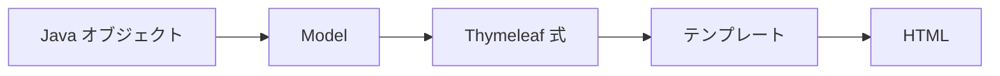

# 04 Thymeleaf のデータバインドとディレクトリ

Model の値がテンプレートへ反映される仕組みと配置規則を学びます。

## 重要ポイント

- th:text などの属性が Java オブジェクトの値を HTML に反映します。
- ${dashboard.totalDevices} のような式はサーバーで評価されます。
- テンプレートは resources/templates、静的リソースは resources/static に置かれます。
- th:each は反復、th:if は条件付き表示に使用します。
- HTML の仮テキストは実行時に Model の実際の値へ置き換わります。

## 実装上の境界

- 現在の実装、教材内シミュレーション、本番向け改善案を区別します。
- 図や設定ファイルの存在だけで、実環境への導入完了とは判断しません。

---

## 章末クイズ

全 5 問の単一選択問題です。通常の Markdown では先に自分で選び、その後で折りたたみを開いてください。

### 第 1 問

「Thymeleaf のデータバインドとディレクトリ」の中心的な説明として正しいものはどれですか。

- A. Thymeleaf Fragment はヘッダー、ナビゲーション、メッセージ領域を再利用します。
- B. th:text などの属性が Java オブジェクトの値を HTML に反映します。
- C. Controller は DashboardService.getDashboard の結果を Model に格納します。
- D. 一覧画面ではページ番号、件数、ソート条件を受け取ります。

回答後に解答を開く

正解：B. th:text などの属性が Java オブジェクトの値を HTML に反映します。

解説：th:text などの属性が Java オブジェクトの値を HTML に反映します。 これは本章の図と要点に一致します。他の選択肢は別章の事実、誤った順序、または検証境界の混同です。

### 第 2 問

章の図に沿った処理順序はどれですか。

- A. HTML → テンプレート → Thymeleaf 式 → Model → Java オブジェクト
- B. Model → Thymeleaf 式 → テンプレート → HTML → Java オブジェクト
- C. Java オブジェクト → HTML → Model → Thymeleaf 式 → テンプレート
- D. Java オブジェクト → Model → Thymeleaf 式 → テンプレート → HTML

回答後に解答を開く

正解：D. Java オブジェクト → Model → Thymeleaf 式 → テンプレート → HTML

解説：Java オブジェクト → Model → Thymeleaf 式 → テンプレート → HTML これは本章の図と要点に一致します。他の選択肢は別章の事実、誤った順序、または検証境界の混同です。

### 第 3 問

この章で説明したコンポーネントの責務として正しいものはどれですか。

- A. テンプレートは resources/templates、静的リソースは resources/static に置かれます。
- B. 共通レイアウトにより権限別ナビゲーションとスタイル入口を一元管理できます。
- C. テンプレートは統計カードを表示し、少量の JavaScript または Canvas がグラフを描画します。
- D. Repository の Page を基に、行、ページリンク、現在状態を描画します。

回答後に解答を開く

正解：A. テンプレートは resources/templates、静的リソースは resources/static に置かれます。

解説：テンプレートは resources/templates、静的リソースは resources/static に置かれます。 これは本章の図と要点に一致します。他の選択肢は別章の事実、誤った順序、または検証境界の混同です。

### 第 4 問

実装や調査を行う際、最も適切な判断はどれですか。

- A. 図に要素があれば、本番導入済みと判断します。
- B. 未実行またはスキップされた検証も成功として報告します。
- C. 現在の実装、教材内のシミュレーション、本番向け提案を区別して確認します。
- D. 画面でボタンを隠せば、サーバー側認可は不要です。

回答後に解答を開く

正解：C. 現在の実装、教材内のシミュレーション、本番向け提案を区別して確認します。

解説：現在の実装、教材内のシミュレーション、本番向け提案を区別して確認します。 これは本章の図と要点に一致します。他の選択肢は別章の事実、誤った順序、または検証境界の混同です。

### 第 5 問

この章の代表的な誤解を避ける説明はどれですか。

- A. 共通骨格の変更は多数のページに影響するため、画面回帰確認が必要です。
- B. HTML の仮テキストは実行時に Model の実際の値へ置き換わります。
- C. 本番統計では occurred_at を基準に時間単位の SQL 集約が必要です。
- D. 一覧は概観、詳細は全属性と操作を担当します。

回答後に解答を開く

正解：B. HTML の仮テキストは実行時に Model の実際の値へ置き換わります。

解説：HTML の仮テキストは実行時に Model の実際の値へ置き換わります。 これは本章の図と要点に一致します。他の選択肢は別章の事実、誤った順序、または検証境界の混同です。

<!-- QUIZ_DATA_START
{
  "chapter": "04",
  "questions": [
    {
      "id": 1,
      "question": "「Thymeleaf のデータバインドとディレクトリ」の中心的な説明として正しいものはどれですか。",
      "options": {
        "A": "Thymeleaf Fragment はヘッダー、ナビゲーション、メッセージ領域を再利用します。",
        "B": "th:text などの属性が Java オブジェクトの値を HTML に反映します。",
        "C": "Controller は DashboardService.getDashboard の結果を Model に格納します。",
        "D": "一覧画面ではページ番号、件数、ソート条件を受け取ります。"
      },
      "answer": "B",
      "explanation": "th:text などの属性が Java オブジェクトの値を HTML に反映します。 これは本章の図と要点に一致します。他の選択肢は別章の事実、誤った順序、または検証境界の混同です。"
    },
    {
      "id": 2,
      "question": "章の図に沿った処理順序はどれですか。",
      "options": {
        "A": "HTML → テンプレート → Thymeleaf 式 → Model → Java オブジェクト",
        "B": "Model → Thymeleaf 式 → テンプレート → HTML → Java オブジェクト",
        "C": "Java オブジェクト → HTML → Model → Thymeleaf 式 → テンプレート",
        "D": "Java オブジェクト → Model → Thymeleaf 式 → テンプレート → HTML"
      },
      "answer": "D",
      "explanation": "Java オブジェクト → Model → Thymeleaf 式 → テンプレート → HTML これは本章の図と要点に一致します。他の選択肢は別章の事実、誤った順序、または検証境界の混同です。"
    },
    {
      "id": 3,
      "question": "この章で説明したコンポーネントの責務として正しいものはどれですか。",
      "options": {
        "A": "テンプレートは resources/templates、静的リソースは resources/static に置かれます。",
        "B": "共通レイアウトにより権限別ナビゲーションとスタイル入口を一元管理できます。",
        "C": "テンプレートは統計カードを表示し、少量の JavaScript または Canvas がグラフを描画します。",
        "D": "Repository の Page を基に、行、ページリンク、現在状態を描画します。"
      },
      "answer": "A",
      "explanation": "テンプレートは resources/templates、静的リソースは resources/static に置かれます。 これは本章の図と要点に一致します。他の選択肢は別章の事実、誤った順序、または検証境界の混同です。"
    },
    {
      "id": 4,
      "question": "実装や調査を行う際、最も適切な判断はどれですか。",
      "options": {
        "A": "図に要素があれば、本番導入済みと判断します。",
        "B": "未実行またはスキップされた検証も成功として報告します。",
        "C": "現在の実装、教材内のシミュレーション、本番向け提案を区別して確認します。",
        "D": "画面でボタンを隠せば、サーバー側認可は不要です。"
      },
      "answer": "C",
      "explanation": "現在の実装、教材内のシミュレーション、本番向け提案を区別して確認します。 これは本章の図と要点に一致します。他の選択肢は別章の事実、誤った順序、または検証境界の混同です。"
    },
    {
      "id": 5,
      "question": "この章の代表的な誤解を避ける説明はどれですか。",
      "options": {
        "A": "共通骨格の変更は多数のページに影響するため、画面回帰確認が必要です。",
        "B": "HTML の仮テキストは実行時に Model の実際の値へ置き換わります。",
        "C": "本番統計では occurred_at を基準に時間単位の SQL 集約が必要です。",
        "D": "一覧は概観、詳細は全属性と操作を担当します。"
      },
      "answer": "B",
      "explanation": "HTML の仮テキストは実行時に Model の実際の値へ置き換わります。 これは本章の図と要点に一致します。他の選択肢は別章の事実、誤った順序、または検証境界の混同です。"
    }
  ]
}
QUIZ_DATA_END -->
