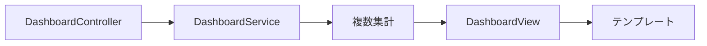

# 06 Dashboard の集約とデモトレンド

ダッシュボードの組み立て方と、デモ値を本番統計と区別します。

## 重要ポイント

- Controller は DashboardService.getDashboard の結果を Model に格納します。
- Service は機器、Event、Alert、TCP Ping の情報を集約します。
- テンプレートは統計カードを表示し、少量の JavaScript または Canvas がグラフを描画します。
- 現在の 24 時間トレンドは安定した重みで作る学習用データです。
- 本番統計では occurred_at を基準に時間単位の SQL 集約が必要です。

## 実装上の境界

- 現在の実装、教材内シミュレーション、本番向け改善案を区別します。
- 図や設定ファイルの存在だけで、実環境への導入完了とは判断しません。

---

## 章末クイズ

全 5 問の単一選択問題です。通常の Markdown では先に自分で選び、その後で折りたたみを開いてください。

### 第 1 問

「Dashboard の集約とデモトレンド」の中心的な説明として正しいものはどれですか。

- A. 一覧画面ではページ番号、件数、ソート条件を受け取ります。
- B. Controller は DashboardService.getDashboard の結果を Model に格納します。
- C. GET で Form DTO を準備し、th:field で入力要素へバインドします。
- D. th:href はコンテキストパスと引数を含む URL を生成します。

回答後に解答を開く

正解：B. Controller は DashboardService.getDashboard の結果を Model に格納します。

解説：Controller は DashboardService.getDashboard の結果を Model に格納します。 これは本章の図と要点に一致します。他の選択肢は別章の事実、誤った順序、または検証境界の混同です。

### 第 2 問

章の図に沿った処理順序はどれですか。

- A. テンプレート → DashboardView → 複数集計 → DashboardService → DashboardController
- B. DashboardService → 複数集計 → DashboardView → テンプレート → DashboardController
- C. DashboardController → テンプレート → DashboardService → 複数集計 → DashboardView
- D. DashboardController → DashboardService → 複数集計 → DashboardView → テンプレート

回答後に解答を開く

正解：D. DashboardController → DashboardService → 複数集計 → DashboardView → テンプレート

解説：DashboardController → DashboardService → 複数集計 → DashboardView → テンプレート これは本章の図と要点に一致します。他の選択肢は別章の事実、誤った順序、または検証境界の混同です。

### 第 3 問

この章で説明したコンポーネントの責務として正しいものはどれですか。

- A. テンプレートは統計カードを表示し、少量の JavaScript または Canvas がグラフを描画します。
- B. Repository の Page を基に、行、ページリンク、現在状態を描画します。
- C. 検証エラーがあれば同じフォームを返し、項目別メッセージを表示します。
- D. th:classappend は Alert 状態を CSS class に対応付けます。

回答後に解答を開く

正解：A. テンプレートは統計カードを表示し、少量の JavaScript または Canvas がグラフを描画します。

解説：テンプレートは統計カードを表示し、少量の JavaScript または Canvas がグラフを描画します。 これは本章の図と要点に一致します。他の選択肢は別章の事実、誤った順序、または検証境界の混同です。

### 第 4 問

実装や調査を行う際、最も適切な判断はどれですか。

- A. 図に要素があれば、本番導入済みと判断します。
- B. 未実行またはスキップされた検証も成功として報告します。
- C. 現在の実装、教材内のシミュレーション、本番向け提案を区別して確認します。
- D. 画面でボタンを隠せば、サーバー側認可は不要です。

回答後に解答を開く

正解：C. 現在の実装、教材内のシミュレーション、本番向け提案を区別して確認します。

解説：現在の実装、教材内のシミュレーション、本番向け提案を区別して確認します。 これは本章の図と要点に一致します。他の選択肢は別章の事実、誤った順序、または検証境界の混同です。

### 第 5 問

この章の代表的な誤解を避ける説明はどれですか。

- A. 一覧は概観、詳細は全属性と操作を担当します。
- B. 本番統計では occurred_at を基準に時間単位の SQL 集約が必要です。
- C. Service は Form DTO で許可された項目だけを Entity に反映します。
- D. ボタンを隠すだけでは認可にならず、サーバー側の権限制御が必要です。

回答後に解答を開く

正解：B. 本番統計では occurred_at を基準に時間単位の SQL 集約が必要です。

解説：本番統計では occurred_at を基準に時間単位の SQL 集約が必要です。 これは本章の図と要点に一致します。他の選択肢は別章の事実、誤った順序、または検証境界の混同です。

<!-- QUIZ_DATA_START
{
  "chapter": "06",
  "questions": [
    {
      "id": 1,
      "question": "「Dashboard の集約とデモトレンド」の中心的な説明として正しいものはどれですか。",
      "options": {
        "A": "一覧画面ではページ番号、件数、ソート条件を受け取ります。",
        "B": "Controller は DashboardService.getDashboard の結果を Model に格納します。",
        "C": "GET で Form DTO を準備し、th:field で入力要素へバインドします。",
        "D": "th:href はコンテキストパスと引数を含む URL を生成します。"
      },
      "answer": "B",
      "explanation": "Controller は DashboardService.getDashboard の結果を Model に格納します。 これは本章の図と要点に一致します。他の選択肢は別章の事実、誤った順序、または検証境界の混同です。"
    },
    {
      "id": 2,
      "question": "章の図に沿った処理順序はどれですか。",
      "options": {
        "A": "テンプレート → DashboardView → 複数集計 → DashboardService → DashboardController",
        "B": "DashboardService → 複数集計 → DashboardView → テンプレート → DashboardController",
        "C": "DashboardController → テンプレート → DashboardService → 複数集計 → DashboardView",
        "D": "DashboardController → DashboardService → 複数集計 → DashboardView → テンプレート"
      },
      "answer": "D",
      "explanation": "DashboardController → DashboardService → 複数集計 → DashboardView → テンプレート これは本章の図と要点に一致します。他の選択肢は別章の事実、誤った順序、または検証境界の混同です。"
    },
    {
      "id": 3,
      "question": "この章で説明したコンポーネントの責務として正しいものはどれですか。",
      "options": {
        "A": "テンプレートは統計カードを表示し、少量の JavaScript または Canvas がグラフを描画します。",
        "B": "Repository の Page を基に、行、ページリンク、現在状態を描画します。",
        "C": "検証エラーがあれば同じフォームを返し、項目別メッセージを表示します。",
        "D": "th:classappend は Alert 状態を CSS class に対応付けます。"
      },
      "answer": "A",
      "explanation": "テンプレートは統計カードを表示し、少量の JavaScript または Canvas がグラフを描画します。 これは本章の図と要点に一致します。他の選択肢は別章の事実、誤った順序、または検証境界の混同です。"
    },
    {
      "id": 4,
      "question": "実装や調査を行う際、最も適切な判断はどれですか。",
      "options": {
        "A": "図に要素があれば、本番導入済みと判断します。",
        "B": "未実行またはスキップされた検証も成功として報告します。",
        "C": "現在の実装、教材内のシミュレーション、本番向け提案を区別して確認します。",
        "D": "画面でボタンを隠せば、サーバー側認可は不要です。"
      },
      "answer": "C",
      "explanation": "現在の実装、教材内のシミュレーション、本番向け提案を区別して確認します。 これは本章の図と要点に一致します。他の選択肢は別章の事実、誤った順序、または検証境界の混同です。"
    },
    {
      "id": 5,
      "question": "この章の代表的な誤解を避ける説明はどれですか。",
      "options": {
        "A": "一覧は概観、詳細は全属性と操作を担当します。",
        "B": "本番統計では occurred_at を基準に時間単位の SQL 集約が必要です。",
        "C": "Service は Form DTO で許可された項目だけを Entity に反映します。",
        "D": "ボタンを隠すだけでは認可にならず、サーバー側の権限制御が必要です。"
      },
      "answer": "B",
      "explanation": "本番統計では occurred_at を基準に時間単位の SQL 集約が必要です。 これは本章の図と要点に一致します。他の選択肢は別章の事実、誤った順序、または検証境界の混同です。"
    }
  ]
}
QUIZ_DATA_END -->
