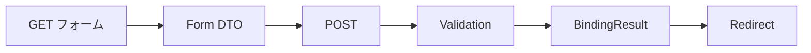

# 08 フォームバインド、検証、PRG

入力表示、サーバー検証、保存、リダイレクトの閉じた流れを理解します。

## 重要ポイント

- GET で Form DTO を準備し、th:field で入力要素へバインドします。
- POST では @Valid が Jakarta Validation を実行し、BindingResult がエラーを保持します。
- 検証エラーがあれば同じフォームを返し、項目別メッセージを表示します。
- 保存成功後は Post/Redirect/Get により再送信を防ぎます。
- Service は Form DTO で許可された項目だけを Entity に反映します。

## 実装上の境界

- 現在の実装、教材内シミュレーション、本番向け改善案を区別します。
- 図や設定ファイルの存在だけで、実環境への導入完了とは判断しません。

---

## 章末クイズ

全 5 問の単一選択問題です。通常の Markdown では先に自分で選び、その後で折りたたみを開いてください。

### 第 1 問

「フォームバインド、検証、PRG」の中心的な説明として正しいものはどれですか。

- A. th:href はコンテキストパスと引数を含む URL を生成します。
- B. GET で Form DTO を準備し、th:field で入力要素へバインドします。
- C. Spring Security 6 は SecurityFilterChain で要求セキュリティを構成します。
- D. 統一例外処理は Not Found などを適切な状態コードとエラー画面へ変換します。

回答後に解答を開く

正解：B. GET で Form DTO を準備し、th:field で入力要素へバインドします。

解説：GET で Form DTO を準備し、th:field で入力要素へバインドします。 これは本章の図と要点に一致します。他の選択肢は別章の事実、誤った順序、または検証境界の混同です。

### 第 2 問

章の図に沿った処理順序はどれですか。

- A. Redirect → BindingResult → Validation → POST → Form DTO → GET フォーム
- B. Form DTO → POST → Validation → BindingResult → Redirect → GET フォーム
- C. GET フォーム → Redirect → Form DTO → POST → Validation → BindingResult
- D. GET フォーム → Form DTO → POST → Validation → BindingResult → Redirect

回答後に解答を開く

正解：D. GET フォーム → Form DTO → POST → Validation → BindingResult → Redirect

解説：GET フォーム → Form DTO → POST → Validation → BindingResult → Redirect これは本章の図と要点に一致します。他の選択肢は別章の事実、誤った順序、または検証境界の混同です。

### 第 3 問

この章で説明したコンポーネントの責務として正しいものはどれですか。

- A. 検証エラーがあれば同じフォームを返し、項目別メッセージを表示します。
- B. th:classappend は Alert 状態を CSS class に対応付けます。
- C. 管理 URL の規則に加え、@PreAuthorize がメソッドを二重に保護します。
- D. JavaScript が無効でも主要情報とサーバー操作を維持する設計が望まれます。

回答後に解答を開く

正解：A. 検証エラーがあれば同じフォームを返し、項目別メッセージを表示します。

解説：検証エラーがあれば同じフォームを返し、項目別メッセージを表示します。 これは本章の図と要点に一致します。他の選択肢は別章の事実、誤った順序、または検証境界の混同です。

### 第 4 問

実装や調査を行う際、最も適切な判断はどれですか。

- A. 図に要素があれば、本番導入済みと判断します。
- B. 未実行またはスキップされた検証も成功として報告します。
- C. 現在の実装、教材内のシミュレーション、本番向け提案を区別して確認します。
- D. 画面でボタンを隠せば、サーバー側認可は不要です。

回答後に解答を開く

正解：C. 現在の実装、教材内のシミュレーション、本番向け提案を区別して確認します。

解説：現在の実装、教材内のシミュレーション、本番向け提案を区別して確認します。 これは本章の図と要点に一致します。他の選択肢は別章の事実、誤った順序、または検証境界の混同です。

### 第 5 問

この章の代表的な誤解を避ける説明はどれですか。

- A. ボタンを隠すだけでは認可にならず、サーバー側の権限制御が必要です。
- B. Service は Form DTO で許可された項目だけを Entity に反映します。
- C. 本番では企業 OIDC と、より強い API 認証へ置き換える必要があります。
- D. 複雑なアニメーションは Visual Explorer、実運用管理は Thymeleaf UI が担当します。

回答後に解答を開く

正解：B. Service は Form DTO で許可された項目だけを Entity に反映します。

解説：Service は Form DTO で許可された項目だけを Entity に反映します。 これは本章の図と要点に一致します。他の選択肢は別章の事実、誤った順序、または検証境界の混同です。

<!-- QUIZ_DATA_START
{
  "chapter": "08",
  "questions": [
    {
      "id": 1,
      "question": "「フォームバインド、検証、PRG」の中心的な説明として正しいものはどれですか。",
      "options": {
        "A": "th:href はコンテキストパスと引数を含む URL を生成します。",
        "B": "GET で Form DTO を準備し、th:field で入力要素へバインドします。",
        "C": "Spring Security 6 は SecurityFilterChain で要求セキュリティを構成します。",
        "D": "統一例外処理は Not Found などを適切な状態コードとエラー画面へ変換します。"
      },
      "answer": "B",
      "explanation": "GET で Form DTO を準備し、th:field で入力要素へバインドします。 これは本章の図と要点に一致します。他の選択肢は別章の事実、誤った順序、または検証境界の混同です。"
    },
    {
      "id": 2,
      "question": "章の図に沿った処理順序はどれですか。",
      "options": {
        "A": "Redirect → BindingResult → Validation → POST → Form DTO → GET フォーム",
        "B": "Form DTO → POST → Validation → BindingResult → Redirect → GET フォーム",
        "C": "GET フォーム → Redirect → Form DTO → POST → Validation → BindingResult",
        "D": "GET フォーム → Form DTO → POST → Validation → BindingResult → Redirect"
      },
      "answer": "D",
      "explanation": "GET フォーム → Form DTO → POST → Validation → BindingResult → Redirect これは本章の図と要点に一致します。他の選択肢は別章の事実、誤った順序、または検証境界の混同です。"
    },
    {
      "id": 3,
      "question": "この章で説明したコンポーネントの責務として正しいものはどれですか。",
      "options": {
        "A": "検証エラーがあれば同じフォームを返し、項目別メッセージを表示します。",
        "B": "th:classappend は Alert 状態を CSS class に対応付けます。",
        "C": "管理 URL の規則に加え、@PreAuthorize がメソッドを二重に保護します。",
        "D": "JavaScript が無効でも主要情報とサーバー操作を維持する設計が望まれます。"
      },
      "answer": "A",
      "explanation": "検証エラーがあれば同じフォームを返し、項目別メッセージを表示します。 これは本章の図と要点に一致します。他の選択肢は別章の事実、誤った順序、または検証境界の混同です。"
    },
    {
      "id": 4,
      "question": "実装や調査を行う際、最も適切な判断はどれですか。",
      "options": {
        "A": "図に要素があれば、本番導入済みと判断します。",
        "B": "未実行またはスキップされた検証も成功として報告します。",
        "C": "現在の実装、教材内のシミュレーション、本番向け提案を区別して確認します。",
        "D": "画面でボタンを隠せば、サーバー側認可は不要です。"
      },
      "answer": "C",
      "explanation": "現在の実装、教材内のシミュレーション、本番向け提案を区別して確認します。 これは本章の図と要点に一致します。他の選択肢は別章の事実、誤った順序、または検証境界の混同です。"
    },
    {
      "id": 5,
      "question": "この章の代表的な誤解を避ける説明はどれですか。",
      "options": {
        "A": "ボタンを隠すだけでは認可にならず、サーバー側の権限制御が必要です。",
        "B": "Service は Form DTO で許可された項目だけを Entity に反映します。",
        "C": "本番では企業 OIDC と、より強い API 認証へ置き換える必要があります。",
        "D": "複雑なアニメーションは Visual Explorer、実運用管理は Thymeleaf UI が担当します。"
      },
      "answer": "B",
      "explanation": "Service は Form DTO で許可された項目だけを Entity に反映します。 これは本章の図と要点に一致します。他の選択肢は別章の事実、誤った順序、または検証境界の混同です。"
    }
  ]
}
QUIZ_DATA_END -->
