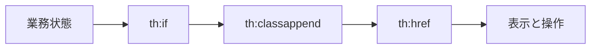

# 09 URL、条件表示、状態スタイル

リンク生成、条件付き要素、業務状態の CSS 表現を確認します。

## 重要ポイント

- th:href はコンテキストパスと引数を含む URL を生成します。
- th:if と th:unless は Model の値に応じて要素を描画します。
- th:classappend は Alert 状態を CSS class に対応付けます。
- ページングとソートのリンクは必要な検索引数を保持します。
- ボタンを隠すだけでは認可にならず、サーバー側の権限制御が必要です。

## 実装上の境界

- 現在の実装、教材内シミュレーション、本番向け改善案を区別します。
- 図や設定ファイルの存在だけで、実環境への導入完了とは判断しません。

---

## 章末クイズ

全 5 問の単一選択問題です。通常の Markdown では先に自分で選び、その後で折りたたみを開いてください。

### 第 1 問

「URL、条件表示、状態スタイル」の中心的な説明として正しいものはどれですか。

- A. Spring Security 6 は SecurityFilterChain で要求セキュリティを構成します。
- B. th:href はコンテキストパスと引数を含む URL を生成します。
- C. 統一例外処理は Not Found などを適切な状態コードとエラー画面へ変換します。
- D. @SpringBootApplication は自動構成、コンポーネント検索、構成入口をまとめます。

回答後に解答を開く

正解：B. th:href はコンテキストパスと引数を含む URL を生成します。

解説：th:href はコンテキストパスと引数を含む URL を生成します。 これは本章の図と要点に一致します。他の選択肢は別章の事実、誤った順序、または検証境界の混同です。

### 第 2 問

章の図に沿った処理順序はどれですか。

- A. 表示と操作 → th:href → th:classappend → th:if → 業務状態
- B. th:if → th:classappend → th:href → 表示と操作 → 業務状態
- C. 業務状態 → 表示と操作 → th:if → th:classappend → th:href
- D. 業務状態 → th:if → th:classappend → th:href → 表示と操作

回答後に解答を開く

正解：D. 業務状態 → th:if → th:classappend → th:href → 表示と操作

解説：業務状態 → th:if → th:classappend → th:href → 表示と操作 これは本章の図と要点に一致します。他の選択肢は別章の事実、誤った順序、または検証境界の混同です。

### 第 3 問

この章で説明したコンポーネントの責務として正しいものはどれですか。

- A. th:classappend は Alert 状態を CSS class に対応付けます。
- B. 管理 URL の規則に加え、@PreAuthorize がメソッドを二重に保護します。
- C. JavaScript が無効でも主要情報とサーバー操作を維持する設計が望まれます。
- D. Controller は HTTP、Service は業務とトランザクションを担当します。

回答後に解答を開く

正解：A. th:classappend は Alert 状態を CSS class に対応付けます。

解説：th:classappend は Alert 状態を CSS class に対応付けます。 これは本章の図と要点に一致します。他の選択肢は別章の事実、誤った順序、または検証境界の混同です。

### 第 4 問

実装や調査を行う際、最も適切な判断はどれですか。

- A. 図に要素があれば、本番導入済みと判断します。
- B. 未実行またはスキップされた検証も成功として報告します。
- C. 現在の実装、教材内のシミュレーション、本番向け提案を区別して確認します。
- D. 画面でボタンを隠せば、サーバー側認可は不要です。

回答後に解答を開く

正解：C. 現在の実装、教材内のシミュレーション、本番向け提案を区別して確認します。

解説：現在の実装、教材内のシミュレーション、本番向け提案を区別して確認します。 これは本章の図と要点に一致します。他の選択肢は別章の事実、誤った順序、または検証境界の混同です。

### 第 5 問

この章の代表的な誤解を避ける説明はどれですか。

- A. 本番では企業 OIDC と、より強い API 認証へ置き換える必要があります。
- B. ボタンを隠すだけでは認可にならず、サーバー側の権限制御が必要です。
- C. 複雑なアニメーションは Visual Explorer、実運用管理は Thymeleaf UI が担当します。
- D. 分離により Controller が Repository や Entity の全項目を直接操作することを防ぎます。

回答後に解答を開く

正解：B. ボタンを隠すだけでは認可にならず、サーバー側の権限制御が必要です。

解説：ボタンを隠すだけでは認可にならず、サーバー側の権限制御が必要です。 これは本章の図と要点に一致します。他の選択肢は別章の事実、誤った順序、または検証境界の混同です。

<!-- QUIZ_DATA_START
{
  "chapter": "09",
  "questions": [
    {
      "id": 1,
      "question": "「URL、条件表示、状態スタイル」の中心的な説明として正しいものはどれですか。",
      "options": {
        "A": "Spring Security 6 は SecurityFilterChain で要求セキュリティを構成します。",
        "B": "th:href はコンテキストパスと引数を含む URL を生成します。",
        "C": "統一例外処理は Not Found などを適切な状態コードとエラー画面へ変換します。",
        "D": "@SpringBootApplication は自動構成、コンポーネント検索、構成入口をまとめます。"
      },
      "answer": "B",
      "explanation": "th:href はコンテキストパスと引数を含む URL を生成します。 これは本章の図と要点に一致します。他の選択肢は別章の事実、誤った順序、または検証境界の混同です。"
    },
    {
      "id": 2,
      "question": "章の図に沿った処理順序はどれですか。",
      "options": {
        "A": "表示と操作 → th:href → th:classappend → th:if → 業務状態",
        "B": "th:if → th:classappend → th:href → 表示と操作 → 業務状態",
        "C": "業務状態 → 表示と操作 → th:if → th:classappend → th:href",
        "D": "業務状態 → th:if → th:classappend → th:href → 表示と操作"
      },
      "answer": "D",
      "explanation": "業務状態 → th:if → th:classappend → th:href → 表示と操作 これは本章の図と要点に一致します。他の選択肢は別章の事実、誤った順序、または検証境界の混同です。"
    },
    {
      "id": 3,
      "question": "この章で説明したコンポーネントの責務として正しいものはどれですか。",
      "options": {
        "A": "th:classappend は Alert 状態を CSS class に対応付けます。",
        "B": "管理 URL の規則に加え、@PreAuthorize がメソッドを二重に保護します。",
        "C": "JavaScript が無効でも主要情報とサーバー操作を維持する設計が望まれます。",
        "D": "Controller は HTTP、Service は業務とトランザクションを担当します。"
      },
      "answer": "A",
      "explanation": "th:classappend は Alert 状態を CSS class に対応付けます。 これは本章の図と要点に一致します。他の選択肢は別章の事実、誤った順序、または検証境界の混同です。"
    },
    {
      "id": 4,
      "question": "実装や調査を行う際、最も適切な判断はどれですか。",
      "options": {
        "A": "図に要素があれば、本番導入済みと判断します。",
        "B": "未実行またはスキップされた検証も成功として報告します。",
        "C": "現在の実装、教材内のシミュレーション、本番向け提案を区別して確認します。",
        "D": "画面でボタンを隠せば、サーバー側認可は不要です。"
      },
      "answer": "C",
      "explanation": "現在の実装、教材内のシミュレーション、本番向け提案を区別して確認します。 これは本章の図と要点に一致します。他の選択肢は別章の事実、誤った順序、または検証境界の混同です。"
    },
    {
      "id": 5,
      "question": "この章の代表的な誤解を避ける説明はどれですか。",
      "options": {
        "A": "本番では企業 OIDC と、より強い API 認証へ置き換える必要があります。",
        "B": "ボタンを隠すだけでは認可にならず、サーバー側の権限制御が必要です。",
        "C": "複雑なアニメーションは Visual Explorer、実運用管理は Thymeleaf UI が担当します。",
        "D": "分離により Controller が Repository や Entity の全項目を直接操作することを防ぎます。"
      },
      "answer": "B",
      "explanation": "ボタンを隠すだけでは認可にならず、サーバー側の権限制御が必要です。 これは本章の図と要点に一致します。他の選択肢は別章の事実、誤った順序、または検証境界の混同です。"
    }
  ]
}
QUIZ_DATA_END -->
