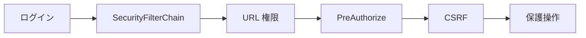

# 10 認証、ロール権限、CSRF

ログインから URL、メソッド、フォームまでの多層防御を理解します。

## 重要ポイント

- Spring Security 6 は SecurityFilterChain で要求セキュリティを構成します。
- 学習環境では ADMIN、OPERATOR、VIEWER のメモリユーザーを使います。
- 管理 URL の規則に加え、@PreAuthorize がメソッドを二重に保護します。
- POST フォームは CSRF Token によりクロスサイト要求を検証します。
- 本番では企業 OIDC と、より強い API 認証へ置き換える必要があります。

## 実装上の境界

- 現在の実装、教材内シミュレーション、本番向け改善案を区別します。
- 図や設定ファイルの存在だけで、実環境への導入完了とは判断しません。

---

## 章末クイズ

全 5 問の単一選択問題です。通常の Markdown では先に自分で選び、その後で折りたたみを開いてください。

### 第 1 問

「認証、ロール権限、CSRF」の中心的な説明として正しいものはどれですか。

- A. 統一例外処理は Not Found などを適切な状態コードとエラー画面へ変換します。
- B. Spring Security 6 は SecurityFilterChain で要求セキュリティを構成します。
- C. @SpringBootApplication は自動構成、コンポーネント検索、構成入口をまとめます。
- D. 4 種類のプロトコルアダプターは共通の IngestRequest に変換します。

回答後に解答を開く

正解：B. Spring Security 6 は SecurityFilterChain で要求セキュリティを構成します。

解説：Spring Security 6 は SecurityFilterChain で要求セキュリティを構成します。 これは本章の図と要点に一致します。他の選択肢は別章の事実、誤った順序、または検証境界の混同です。

### 第 2 問

章の図に沿った処理順序はどれですか。

- A. 保護操作 → CSRF → PreAuthorize → URL 権限 → SecurityFilterChain → ログイン
- B. SecurityFilterChain → URL 権限 → PreAuthorize → CSRF → 保護操作 → ログイン
- C. ログイン → 保護操作 → SecurityFilterChain → URL 権限 → PreAuthorize → CSRF
- D. ログイン → SecurityFilterChain → URL 権限 → PreAuthorize → CSRF → 保護操作

回答後に解答を開く

正解：D. ログイン → SecurityFilterChain → URL 権限 → PreAuthorize → CSRF → 保護操作

解説：ログイン → SecurityFilterChain → URL 権限 → PreAuthorize → CSRF → 保護操作 これは本章の図と要点に一致します。他の選択肢は別章の事実、誤った順序、または検証境界の混同です。

### 第 3 問

この章で説明したコンポーネントの責務として正しいものはどれですか。

- A. 管理 URL の規則に加え、@PreAuthorize がメソッドを二重に保護します。
- B. JavaScript が無効でも主要情報とサーバー操作を維持する設計が望まれます。
- C. Controller は HTTP、Service は業務とトランザクションを担当します。
- D. @NotNull、@NotBlank、@Size などが入力構造を検証します。

回答後に解答を開く

正解：A. 管理 URL の規則に加え、@PreAuthorize がメソッドを二重に保護します。

解説：管理 URL の規則に加え、@PreAuthorize がメソッドを二重に保護します。 これは本章の図と要点に一致します。他の選択肢は別章の事実、誤った順序、または検証境界の混同です。

### 第 4 問

実装や調査を行う際、最も適切な判断はどれですか。

- A. 図に要素があれば、本番導入済みと判断します。
- B. 未実行またはスキップされた検証も成功として報告します。
- C. 現在の実装、教材内のシミュレーション、本番向け提案を区別して確認します。
- D. 画面でボタンを隠せば、サーバー側認可は不要です。

回答後に解答を開く

正解：C. 現在の実装、教材内のシミュレーション、本番向け提案を区別して確認します。

解説：現在の実装、教材内のシミュレーション、本番向け提案を区別して確認します。 これは本章の図と要点に一致します。他の選択肢は別章の事実、誤った順序、または検証境界の混同です。

### 第 5 問

この章の代表的な誤解を避ける説明はどれですか。

- A. 複雑なアニメーションは Visual Explorer、実運用管理は Thymeleaf UI が担当します。
- B. 本番では企業 OIDC と、より強い API 認証へ置き換える必要があります。
- C. 分離により Controller が Repository や Entity の全項目を直接操作することを防ぎます。
- D. 新しいプロトコルも IngestRequest へ変換できれば後続処理を再利用できます。

回答後に解答を開く

正解：B. 本番では企業 OIDC と、より強い API 認証へ置き換える必要があります。

解説：本番では企業 OIDC と、より強い API 認証へ置き換える必要があります。 これは本章の図と要点に一致します。他の選択肢は別章の事実、誤った順序、または検証境界の混同です。

<!-- QUIZ_DATA_START
{
  "chapter": "10",
  "questions": [
    {
      "id": 1,
      "question": "「認証、ロール権限、CSRF」の中心的な説明として正しいものはどれですか。",
      "options": {
        "A": "統一例外処理は Not Found などを適切な状態コードとエラー画面へ変換します。",
        "B": "Spring Security 6 は SecurityFilterChain で要求セキュリティを構成します。",
        "C": "@SpringBootApplication は自動構成、コンポーネント検索、構成入口をまとめます。",
        "D": "4 種類のプロトコルアダプターは共通の IngestRequest に変換します。"
      },
      "answer": "B",
      "explanation": "Spring Security 6 は SecurityFilterChain で要求セキュリティを構成します。 これは本章の図と要点に一致します。他の選択肢は別章の事実、誤った順序、または検証境界の混同です。"
    },
    {
      "id": 2,
      "question": "章の図に沿った処理順序はどれですか。",
      "options": {
        "A": "保護操作 → CSRF → PreAuthorize → URL 権限 → SecurityFilterChain → ログイン",
        "B": "SecurityFilterChain → URL 権限 → PreAuthorize → CSRF → 保護操作 → ログイン",
        "C": "ログイン → 保護操作 → SecurityFilterChain → URL 権限 → PreAuthorize → CSRF",
        "D": "ログイン → SecurityFilterChain → URL 権限 → PreAuthorize → CSRF → 保護操作"
      },
      "answer": "D",
      "explanation": "ログイン → SecurityFilterChain → URL 権限 → PreAuthorize → CSRF → 保護操作 これは本章の図と要点に一致します。他の選択肢は別章の事実、誤った順序、または検証境界の混同です。"
    },
    {
      "id": 3,
      "question": "この章で説明したコンポーネントの責務として正しいものはどれですか。",
      "options": {
        "A": "管理 URL の規則に加え、@PreAuthorize がメソッドを二重に保護します。",
        "B": "JavaScript が無効でも主要情報とサーバー操作を維持する設計が望まれます。",
        "C": "Controller は HTTP、Service は業務とトランザクションを担当します。",
        "D": "@NotNull、@NotBlank、@Size などが入力構造を検証します。"
      },
      "answer": "A",
      "explanation": "管理 URL の規則に加え、@PreAuthorize がメソッドを二重に保護します。 これは本章の図と要点に一致します。他の選択肢は別章の事実、誤った順序、または検証境界の混同です。"
    },
    {
      "id": 4,
      "question": "実装や調査を行う際、最も適切な判断はどれですか。",
      "options": {
        "A": "図に要素があれば、本番導入済みと判断します。",
        "B": "未実行またはスキップされた検証も成功として報告します。",
        "C": "現在の実装、教材内のシミュレーション、本番向け提案を区別して確認します。",
        "D": "画面でボタンを隠せば、サーバー側認可は不要です。"
      },
      "answer": "C",
      "explanation": "現在の実装、教材内のシミュレーション、本番向け提案を区別して確認します。 これは本章の図と要点に一致します。他の選択肢は別章の事実、誤った順序、または検証境界の混同です。"
    },
    {
      "id": 5,
      "question": "この章の代表的な誤解を避ける説明はどれですか。",
      "options": {
        "A": "複雑なアニメーションは Visual Explorer、実運用管理は Thymeleaf UI が担当します。",
        "B": "本番では企業 OIDC と、より強い API 認証へ置き換える必要があります。",
        "C": "分離により Controller が Repository や Entity の全項目を直接操作することを防ぎます。",
        "D": "新しいプロトコルも IngestRequest へ変換できれば後続処理を再利用できます。"
      },
      "answer": "B",
      "explanation": "本番では企業 OIDC と、より強い API 認証へ置き換える必要があります。 これは本章の図と要点に一致します。他の選択肢は別章の事実、誤った順序、または検証境界の混同です。"
    }
  ]
}
QUIZ_DATA_END -->
