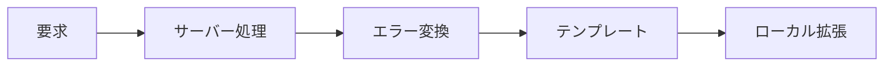

# 11 エラー画面、少量の JavaScript、表示言語

SSR における例外、段階的拡張、言語資源の責務を分けます。

## 重要ポイント

- 統一例外処理は Not Found などを適切な状態コードとエラー画面へ変換します。
- 少量の JavaScript はグラフや操作性を補助し、業務上の事実は保持しません。
- JavaScript が無効でも主要情報とサーバー操作を維持する設計が望まれます。
- 表示言語はテンプレート文言とメッセージ資源で管理します。
- 複雑なアニメーションは Visual Explorer、実運用管理は Thymeleaf UI が担当します。

## 実装上の境界

- 現在の実装、教材内シミュレーション、本番向け改善案を区別します。
- 図や設定ファイルの存在だけで、実環境への導入完了とは判断しません。

---

## 章末クイズ

全 5 問の単一選択問題です。通常の Markdown では先に自分で選び、その後で折りたたみを開いてください。

### 第 1 問

「エラー画面、少量の JavaScript、表示言語」の中心的な説明として正しいものはどれですか。

- A. @SpringBootApplication は自動構成、コンポーネント検索、構成入口をまとめます。
- B. 統一例外処理は Not Found などを適切な状態コードとエラー画面へ変換します。
- C. 4 種類のプロトコルアダプターは共通の IngestRequest に変換します。
- D. process は時刻を確定し、機器、監視対象、ルールを照合します。

回答後に解答を開く

正解：B. 統一例外処理は Not Found などを適切な状態コードとエラー画面へ変換します。

解説：統一例外処理は Not Found などを適切な状態コードとエラー画面へ変換します。 これは本章の図と要点に一致します。他の選択肢は別章の事実、誤った順序、または検証境界の混同です。

### 第 2 問

章の図に沿った処理順序はどれですか。

- A. ローカル拡張 → テンプレート → エラー変換 → サーバー処理 → 要求
- B. サーバー処理 → エラー変換 → テンプレート → ローカル拡張 → 要求
- C. 要求 → ローカル拡張 → サーバー処理 → エラー変換 → テンプレート
- D. 要求 → サーバー処理 → エラー変換 → テンプレート → ローカル拡張

回答後に解答を開く

正解：D. 要求 → サーバー処理 → エラー変換 → テンプレート → ローカル拡張

解説：要求 → サーバー処理 → エラー変換 → テンプレート → ローカル拡張 これは本章の図と要点に一致します。他の選択肢は別章の事実、誤った順序、または検証境界の混同です。

### 第 3 問

この章で説明したコンポーネントの責務として正しいものはどれですか。

- A. JavaScript が無効でも主要情報とサーバー操作を維持する設計が望まれます。
- B. Controller は HTTP、Service は業務とトランザクションを担当します。
- C. @NotNull、@NotBlank、@Size などが入力構造を検証します。
- D. source、host、eventKey、message から SHA-256 fingerprint を作ります。

回答後に解答を開く

正解：A. JavaScript が無効でも主要情報とサーバー操作を維持する設計が望まれます。

解説：JavaScript が無効でも主要情報とサーバー操作を維持する設計が望まれます。 これは本章の図と要点に一致します。他の選択肢は別章の事実、誤った順序、または検証境界の混同です。

### 第 4 問

実装や調査を行う際、最も適切な判断はどれですか。

- A. 図に要素があれば、本番導入済みと判断します。
- B. 未実行またはスキップされた検証も成功として報告します。
- C. 現在の実装、教材内のシミュレーション、本番向け提案を区別して確認します。
- D. 画面でボタンを隠せば、サーバー側認可は不要です。

回答後に解答を開く

正解：C. 現在の実装、教材内のシミュレーション、本番向け提案を区別して確認します。

解説：現在の実装、教材内のシミュレーション、本番向け提案を区別して確認します。 これは本章の図と要点に一致します。他の選択肢は別章の事実、誤った順序、または検証境界の混同です。

### 第 5 問

この章の代表的な誤解を避ける説明はどれですか。

- A. 分離により Controller が Repository や Entity の全項目を直接操作することを防ぎます。
- B. 複雑なアニメーションは Visual Explorer、実運用管理は Thymeleaf UI が担当します。
- C. 新しいプロトコルも IngestRequest へ変換できれば後続処理を再利用できます。
- D. 同一トランザクションで Alert、履歴、機器状態、通知記録を更新します。

回答後に解答を開く

正解：B. 複雑なアニメーションは Visual Explorer、実運用管理は Thymeleaf UI が担当します。

解説：複雑なアニメーションは Visual Explorer、実運用管理は Thymeleaf UI が担当します。 これは本章の図と要点に一致します。他の選択肢は別章の事実、誤った順序、または検証境界の混同です。

<!-- QUIZ_DATA_START
{
  "chapter": "11",
  "questions": [
    {
      "id": 1,
      "question": "「エラー画面、少量の JavaScript、表示言語」の中心的な説明として正しいものはどれですか。",
      "options": {
        "A": "@SpringBootApplication は自動構成、コンポーネント検索、構成入口をまとめます。",
        "B": "統一例外処理は Not Found などを適切な状態コードとエラー画面へ変換します。",
        "C": "4 種類のプロトコルアダプターは共通の IngestRequest に変換します。",
        "D": "process は時刻を確定し、機器、監視対象、ルールを照合します。"
      },
      "answer": "B",
      "explanation": "統一例外処理は Not Found などを適切な状態コードとエラー画面へ変換します。 これは本章の図と要点に一致します。他の選択肢は別章の事実、誤った順序、または検証境界の混同です。"
    },
    {
      "id": 2,
      "question": "章の図に沿った処理順序はどれですか。",
      "options": {
        "A": "ローカル拡張 → テンプレート → エラー変換 → サーバー処理 → 要求",
        "B": "サーバー処理 → エラー変換 → テンプレート → ローカル拡張 → 要求",
        "C": "要求 → ローカル拡張 → サーバー処理 → エラー変換 → テンプレート",
        "D": "要求 → サーバー処理 → エラー変換 → テンプレート → ローカル拡張"
      },
      "answer": "D",
      "explanation": "要求 → サーバー処理 → エラー変換 → テンプレート → ローカル拡張 これは本章の図と要点に一致します。他の選択肢は別章の事実、誤った順序、または検証境界の混同です。"
    },
    {
      "id": 3,
      "question": "この章で説明したコンポーネントの責務として正しいものはどれですか。",
      "options": {
        "A": "JavaScript が無効でも主要情報とサーバー操作を維持する設計が望まれます。",
        "B": "Controller は HTTP、Service は業務とトランザクションを担当します。",
        "C": "@NotNull、@NotBlank、@Size などが入力構造を検証します。",
        "D": "source、host、eventKey、message から SHA-256 fingerprint を作ります。"
      },
      "answer": "A",
      "explanation": "JavaScript が無効でも主要情報とサーバー操作を維持する設計が望まれます。 これは本章の図と要点に一致します。他の選択肢は別章の事実、誤った順序、または検証境界の混同です。"
    },
    {
      "id": 4,
      "question": "実装や調査を行う際、最も適切な判断はどれですか。",
      "options": {
        "A": "図に要素があれば、本番導入済みと判断します。",
        "B": "未実行またはスキップされた検証も成功として報告します。",
        "C": "現在の実装、教材内のシミュレーション、本番向け提案を区別して確認します。",
        "D": "画面でボタンを隠せば、サーバー側認可は不要です。"
      },
      "answer": "C",
      "explanation": "現在の実装、教材内のシミュレーション、本番向け提案を区別して確認します。 これは本章の図と要点に一致します。他の選択肢は別章の事実、誤った順序、または検証境界の混同です。"
    },
    {
      "id": 5,
      "question": "この章の代表的な誤解を避ける説明はどれですか。",
      "options": {
        "A": "分離により Controller が Repository や Entity の全項目を直接操作することを防ぎます。",
        "B": "複雑なアニメーションは Visual Explorer、実運用管理は Thymeleaf UI が担当します。",
        "C": "新しいプロトコルも IngestRequest へ変換できれば後続処理を再利用できます。",
        "D": "同一トランザクションで Alert、履歴、機器状態、通知記録を更新します。"
      },
      "answer": "B",
      "explanation": "複雑なアニメーションは Visual Explorer、実運用管理は Thymeleaf UI が担当します。 これは本章の図と要点に一致します。他の選択肢は別章の事実、誤った順序、または検証境界の混同です。"
    }
  ]
}
QUIZ_DATA_END -->
