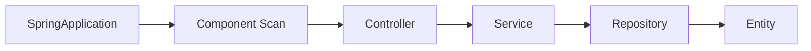

# 12 アプリケーション起動と標準レイヤー

Spring Boot の起動と各レイヤーの責務をつなげます。

## 重要ポイント

- @SpringBootApplication は自動構成、コンポーネント検索、構成入口をまとめます。
- @EnableScheduling はスケジュールタスク機能を有効にします。
- Controller は HTTP、Service は業務とトランザクションを担当します。
- Repository は永続化、Entity はドメインデータ、DTO は外部入力を表します。
- 分離により Controller が Repository や Entity の全項目を直接操作することを防ぎます。

## 実装上の境界

- 現在の実装、教材内シミュレーション、本番向け改善案を区別します。
- 図や設定ファイルの存在だけで、実環境への導入完了とは判断しません。

---

## 章末クイズ

全 5 問の単一選択問題です。通常の Markdown では先に自分で選び、その後で折りたたみを開いてください。

### 第 1 問

「アプリケーション起動と標準レイヤー」の中心的な説明として正しいものはどれですか。

- A. 4 種類のプロトコルアダプターは共通の IngestRequest に変換します。
- B. @SpringBootApplication は自動構成、コンポーネント検索、構成入口をまとめます。
- C. process は時刻を確定し、機器、監視対象、ルールを照合します。
- D. MonitoringEvent は原文、状態、発生時刻を保存する一回の事実です。

回答後に解答を開く

正解：B. @SpringBootApplication は自動構成、コンポーネント検索、構成入口をまとめます。

解説：@SpringBootApplication は自動構成、コンポーネント検索、構成入口をまとめます。 これは本章の図と要点に一致します。他の選択肢は別章の事実、誤った順序、または検証境界の混同です。

### 第 2 問

章の図に沿った処理順序はどれですか。

- A. Entity → Repository → Service → Controller → Component Scan → SpringApplication
- B. Component Scan → Controller → Service → Repository → Entity → SpringApplication
- C. SpringApplication → Entity → Component Scan → Controller → Service → Repository
- D. SpringApplication → Component Scan → Controller → Service → Repository → Entity

回答後に解答を開く

正解：D. SpringApplication → Component Scan → Controller → Service → Repository → Entity

解説：SpringApplication → Component Scan → Controller → Service → Repository → Entity これは本章の図と要点に一致します。他の選択肢は別章の事実、誤った順序、または検証境界の混同です。

### 第 3 問

この章で説明したコンポーネントの責務として正しいものはどれですか。

- A. Controller は HTTP、Service は業務とトランザクションを担当します。
- B. @NotNull、@NotBlank、@Size などが入力構造を検証します。
- C. source、host、eventKey、message から SHA-256 fingerprint を作ります。
- D. ACKNOWLEDGED は担当者が対応を引き受けた状態で、復旧ではありません。

回答後に解答を開く

正解：A. Controller は HTTP、Service は業務とトランザクションを担当します。

解説：Controller は HTTP、Service は業務とトランザクションを担当します。 これは本章の図と要点に一致します。他の選択肢は別章の事実、誤った順序、または検証境界の混同です。

### 第 4 問

実装や調査を行う際、最も適切な判断はどれですか。

- A. 図に要素があれば、本番導入済みと判断します。
- B. 未実行またはスキップされた検証も成功として報告します。
- C. 現在の実装、教材内のシミュレーション、本番向け提案を区別して確認します。
- D. 画面でボタンを隠せば、サーバー側認可は不要です。

回答後に解答を開く

正解：C. 現在の実装、教材内のシミュレーション、本番向け提案を区別して確認します。

解説：現在の実装、教材内のシミュレーション、本番向け提案を区別して確認します。 これは本章の図と要点に一致します。他の選択肢は別章の事実、誤った順序、または検証境界の混同です。

### 第 5 問

この章の代表的な誤解を避ける説明はどれですか。

- A. 新しいプロトコルも IngestRequest へ変換できれば後続処理を再利用できます。
- B. 分離により Controller が Repository や Entity の全項目を直接操作することを防ぎます。
- C. 同一トランザクションで Alert、履歴、機器状態、通知記録を更新します。
- D. CLOSED は人が確認した正式終了で、確認状態へ逆戻りさせません。

回答後に解答を開く

正解：B. 分離により Controller が Repository や Entity の全項目を直接操作することを防ぎます。

解説：分離により Controller が Repository や Entity の全項目を直接操作することを防ぎます。 これは本章の図と要点に一致します。他の選択肢は別章の事実、誤った順序、または検証境界の混同です。

<!-- QUIZ_DATA_START
{
  "chapter": "12",
  "questions": [
    {
      "id": 1,
      "question": "「アプリケーション起動と標準レイヤー」の中心的な説明として正しいものはどれですか。",
      "options": {
        "A": "4 種類のプロトコルアダプターは共通の IngestRequest に変換します。",
        "B": "@SpringBootApplication は自動構成、コンポーネント検索、構成入口をまとめます。",
        "C": "process は時刻を確定し、機器、監視対象、ルールを照合します。",
        "D": "MonitoringEvent は原文、状態、発生時刻を保存する一回の事実です。"
      },
      "answer": "B",
      "explanation": "@SpringBootApplication は自動構成、コンポーネント検索、構成入口をまとめます。 これは本章の図と要点に一致します。他の選択肢は別章の事実、誤った順序、または検証境界の混同です。"
    },
    {
      "id": 2,
      "question": "章の図に沿った処理順序はどれですか。",
      "options": {
        "A": "Entity → Repository → Service → Controller → Component Scan → SpringApplication",
        "B": "Component Scan → Controller → Service → Repository → Entity → SpringApplication",
        "C": "SpringApplication → Entity → Component Scan → Controller → Service → Repository",
        "D": "SpringApplication → Component Scan → Controller → Service → Repository → Entity"
      },
      "answer": "D",
      "explanation": "SpringApplication → Component Scan → Controller → Service → Repository → Entity これは本章の図と要点に一致します。他の選択肢は別章の事実、誤った順序、または検証境界の混同です。"
    },
    {
      "id": 3,
      "question": "この章で説明したコンポーネントの責務として正しいものはどれですか。",
      "options": {
        "A": "Controller は HTTP、Service は業務とトランザクションを担当します。",
        "B": "@NotNull、@NotBlank、@Size などが入力構造を検証します。",
        "C": "source、host、eventKey、message から SHA-256 fingerprint を作ります。",
        "D": "ACKNOWLEDGED は担当者が対応を引き受けた状態で、復旧ではありません。"
      },
      "answer": "A",
      "explanation": "Controller は HTTP、Service は業務とトランザクションを担当します。 これは本章の図と要点に一致します。他の選択肢は別章の事実、誤った順序、または検証境界の混同です。"
    },
    {
      "id": 4,
      "question": "実装や調査を行う際、最も適切な判断はどれですか。",
      "options": {
        "A": "図に要素があれば、本番導入済みと判断します。",
        "B": "未実行またはスキップされた検証も成功として報告します。",
        "C": "現在の実装、教材内のシミュレーション、本番向け提案を区別して確認します。",
        "D": "画面でボタンを隠せば、サーバー側認可は不要です。"
      },
      "answer": "C",
      "explanation": "現在の実装、教材内のシミュレーション、本番向け提案を区別して確認します。 これは本章の図と要点に一致します。他の選択肢は別章の事実、誤った順序、または検証境界の混同です。"
    },
    {
      "id": 5,
      "question": "この章の代表的な誤解を避ける説明はどれですか。",
      "options": {
        "A": "新しいプロトコルも IngestRequest へ変換できれば後続処理を再利用できます。",
        "B": "分離により Controller が Repository や Entity の全項目を直接操作することを防ぎます。",
        "C": "同一トランザクションで Alert、履歴、機器状態、通知記録を更新します。",
        "D": "CLOSED は人が確認した正式終了で、確認状態へ逆戻りさせません。"
      },
      "answer": "B",
      "explanation": "分離により Controller が Repository や Entity の全項目を直接操作することを防ぎます。 これは本章の図と要点に一致します。他の選択肢は別章の事実、誤った順序、または検証境界の混同です。"
    }
  ]
}
QUIZ_DATA_END -->
