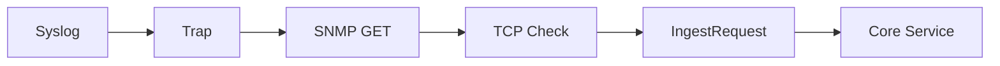

# 13 共通入力モデル IngestRequest

異なる監視プロトコルを一つの業務契約へ標準化します。

## 重要ポイント

- 4 種類のプロトコルアダプターは共通の IngestRequest に変換します。
- source、host、eventKey、message、severity、status、metric、時刻などを保持します。
- @NotNull、@NotBlank、@Size などが入力構造を検証します。
- プロトコル層は受信・解析・変換、コア層は Event と Alert の業務を担当します。
- 新しいプロトコルも IngestRequest へ変換できれば後続処理を再利用できます。

## 実装上の境界

- 現在の実装、教材内シミュレーション、本番向け改善案を区別します。
- 図や設定ファイルの存在だけで、実環境への導入完了とは判断しません。

---

## 章末クイズ

全 5 問の単一選択問題です。通常の Markdown では先に自分で選び、その後で折りたたみを開いてください。

### 第 1 問

「共通入力モデル IngestRequest」の中心的な説明として正しいものはどれですか。

- A. process は時刻を確定し、機器、監視対象、ルールを照合します。
- B. 4 種類のプロトコルアダプターは共通の IngestRequest に変換します。
- C. MonitoringEvent は原文、状態、発生時刻を保存する一回の事実です。
- D. SyslogReceiver は Spring 管理の SmartLifecycle バックグラウンド部品です。

回答後に解答を開く

正解：B. 4 種類のプロトコルアダプターは共通の IngestRequest に変換します。

解説：4 種類のプロトコルアダプターは共通の IngestRequest に変換します。 これは本章の図と要点に一致します。他の選択肢は別章の事実、誤った順序、または検証境界の混同です。

### 第 2 問

章の図に沿った処理順序はどれですか。

- A. Core Service → IngestRequest → TCP Check → SNMP GET → Trap → Syslog
- B. Trap → SNMP GET → TCP Check → IngestRequest → Core Service → Syslog
- C. Syslog → Core Service → Trap → SNMP GET → TCP Check → IngestRequest
- D. Syslog → Trap → SNMP GET → TCP Check → IngestRequest → Core Service

回答後に解答を開く

正解：D. Syslog → Trap → SNMP GET → TCP Check → IngestRequest → Core Service

解説：Syslog → Trap → SNMP GET → TCP Check → IngestRequest → Core Service これは本章の図と要点に一致します。他の選択肢は別章の事実、誤った順序、または検証境界の混同です。

### 第 3 問

この章で説明したコンポーネントの責務として正しいものはどれですか。

- A. @NotNull、@NotBlank、@Size などが入力構造を検証します。
- B. source、host、eventKey、message から SHA-256 fingerprint を作ります。
- C. ACKNOWLEDGED は担当者が対応を引き受けた状態で、復旧ではありません。
- D. UDP は Datagram 単位、TCP は行単位で読み取ります。

回答後に解答を開く

正解：A. @NotNull、@NotBlank、@Size などが入力構造を検証します。

解説：@NotNull、@NotBlank、@Size などが入力構造を検証します。 これは本章の図と要点に一致します。他の選択肢は別章の事実、誤った順序、または検証境界の混同です。

### 第 4 問

実装や調査を行う際、最も適切な判断はどれですか。

- A. 図に要素があれば、本番導入済みと判断します。
- B. 未実行またはスキップされた検証も成功として報告します。
- C. 現在の実装、教材内のシミュレーション、本番向け提案を区別して確認します。
- D. 画面でボタンを隠せば、サーバー側認可は不要です。

回答後に解答を開く

正解：C. 現在の実装、教材内のシミュレーション、本番向け提案を区別して確認します。

解説：現在の実装、教材内のシミュレーション、本番向け提案を区別して確認します。 これは本章の図と要点に一致します。他の選択肢は別章の事実、誤った順序、または検証境界の混同です。

### 第 5 問

この章の代表的な誤解を避ける説明はどれですか。

- A. 同一トランザクションで Alert、履歴、機器状態、通知記録を更新します。
- B. 新しいプロトコルも IngestRequest へ変換できれば後続処理を再利用できます。
- C. CLOSED は人が確認した正式終了で、確認状態へ逆戻りさせません。
- D. 解析失敗も rawMessage を残し、syslog-parse-error Event として保存します。

回答後に解答を開く

正解：B. 新しいプロトコルも IngestRequest へ変換できれば後続処理を再利用できます。

解説：新しいプロトコルも IngestRequest へ変換できれば後続処理を再利用できます。 これは本章の図と要点に一致します。他の選択肢は別章の事実、誤った順序、または検証境界の混同です。

<!-- QUIZ_DATA_START
{
  "chapter": "13",
  "questions": [
    {
      "id": 1,
      "question": "「共通入力モデル IngestRequest」の中心的な説明として正しいものはどれですか。",
      "options": {
        "A": "process は時刻を確定し、機器、監視対象、ルールを照合します。",
        "B": "4 種類のプロトコルアダプターは共通の IngestRequest に変換します。",
        "C": "MonitoringEvent は原文、状態、発生時刻を保存する一回の事実です。",
        "D": "SyslogReceiver は Spring 管理の SmartLifecycle バックグラウンド部品です。"
      },
      "answer": "B",
      "explanation": "4 種類のプロトコルアダプターは共通の IngestRequest に変換します。 これは本章の図と要点に一致します。他の選択肢は別章の事実、誤った順序、または検証境界の混同です。"
    },
    {
      "id": 2,
      "question": "章の図に沿った処理順序はどれですか。",
      "options": {
        "A": "Core Service → IngestRequest → TCP Check → SNMP GET → Trap → Syslog",
        "B": "Trap → SNMP GET → TCP Check → IngestRequest → Core Service → Syslog",
        "C": "Syslog → Core Service → Trap → SNMP GET → TCP Check → IngestRequest",
        "D": "Syslog → Trap → SNMP GET → TCP Check → IngestRequest → Core Service"
      },
      "answer": "D",
      "explanation": "Syslog → Trap → SNMP GET → TCP Check → IngestRequest → Core Service これは本章の図と要点に一致します。他の選択肢は別章の事実、誤った順序、または検証境界の混同です。"
    },
    {
      "id": 3,
      "question": "この章で説明したコンポーネントの責務として正しいものはどれですか。",
      "options": {
        "A": "@NotNull、@NotBlank、@Size などが入力構造を検証します。",
        "B": "source、host、eventKey、message から SHA-256 fingerprint を作ります。",
        "C": "ACKNOWLEDGED は担当者が対応を引き受けた状態で、復旧ではありません。",
        "D": "UDP は Datagram 単位、TCP は行単位で読み取ります。"
      },
      "answer": "A",
      "explanation": "@NotNull、@NotBlank、@Size などが入力構造を検証します。 これは本章の図と要点に一致します。他の選択肢は別章の事実、誤った順序、または検証境界の混同です。"
    },
    {
      "id": 4,
      "question": "実装や調査を行う際、最も適切な判断はどれですか。",
      "options": {
        "A": "図に要素があれば、本番導入済みと判断します。",
        "B": "未実行またはスキップされた検証も成功として報告します。",
        "C": "現在の実装、教材内のシミュレーション、本番向け提案を区別して確認します。",
        "D": "画面でボタンを隠せば、サーバー側認可は不要です。"
      },
      "answer": "C",
      "explanation": "現在の実装、教材内のシミュレーション、本番向け提案を区別して確認します。 これは本章の図と要点に一致します。他の選択肢は別章の事実、誤った順序、または検証境界の混同です。"
    },
    {
      "id": 5,
      "question": "この章の代表的な誤解を避ける説明はどれですか。",
      "options": {
        "A": "同一トランザクションで Alert、履歴、機器状態、通知記録を更新します。",
        "B": "新しいプロトコルも IngestRequest へ変換できれば後続処理を再利用できます。",
        "C": "CLOSED は人が確認した正式終了で、確認状態へ逆戻りさせません。",
        "D": "解析失敗も rawMessage を残し、syslog-parse-error Event として保存します。"
      },
      "answer": "B",
      "explanation": "新しいプロトコルも IngestRequest へ変換できれば後続処理を再利用できます。 これは本章の図と要点に一致します。他の選択肢は別章の事実、誤った順序、または検証境界の混同です。"
    }
  ]
}
QUIZ_DATA_END -->
