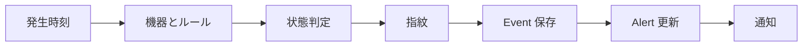

# 14 EventProcessingService の主処理

状態判定、重複抑制、保存、Alert 更新、通知までを追跡します。

## 重要ポイント

- process は時刻を確定し、機器、監視対象、ルールを照合します。
- 明示 status、能動チェック失敗、閾値、severity の順で状態を判断します。
- source、host、eventKey、message から SHA-256 fingerprint を作ります。
- 重複 Event も事実として保存しますが、抑制期間内は再通知しません。
- 同一トランザクションで Alert、履歴、機器状態、通知記録を更新します。

## 実装上の境界

- 現在の実装、教材内シミュレーション、本番向け改善案を区別します。
- 図や設定ファイルの存在だけで、実環境への導入完了とは判断しません。

---

## 章末クイズ

全 5 問の単一選択問題です。通常の Markdown では先に自分で選び、その後で折りたたみを開いてください。

### 第 1 問

「EventProcessingService の主処理」の中心的な説明として正しいものはどれですか。

- A. MonitoringEvent は原文、状態、発生時刻を保存する一回の事実です。
- B. process は時刻を確定し、機器、監視対象、ルールを照合します。
- C. SyslogReceiver は Spring 管理の SmartLifecycle バックグラウンド部品です。
- D. SNMP Trap は SNMP4J と SmartLifecycle コンポーネントで受信します。

回答後に解答を開く

正解：B. process は時刻を確定し、機器、監視対象、ルールを照合します。

解説：process は時刻を確定し、機器、監視対象、ルールを照合します。 これは本章の図と要点に一致します。他の選択肢は別章の事実、誤った順序、または検証境界の混同です。

### 第 2 問

章の図に沿った処理順序はどれですか。

- A. 通知 → Alert 更新 → Event 保存 → 指紋 → 状態判定 → 機器とルール → 発生時刻
- B. 機器とルール → 状態判定 → 指紋 → Event 保存 → Alert 更新 → 通知 → 発生時刻
- C. 発生時刻 → 通知 → 機器とルール → 状態判定 → 指紋 → Event 保存 → Alert 更新
- D. 発生時刻 → 機器とルール → 状態判定 → 指紋 → Event 保存 → Alert 更新 → 通知

回答後に解答を開く

正解：D. 発生時刻 → 機器とルール → 状態判定 → 指紋 → Event 保存 → Alert 更新 → 通知

解説：発生時刻 → 機器とルール → 状態判定 → 指紋 → Event 保存 → Alert 更新 → 通知 これは本章の図と要点に一致します。他の選択肢は別章の事実、誤った順序、または検証境界の混同です。

### 第 3 問

この章で説明したコンポーネントの責務として正しいものはどれですか。

- A. source、host、eventKey、message から SHA-256 fingerprint を作ります。
- B. ACKNOWLEDGED は担当者が対応を引き受けた状態で、復旧ではありません。
- C. UDP は Datagram 単位、TCP は行単位で読み取ります。
- D. CommandResponderEvent を解析して IngestRequest に変換します。

回答後に解答を開く

正解：A. source、host、eventKey、message から SHA-256 fingerprint を作ります。

解説：source、host、eventKey、message から SHA-256 fingerprint を作ります。 これは本章の図と要点に一致します。他の選択肢は別章の事実、誤った順序、または検証境界の混同です。

### 第 4 問

実装や調査を行う際、最も適切な判断はどれですか。

- A. 図に要素があれば、本番導入済みと判断します。
- B. 未実行またはスキップされた検証も成功として報告します。
- C. 現在の実装、教材内のシミュレーション、本番向け提案を区別して確認します。
- D. 画面でボタンを隠せば、サーバー側認可は不要です。

回答後に解答を開く

正解：C. 現在の実装、教材内のシミュレーション、本番向け提案を区別して確認します。

解説：現在の実装、教材内のシミュレーション、本番向け提案を区別して確認します。 これは本章の図と要点に一致します。他の選択肢は別章の事実、誤った順序、または検証境界の混同です。

### 第 5 問

この章の代表的な誤解を避ける説明はどれですか。

- A. CLOSED は人が確認した正式終了で、確認状態へ逆戻りさせません。
- B. 同一トランザクションで Alert、履歴、機器状態、通知記録を更新します。
- C. 解析失敗も rawMessage を残し、syslog-parse-error Event として保存します。
- D. Trap は機器からの能動送信であり、SNMP GET の能動照会とは異なります。

回答後に解答を開く

正解：B. 同一トランザクションで Alert、履歴、機器状態、通知記録を更新します。

解説：同一トランザクションで Alert、履歴、機器状態、通知記録を更新します。 これは本章の図と要点に一致します。他の選択肢は別章の事実、誤った順序、または検証境界の混同です。

<!-- QUIZ_DATA_START
{
  "chapter": "14",
  "questions": [
    {
      "id": 1,
      "question": "「EventProcessingService の主処理」の中心的な説明として正しいものはどれですか。",
      "options": {
        "A": "MonitoringEvent は原文、状態、発生時刻を保存する一回の事実です。",
        "B": "process は時刻を確定し、機器、監視対象、ルールを照合します。",
        "C": "SyslogReceiver は Spring 管理の SmartLifecycle バックグラウンド部品です。",
        "D": "SNMP Trap は SNMP4J と SmartLifecycle コンポーネントで受信します。"
      },
      "answer": "B",
      "explanation": "process は時刻を確定し、機器、監視対象、ルールを照合します。 これは本章の図と要点に一致します。他の選択肢は別章の事実、誤った順序、または検証境界の混同です。"
    },
    {
      "id": 2,
      "question": "章の図に沿った処理順序はどれですか。",
      "options": {
        "A": "通知 → Alert 更新 → Event 保存 → 指紋 → 状態判定 → 機器とルール → 発生時刻",
        "B": "機器とルール → 状態判定 → 指紋 → Event 保存 → Alert 更新 → 通知 → 発生時刻",
        "C": "発生時刻 → 通知 → 機器とルール → 状態判定 → 指紋 → Event 保存 → Alert 更新",
        "D": "発生時刻 → 機器とルール → 状態判定 → 指紋 → Event 保存 → Alert 更新 → 通知"
      },
      "answer": "D",
      "explanation": "発生時刻 → 機器とルール → 状態判定 → 指紋 → Event 保存 → Alert 更新 → 通知 これは本章の図と要点に一致します。他の選択肢は別章の事実、誤った順序、または検証境界の混同です。"
    },
    {
      "id": 3,
      "question": "この章で説明したコンポーネントの責務として正しいものはどれですか。",
      "options": {
        "A": "source、host、eventKey、message から SHA-256 fingerprint を作ります。",
        "B": "ACKNOWLEDGED は担当者が対応を引き受けた状態で、復旧ではありません。",
        "C": "UDP は Datagram 単位、TCP は行単位で読み取ります。",
        "D": "CommandResponderEvent を解析して IngestRequest に変換します。"
      },
      "answer": "A",
      "explanation": "source、host、eventKey、message から SHA-256 fingerprint を作ります。 これは本章の図と要点に一致します。他の選択肢は別章の事実、誤った順序、または検証境界の混同です。"
    },
    {
      "id": 4,
      "question": "実装や調査を行う際、最も適切な判断はどれですか。",
      "options": {
        "A": "図に要素があれば、本番導入済みと判断します。",
        "B": "未実行またはスキップされた検証も成功として報告します。",
        "C": "現在の実装、教材内のシミュレーション、本番向け提案を区別して確認します。",
        "D": "画面でボタンを隠せば、サーバー側認可は不要です。"
      },
      "answer": "C",
      "explanation": "現在の実装、教材内のシミュレーション、本番向け提案を区別して確認します。 これは本章の図と要点に一致します。他の選択肢は別章の事実、誤った順序、または検証境界の混同です。"
    },
    {
      "id": 5,
      "question": "この章の代表的な誤解を避ける説明はどれですか。",
      "options": {
        "A": "CLOSED は人が確認した正式終了で、確認状態へ逆戻りさせません。",
        "B": "同一トランザクションで Alert、履歴、機器状態、通知記録を更新します。",
        "C": "解析失敗も rawMessage を残し、syslog-parse-error Event として保存します。",
        "D": "Trap は機器からの能動送信であり、SNMP GET の能動照会とは異なります。"
      },
      "answer": "B",
      "explanation": "同一トランザクションで Alert、履歴、機器状態、通知記録を更新します。 これは本章の図と要点に一致します。他の選択肢は別章の事実、誤った順序、または検証境界の混同です。"
    }
  ]
}
QUIZ_DATA_END -->
