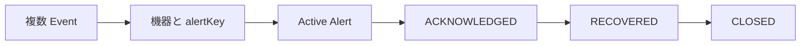

# 15 Event、Alert、ライフサイクル

発生事実と継続障害を分け、確認、復旧、終了の意味を整理します。

## 重要ポイント

- MonitoringEvent は原文、状態、発生時刻を保存する一回の事実です。
- Alert は同じ機器と alertKey の複数 Event をまとめる継続障害です。
- ACKNOWLEDGED は担当者が対応を引き受けた状態で、復旧ではありません。
- RECOVERED は監視値の復旧であり、業務上の正式終了とは限りません。
- CLOSED は人が確認した正式終了で、確認状態へ逆戻りさせません。

## 実装上の境界

- 現在の実装、教材内シミュレーション、本番向け改善案を区別します。
- 図や設定ファイルの存在だけで、実環境への導入完了とは判断しません。

---

## 章末クイズ

全 5 問の単一選択問題です。通常の Markdown では先に自分で選び、その後で折りたたみを開いてください。

### 第 1 問

「Event、Alert、ライフサイクル」の中心的な説明として正しいものはどれですか。

- A. SyslogReceiver は Spring 管理の SmartLifecycle バックグラウンド部品です。
- B. MonitoringEvent は原文、状態、発生時刻を保存する一回の事実です。
- C. SNMP Trap は SNMP4J と SmartLifecycle コンポーネントで受信します。
- D. SnmpV2cQueryClient は Transport、community、timeout、retry を設定します。

回答後に解答を開く

正解：B. MonitoringEvent は原文、状態、発生時刻を保存する一回の事実です。

解説：MonitoringEvent は原文、状態、発生時刻を保存する一回の事実です。 これは本章の図と要点に一致します。他の選択肢は別章の事実、誤った順序、または検証境界の混同です。

### 第 2 問

章の図に沿った処理順序はどれですか。

- A. CLOSED → RECOVERED → ACKNOWLEDGED → Active Alert → 機器と alertKey → 複数 Event
- B. 機器と alertKey → Active Alert → ACKNOWLEDGED → RECOVERED → CLOSED → 複数 Event
- C. 複数 Event → CLOSED → 機器と alertKey → Active Alert → ACKNOWLEDGED → RECOVERED
- D. 複数 Event → 機器と alertKey → Active Alert → ACKNOWLEDGED → RECOVERED → CLOSED

回答後に解答を開く

正解：D. 複数 Event → 機器と alertKey → Active Alert → ACKNOWLEDGED → RECOVERED → CLOSED

解説：複数 Event → 機器と alertKey → Active Alert → ACKNOWLEDGED → RECOVERED → CLOSED これは本章の図と要点に一致します。他の選択肢は別章の事実、誤った順序、または検証境界の混同です。

### 第 3 問

この章で説明したコンポーネントの責務として正しいものはどれですか。

- A. ACKNOWLEDGED は担当者が対応を引き受けた状態で、復旧ではありません。
- B. UDP は Datagram 単位、TCP は行単位で読み取ります。
- C. CommandResponderEvent を解析して IngestRequest に変換します。
- D. TIMEOUT、SNMP_ERROR、INVALID_ADDRESS、IO_ERROR を区別します。

回答後に解答を開く

正解：A. ACKNOWLEDGED は担当者が対応を引き受けた状態で、復旧ではありません。

解説：ACKNOWLEDGED は担当者が対応を引き受けた状態で、復旧ではありません。 これは本章の図と要点に一致します。他の選択肢は別章の事実、誤った順序、または検証境界の混同です。

### 第 4 問

実装や調査を行う際、最も適切な判断はどれですか。

- A. 図に要素があれば、本番導入済みと判断します。
- B. 未実行またはスキップされた検証も成功として報告します。
- C. 現在の実装、教材内のシミュレーション、本番向け提案を区別して確認します。
- D. 画面でボタンを隠せば、サーバー側認可は不要です。

回答後に解答を開く

正解：C. 現在の実装、教材内のシミュレーション、本番向け提案を区別して確認します。

解説：現在の実装、教材内のシミュレーション、本番向け提案を区別して確認します。 これは本章の図と要点に一致します。他の選択肢は別章の事実、誤った順序、または検証境界の混同です。

### 第 5 問

この章の代表的な誤解を避ける説明はどれですか。

- A. 解析失敗も rawMessage を残し、syslog-parse-error Event として保存します。
- B. CLOSED は人が確認した正式終了で、確認状態へ逆戻りさせません。
- C. Trap は機器からの能動送信であり、SNMP GET の能動照会とは異なります。
- D. SnmpQueryClient は拡張点ですが、現在の実装は v2c であり v3 authPriv ではありません。

回答後に解答を開く

正解：B. CLOSED は人が確認した正式終了で、確認状態へ逆戻りさせません。

解説：CLOSED は人が確認した正式終了で、確認状態へ逆戻りさせません。 これは本章の図と要点に一致します。他の選択肢は別章の事実、誤った順序、または検証境界の混同です。

<!-- QUIZ_DATA_START
{
  "chapter": "15",
  "questions": [
    {
      "id": 1,
      "question": "「Event、Alert、ライフサイクル」の中心的な説明として正しいものはどれですか。",
      "options": {
        "A": "SyslogReceiver は Spring 管理の SmartLifecycle バックグラウンド部品です。",
        "B": "MonitoringEvent は原文、状態、発生時刻を保存する一回の事実です。",
        "C": "SNMP Trap は SNMP4J と SmartLifecycle コンポーネントで受信します。",
        "D": "SnmpV2cQueryClient は Transport、community、timeout、retry を設定します。"
      },
      "answer": "B",
      "explanation": "MonitoringEvent は原文、状態、発生時刻を保存する一回の事実です。 これは本章の図と要点に一致します。他の選択肢は別章の事実、誤った順序、または検証境界の混同です。"
    },
    {
      "id": 2,
      "question": "章の図に沿った処理順序はどれですか。",
      "options": {
        "A": "CLOSED → RECOVERED → ACKNOWLEDGED → Active Alert → 機器と alertKey → 複数 Event",
        "B": "機器と alertKey → Active Alert → ACKNOWLEDGED → RECOVERED → CLOSED → 複数 Event",
        "C": "複数 Event → CLOSED → 機器と alertKey → Active Alert → ACKNOWLEDGED → RECOVERED",
        "D": "複数 Event → 機器と alertKey → Active Alert → ACKNOWLEDGED → RECOVERED → CLOSED"
      },
      "answer": "D",
      "explanation": "複数 Event → 機器と alertKey → Active Alert → ACKNOWLEDGED → RECOVERED → CLOSED これは本章の図と要点に一致します。他の選択肢は別章の事実、誤った順序、または検証境界の混同です。"
    },
    {
      "id": 3,
      "question": "この章で説明したコンポーネントの責務として正しいものはどれですか。",
      "options": {
        "A": "ACKNOWLEDGED は担当者が対応を引き受けた状態で、復旧ではありません。",
        "B": "UDP は Datagram 単位、TCP は行単位で読み取ります。",
        "C": "CommandResponderEvent を解析して IngestRequest に変換します。",
        "D": "TIMEOUT、SNMP_ERROR、INVALID_ADDRESS、IO_ERROR を区別します。"
      },
      "answer": "A",
      "explanation": "ACKNOWLEDGED は担当者が対応を引き受けた状態で、復旧ではありません。 これは本章の図と要点に一致します。他の選択肢は別章の事実、誤った順序、または検証境界の混同です。"
    },
    {
      "id": 4,
      "question": "実装や調査を行う際、最も適切な判断はどれですか。",
      "options": {
        "A": "図に要素があれば、本番導入済みと判断します。",
        "B": "未実行またはスキップされた検証も成功として報告します。",
        "C": "現在の実装、教材内のシミュレーション、本番向け提案を区別して確認します。",
        "D": "画面でボタンを隠せば、サーバー側認可は不要です。"
      },
      "answer": "C",
      "explanation": "現在の実装、教材内のシミュレーション、本番向け提案を区別して確認します。 これは本章の図と要点に一致します。他の選択肢は別章の事実、誤った順序、または検証境界の混同です。"
    },
    {
      "id": 5,
      "question": "この章の代表的な誤解を避ける説明はどれですか。",
      "options": {
        "A": "解析失敗も rawMessage を残し、syslog-parse-error Event として保存します。",
        "B": "CLOSED は人が確認した正式終了で、確認状態へ逆戻りさせません。",
        "C": "Trap は機器からの能動送信であり、SNMP GET の能動照会とは異なります。",
        "D": "SnmpQueryClient は拡張点ですが、現在の実装は v2c であり v3 authPriv ではありません。"
      },
      "answer": "B",
      "explanation": "CLOSED は人が確認した正式終了で、確認状態へ逆戻りさせません。 これは本章の図と要点に一致します。他の選択肢は別章の事実、誤った順序、または検証境界の混同です。"
    }
  ]
}
QUIZ_DATA_END -->
