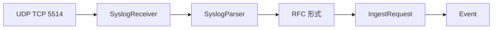

# 16 Syslog の受信、解析、失敗保存

UDP/TCP 受信器のライフサイクルと解析失敗時の扱いを学びます。

## 重要ポイント

- SyslogReceiver は Spring 管理の SmartLifecycle バックグラウンド部品です。
- 標準設定では UDP 5514 と TCP 5514 を同時に待ち受けます。
- UDP は Datagram 単位、TCP は行単位で読み取ります。
- SyslogParser は RFC3164 と RFC5424 の PRI、Facility、Severity などを解析します。
- 解析失敗も rawMessage を残し、syslog-parse-error Event として保存します。

## 実装上の境界

- 現在の実装、教材内シミュレーション、本番向け改善案を区別します。
- 図や設定ファイルの存在だけで、実環境への導入完了とは判断しません。

---

## 章末クイズ

全 5 問の単一選択問題です。通常の Markdown では先に自分で選び、その後で折りたたみを開いてください。

### 第 1 問

「Syslog の受信、解析、失敗保存」の中心的な説明として正しいものはどれですか。

- A. SNMP Trap は SNMP4J と SmartLifecycle コンポーネントで受信します。
- B. SyslogReceiver は Spring 管理の SmartLifecycle バックグラウンド部品です。
- C. SnmpV2cQueryClient は Transport、community、timeout、retry を設定します。
- D. TCP Ping は socket.connect で指定ホストとポートへの接続を確認します。

回答後に解答を開く

正解：B. SyslogReceiver は Spring 管理の SmartLifecycle バックグラウンド部品です。

解説：SyslogReceiver は Spring 管理の SmartLifecycle バックグラウンド部品です。 これは本章の図と要点に一致します。他の選択肢は別章の事実、誤った順序、または検証境界の混同です。

### 第 2 問

章の図に沿った処理順序はどれですか。

- A. Event → IngestRequest → RFC 形式 → SyslogParser → SyslogReceiver → UDP TCP 5514
- B. SyslogReceiver → SyslogParser → RFC 形式 → IngestRequest → Event → UDP TCP 5514
- C. UDP TCP 5514 → Event → SyslogReceiver → SyslogParser → RFC 形式 → IngestRequest
- D. UDP TCP 5514 → SyslogReceiver → SyslogParser → RFC 形式 → IngestRequest → Event

回答後に解答を開く

正解：D. UDP TCP 5514 → SyslogReceiver → SyslogParser → RFC 形式 → IngestRequest → Event

解説：UDP TCP 5514 → SyslogReceiver → SyslogParser → RFC 形式 → IngestRequest → Event これは本章の図と要点に一致します。他の選択肢は別章の事実、誤った順序、または検証境界の混同です。

### 第 3 問

この章で説明したコンポーネントの責務として正しいものはどれですか。

- A. UDP は Datagram 単位、TCP は行単位で読み取ります。
- B. CommandResponderEvent を解析して IngestRequest に変換します。
- C. TIMEOUT、SNMP_ERROR、INVALID_ADDRESS、IO_ERROR を区別します。
- D. DNS_ERROR、TIMEOUT、CONNECTION_REFUSED、IO_ERROR を分類します。

回答後に解答を開く

正解：A. UDP は Datagram 単位、TCP は行単位で読み取ります。

解説：UDP は Datagram 単位、TCP は行単位で読み取ります。 これは本章の図と要点に一致します。他の選択肢は別章の事実、誤った順序、または検証境界の混同です。

### 第 4 問

実装や調査を行う際、最も適切な判断はどれですか。

- A. 図に要素があれば、本番導入済みと判断します。
- B. 未実行またはスキップされた検証も成功として報告します。
- C. 現在の実装、教材内のシミュレーション、本番向け提案を区別して確認します。
- D. 画面でボタンを隠せば、サーバー側認可は不要です。

回答後に解答を開く

正解：C. 現在の実装、教材内のシミュレーション、本番向け提案を区別して確認します。

解説：現在の実装、教材内のシミュレーション、本番向け提案を区別して確認します。 これは本章の図と要点に一致します。他の選択肢は別章の事実、誤った順序、または検証境界の混同です。

### 第 5 問

この章の代表的な誤解を避ける説明はどれですか。

- A. Trap は機器からの能動送信であり、SNMP GET の能動照会とは異なります。
- B. 解析失敗も rawMessage を残し、syslog-parse-error Event として保存します。
- C. SnmpQueryClient は拡張点ですが、現在の実装は v2c であり v3 authPriv ではありません。
- D. ICMP が通っても PostgreSQL 5432 や HTTPS 443 が利用可能とは限りません。

回答後に解答を開く

正解：B. 解析失敗も rawMessage を残し、syslog-parse-error Event として保存します。

解説：解析失敗も rawMessage を残し、syslog-parse-error Event として保存します。 これは本章の図と要点に一致します。他の選択肢は別章の事実、誤った順序、または検証境界の混同です。

<!-- QUIZ_DATA_START
{
  "chapter": "16",
  "questions": [
    {
      "id": 1,
      "question": "「Syslog の受信、解析、失敗保存」の中心的な説明として正しいものはどれですか。",
      "options": {
        "A": "SNMP Trap は SNMP4J と SmartLifecycle コンポーネントで受信します。",
        "B": "SyslogReceiver は Spring 管理の SmartLifecycle バックグラウンド部品です。",
        "C": "SnmpV2cQueryClient は Transport、community、timeout、retry を設定します。",
        "D": "TCP Ping は socket.connect で指定ホストとポートへの接続を確認します。"
      },
      "answer": "B",
      "explanation": "SyslogReceiver は Spring 管理の SmartLifecycle バックグラウンド部品です。 これは本章の図と要点に一致します。他の選択肢は別章の事実、誤った順序、または検証境界の混同です。"
    },
    {
      "id": 2,
      "question": "章の図に沿った処理順序はどれですか。",
      "options": {
        "A": "Event → IngestRequest → RFC 形式 → SyslogParser → SyslogReceiver → UDP TCP 5514",
        "B": "SyslogReceiver → SyslogParser → RFC 形式 → IngestRequest → Event → UDP TCP 5514",
        "C": "UDP TCP 5514 → Event → SyslogReceiver → SyslogParser → RFC 形式 → IngestRequest",
        "D": "UDP TCP 5514 → SyslogReceiver → SyslogParser → RFC 形式 → IngestRequest → Event"
      },
      "answer": "D",
      "explanation": "UDP TCP 5514 → SyslogReceiver → SyslogParser → RFC 形式 → IngestRequest → Event これは本章の図と要点に一致します。他の選択肢は別章の事実、誤った順序、または検証境界の混同です。"
    },
    {
      "id": 3,
      "question": "この章で説明したコンポーネントの責務として正しいものはどれですか。",
      "options": {
        "A": "UDP は Datagram 単位、TCP は行単位で読み取ります。",
        "B": "CommandResponderEvent を解析して IngestRequest に変換します。",
        "C": "TIMEOUT、SNMP_ERROR、INVALID_ADDRESS、IO_ERROR を区別します。",
        "D": "DNS_ERROR、TIMEOUT、CONNECTION_REFUSED、IO_ERROR を分類します。"
      },
      "answer": "A",
      "explanation": "UDP は Datagram 単位、TCP は行単位で読み取ります。 これは本章の図と要点に一致します。他の選択肢は別章の事実、誤った順序、または検証境界の混同です。"
    },
    {
      "id": 4,
      "question": "実装や調査を行う際、最も適切な判断はどれですか。",
      "options": {
        "A": "図に要素があれば、本番導入済みと判断します。",
        "B": "未実行またはスキップされた検証も成功として報告します。",
        "C": "現在の実装、教材内のシミュレーション、本番向け提案を区別して確認します。",
        "D": "画面でボタンを隠せば、サーバー側認可は不要です。"
      },
      "answer": "C",
      "explanation": "現在の実装、教材内のシミュレーション、本番向け提案を区別して確認します。 これは本章の図と要点に一致します。他の選択肢は別章の事実、誤った順序、または検証境界の混同です。"
    },
    {
      "id": 5,
      "question": "この章の代表的な誤解を避ける説明はどれですか。",
      "options": {
        "A": "Trap は機器からの能動送信であり、SNMP GET の能動照会とは異なります。",
        "B": "解析失敗も rawMessage を残し、syslog-parse-error Event として保存します。",
        "C": "SnmpQueryClient は拡張点ですが、現在の実装は v2c であり v3 authPriv ではありません。",
        "D": "ICMP が通っても PostgreSQL 5432 や HTTPS 443 が利用可能とは限りません。"
      },
      "answer": "B",
      "explanation": "解析失敗も rawMessage を残し、syslog-parse-error Event として保存します。 これは本章の図と要点に一致します。他の選択肢は別章の事実、誤った順序、または検証境界の混同です。"
    }
  ]
}
QUIZ_DATA_END -->
