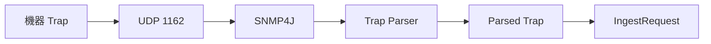

# 17 SNMP Trap の受動受信

SNMP v2c Trap が共通処理へ入るまでの経路を理解します。

## 重要ポイント

- SNMP Trap は SNMP4J と SmartLifecycle コンポーネントで受信します。
- 標準設定は 0.0.0.0:1162 UDP で、外部 162 からマッピングできます。
- CommandResponderEvent を解析して IngestRequest に変換します。
- 現在の実装対象は SNMP v2c Trap です。
- Trap は機器からの能動送信であり、SNMP GET の能動照会とは異なります。

## 実装上の境界

- 現在の実装、教材内シミュレーション、本番向け改善案を区別します。
- 図や設定ファイルの存在だけで、実環境への導入完了とは判断しません。

---

## 章末クイズ

全 5 問の単一選択問題です。通常の Markdown では先に自分で選び、その後で折りたたみを開いてください。

### 第 1 問

「SNMP Trap の受動受信」の中心的な説明として正しいものはどれですか。

- A. SnmpV2cQueryClient は Transport、community、timeout、retry を設定します。
- B. SNMP Trap は SNMP4J と SmartLifecycle コンポーネントで受信します。
- C. TCP Ping は socket.connect で指定ホストとポートへの接続を確認します。
- D. Spring Data JPA Repository が永続化を担当し、関連は主に LAZY です。

回答後に解答を開く

正解：B. SNMP Trap は SNMP4J と SmartLifecycle コンポーネントで受信します。

解説：SNMP Trap は SNMP4J と SmartLifecycle コンポーネントで受信します。 これは本章の図と要点に一致します。他の選択肢は別章の事実、誤った順序、または検証境界の混同です。

### 第 2 問

章の図に沿った処理順序はどれですか。

- A. IngestRequest → Parsed Trap → Trap Parser → SNMP4J → UDP 1162 → 機器 Trap
- B. UDP 1162 → SNMP4J → Trap Parser → Parsed Trap → IngestRequest → 機器 Trap
- C. 機器 Trap → IngestRequest → UDP 1162 → SNMP4J → Trap Parser → Parsed Trap
- D. 機器 Trap → UDP 1162 → SNMP4J → Trap Parser → Parsed Trap → IngestRequest

回答後に解答を開く

正解：D. 機器 Trap → UDP 1162 → SNMP4J → Trap Parser → Parsed Trap → IngestRequest

解説：機器 Trap → UDP 1162 → SNMP4J → Trap Parser → Parsed Trap → IngestRequest これは本章の図と要点に一致します。他の選択肢は別章の事実、誤った順序、または検証境界の混同です。

### 第 3 問

この章で説明したコンポーネントの責務として正しいものはどれですか。

- A. CommandResponderEvent を解析して IngestRequest に変換します。
- B. TIMEOUT、SNMP_ERROR、INVALID_ADDRESS、IO_ERROR を区別します。
- C. DNS_ERROR、TIMEOUT、CONNECTION_REFUSED、IO_ERROR を分類します。
- D. open-in-view=false によりテンプレート描画中の暗黙 SQL を防ぎます。

回答後に解答を開く

正解：A. CommandResponderEvent を解析して IngestRequest に変換します。

解説：CommandResponderEvent を解析して IngestRequest に変換します。 これは本章の図と要点に一致します。他の選択肢は別章の事実、誤った順序、または検証境界の混同です。

### 第 4 問

実装や調査を行う際、最も適切な判断はどれですか。

- A. 図に要素があれば、本番導入済みと判断します。
- B. 未実行またはスキップされた検証も成功として報告します。
- C. 現在の実装、教材内のシミュレーション、本番向け提案を区別して確認します。
- D. 画面でボタンを隠せば、サーバー側認可は不要です。

回答後に解答を開く

正解：C. 現在の実装、教材内のシミュレーション、本番向け提案を区別して確認します。

解説：現在の実装、教材内のシミュレーション、本番向け提案を区別して確認します。 これは本章の図と要点に一致します。他の選択肢は別章の事実、誤った順序、または検証境界の混同です。

### 第 5 問

この章の代表的な誤解を避ける説明はどれですか。

- A. SnmpQueryClient は拡張点ですが、現在の実装は v2c であり v3 authPriv ではありません。
- B. Trap は機器からの能動送信であり、SNMP GET の能動照会とは異なります。
- C. ICMP が通っても PostgreSQL 5432 や HTTPS 443 が利用可能とは限りません。
- D. 実際のスキーマ変更は Flyway migration が担当します。

回答後に解答を開く

正解：B. Trap は機器からの能動送信であり、SNMP GET の能動照会とは異なります。

解説：Trap は機器からの能動送信であり、SNMP GET の能動照会とは異なります。 これは本章の図と要点に一致します。他の選択肢は別章の事実、誤った順序、または検証境界の混同です。

<!-- QUIZ_DATA_START
{
  "chapter": "17",
  "questions": [
    {
      "id": 1,
      "question": "「SNMP Trap の受動受信」の中心的な説明として正しいものはどれですか。",
      "options": {
        "A": "SnmpV2cQueryClient は Transport、community、timeout、retry を設定します。",
        "B": "SNMP Trap は SNMP4J と SmartLifecycle コンポーネントで受信します。",
        "C": "TCP Ping は socket.connect で指定ホストとポートへの接続を確認します。",
        "D": "Spring Data JPA Repository が永続化を担当し、関連は主に LAZY です。"
      },
      "answer": "B",
      "explanation": "SNMP Trap は SNMP4J と SmartLifecycle コンポーネントで受信します。 これは本章の図と要点に一致します。他の選択肢は別章の事実、誤った順序、または検証境界の混同です。"
    },
    {
      "id": 2,
      "question": "章の図に沿った処理順序はどれですか。",
      "options": {
        "A": "IngestRequest → Parsed Trap → Trap Parser → SNMP4J → UDP 1162 → 機器 Trap",
        "B": "UDP 1162 → SNMP4J → Trap Parser → Parsed Trap → IngestRequest → 機器 Trap",
        "C": "機器 Trap → IngestRequest → UDP 1162 → SNMP4J → Trap Parser → Parsed Trap",
        "D": "機器 Trap → UDP 1162 → SNMP4J → Trap Parser → Parsed Trap → IngestRequest"
      },
      "answer": "D",
      "explanation": "機器 Trap → UDP 1162 → SNMP4J → Trap Parser → Parsed Trap → IngestRequest これは本章の図と要点に一致します。他の選択肢は別章の事実、誤った順序、または検証境界の混同です。"
    },
    {
      "id": 3,
      "question": "この章で説明したコンポーネントの責務として正しいものはどれですか。",
      "options": {
        "A": "CommandResponderEvent を解析して IngestRequest に変換します。",
        "B": "TIMEOUT、SNMP_ERROR、INVALID_ADDRESS、IO_ERROR を区別します。",
        "C": "DNS_ERROR、TIMEOUT、CONNECTION_REFUSED、IO_ERROR を分類します。",
        "D": "open-in-view=false によりテンプレート描画中の暗黙 SQL を防ぎます。"
      },
      "answer": "A",
      "explanation": "CommandResponderEvent を解析して IngestRequest に変換します。 これは本章の図と要点に一致します。他の選択肢は別章の事実、誤った順序、または検証境界の混同です。"
    },
    {
      "id": 4,
      "question": "実装や調査を行う際、最も適切な判断はどれですか。",
      "options": {
        "A": "図に要素があれば、本番導入済みと判断します。",
        "B": "未実行またはスキップされた検証も成功として報告します。",
        "C": "現在の実装、教材内のシミュレーション、本番向け提案を区別して確認します。",
        "D": "画面でボタンを隠せば、サーバー側認可は不要です。"
      },
      "answer": "C",
      "explanation": "現在の実装、教材内のシミュレーション、本番向け提案を区別して確認します。 これは本章の図と要点に一致します。他の選択肢は別章の事実、誤った順序、または検証境界の混同です。"
    },
    {
      "id": 5,
      "question": "この章の代表的な誤解を避ける説明はどれですか。",
      "options": {
        "A": "SnmpQueryClient は拡張点ですが、現在の実装は v2c であり v3 authPriv ではありません。",
        "B": "Trap は機器からの能動送信であり、SNMP GET の能動照会とは異なります。",
        "C": "ICMP が通っても PostgreSQL 5432 や HTTPS 443 が利用可能とは限りません。",
        "D": "実際のスキーマ変更は Flyway migration が担当します。"
      },
      "answer": "B",
      "explanation": "Trap は機器からの能動送信であり、SNMP GET の能動照会とは異なります。 これは本章の図と要点に一致します。他の選択肢は別章の事実、誤った順序、または検証境界の混同です。"
    }
  ]
}
QUIZ_DATA_END -->
