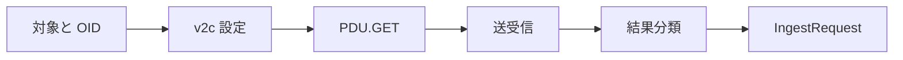

# 18 SNMP GET とエラー分類

能動照会の組み立て、再試行、結果の標準化を理解します。

## 重要ポイント

- SnmpV2cQueryClient は Transport、community、timeout、retry を設定します。
- PDU.GET に照会対象の OID を追加して送信します。
- TIMEOUT、SNMP_ERROR、INVALID_ADDRESS、IO_ERROR を区別します。
- 結果には成功可否、OID、値、応答時間、エラー、再試行回数を残します。
- SnmpQueryClient は拡張点ですが、現在の実装は v2c であり v3 authPriv ではありません。

## 実装上の境界

- 現在の実装、教材内シミュレーション、本番向け改善案を区別します。
- 図や設定ファイルの存在だけで、実環境への導入完了とは判断しません。

---

## 章末クイズ

全 5 問の単一選択問題です。通常の Markdown では先に自分で選び、その後で折りたたみを開いてください。

### 第 1 問

「SNMP GET とエラー分類」の中心的な説明として正しいものはどれですか。

- A. TCP Ping は socket.connect で指定ホストとポートへの接続を確認します。
- B. SnmpV2cQueryClient は Transport、community、timeout、retry を設定します。
- C. Spring Data JPA Repository が永続化を担当し、関連は主に LAZY です。
- D. 標準 Profile は PostgreSQL、HikariCP、PostgreSQLDialect を使用します。

回答後に解答を開く

正解：B. SnmpV2cQueryClient は Transport、community、timeout、retry を設定します。

解説：SnmpV2cQueryClient は Transport、community、timeout、retry を設定します。 これは本章の図と要点に一致します。他の選択肢は別章の事実、誤った順序、または検証境界の混同です。

### 第 2 問

章の図に沿った処理順序はどれですか。

- A. IngestRequest → 結果分類 → 送受信 → PDU.GET → v2c 設定 → 対象と OID
- B. v2c 設定 → PDU.GET → 送受信 → 結果分類 → IngestRequest → 対象と OID
- C. 対象と OID → IngestRequest → v2c 設定 → PDU.GET → 送受信 → 結果分類
- D. 対象と OID → v2c 設定 → PDU.GET → 送受信 → 結果分類 → IngestRequest

回答後に解答を開く

正解：D. 対象と OID → v2c 設定 → PDU.GET → 送受信 → 結果分類 → IngestRequest

解説：対象と OID → v2c 設定 → PDU.GET → 送受信 → 結果分類 → IngestRequest これは本章の図と要点に一致します。他の選択肢は別章の事実、誤った順序、または検証境界の混同です。

### 第 3 問

この章で説明したコンポーネントの責務として正しいものはどれですか。

- A. TIMEOUT、SNMP_ERROR、INVALID_ADDRESS、IO_ERROR を区別します。
- B. DNS_ERROR、TIMEOUT、CONNECTION_REFUSED、IO_ERROR を分類します。
- C. open-in-view=false によりテンプレート描画中の暗黙 SQL を防ぎます。
- D. Oracle Profile は OracleDriver と OracleDialect に切り替えます。

回答後に解答を開く

正解：A. TIMEOUT、SNMP_ERROR、INVALID_ADDRESS、IO_ERROR を区別します。

解説：TIMEOUT、SNMP_ERROR、INVALID_ADDRESS、IO_ERROR を区別します。 これは本章の図と要点に一致します。他の選択肢は別章の事実、誤った順序、または検証境界の混同です。

### 第 4 問

実装や調査を行う際、最も適切な判断はどれですか。

- A. 図に要素があれば、本番導入済みと判断します。
- B. 未実行またはスキップされた検証も成功として報告します。
- C. 現在の実装、教材内のシミュレーション、本番向け提案を区別して確認します。
- D. 画面でボタンを隠せば、サーバー側認可は不要です。

回答後に解答を開く

正解：C. 現在の実装、教材内のシミュレーション、本番向け提案を区別して確認します。

解説：現在の実装、教材内のシミュレーション、本番向け提案を区別して確認します。 これは本章の図と要点に一致します。他の選択肢は別章の事実、誤った順序、または検証境界の混同です。

### 第 5 問

この章の代表的な誤解を避ける説明はどれですか。

- A. ICMP が通っても PostgreSQL 5432 や HTTPS 443 が利用可能とは限りません。
- B. SnmpQueryClient は拡張点ですが、現在の実装は v2c であり v3 authPriv ではありません。
- C. 実際のスキーマ変更は Flyway migration が担当します。
- D. PostgreSQL と Oracle は起動時に一方を選び、同時接続する構成ではありません。

回答後に解答を開く

正解：B. SnmpQueryClient は拡張点ですが、現在の実装は v2c であり v3 authPriv ではありません。

解説：SnmpQueryClient は拡張点ですが、現在の実装は v2c であり v3 authPriv ではありません。 これは本章の図と要点に一致します。他の選択肢は別章の事実、誤った順序、または検証境界の混同です。

<!-- QUIZ_DATA_START
{
  "chapter": "18",
  "questions": [
    {
      "id": 1,
      "question": "「SNMP GET とエラー分類」の中心的な説明として正しいものはどれですか。",
      "options": {
        "A": "TCP Ping は socket.connect で指定ホストとポートへの接続を確認します。",
        "B": "SnmpV2cQueryClient は Transport、community、timeout、retry を設定します。",
        "C": "Spring Data JPA Repository が永続化を担当し、関連は主に LAZY です。",
        "D": "標準 Profile は PostgreSQL、HikariCP、PostgreSQLDialect を使用します。"
      },
      "answer": "B",
      "explanation": "SnmpV2cQueryClient は Transport、community、timeout、retry を設定します。 これは本章の図と要点に一致します。他の選択肢は別章の事実、誤った順序、または検証境界の混同です。"
    },
    {
      "id": 2,
      "question": "章の図に沿った処理順序はどれですか。",
      "options": {
        "A": "IngestRequest → 結果分類 → 送受信 → PDU.GET → v2c 設定 → 対象と OID",
        "B": "v2c 設定 → PDU.GET → 送受信 → 結果分類 → IngestRequest → 対象と OID",
        "C": "対象と OID → IngestRequest → v2c 設定 → PDU.GET → 送受信 → 結果分類",
        "D": "対象と OID → v2c 設定 → PDU.GET → 送受信 → 結果分類 → IngestRequest"
      },
      "answer": "D",
      "explanation": "対象と OID → v2c 設定 → PDU.GET → 送受信 → 結果分類 → IngestRequest これは本章の図と要点に一致します。他の選択肢は別章の事実、誤った順序、または検証境界の混同です。"
    },
    {
      "id": 3,
      "question": "この章で説明したコンポーネントの責務として正しいものはどれですか。",
      "options": {
        "A": "TIMEOUT、SNMP_ERROR、INVALID_ADDRESS、IO_ERROR を区別します。",
        "B": "DNS_ERROR、TIMEOUT、CONNECTION_REFUSED、IO_ERROR を分類します。",
        "C": "open-in-view=false によりテンプレート描画中の暗黙 SQL を防ぎます。",
        "D": "Oracle Profile は OracleDriver と OracleDialect に切り替えます。"
      },
      "answer": "A",
      "explanation": "TIMEOUT、SNMP_ERROR、INVALID_ADDRESS、IO_ERROR を区別します。 これは本章の図と要点に一致します。他の選択肢は別章の事実、誤った順序、または検証境界の混同です。"
    },
    {
      "id": 4,
      "question": "実装や調査を行う際、最も適切な判断はどれですか。",
      "options": {
        "A": "図に要素があれば、本番導入済みと判断します。",
        "B": "未実行またはスキップされた検証も成功として報告します。",
        "C": "現在の実装、教材内のシミュレーション、本番向け提案を区別して確認します。",
        "D": "画面でボタンを隠せば、サーバー側認可は不要です。"
      },
      "answer": "C",
      "explanation": "現在の実装、教材内のシミュレーション、本番向け提案を区別して確認します。 これは本章の図と要点に一致します。他の選択肢は別章の事実、誤った順序、または検証境界の混同です。"
    },
    {
      "id": 5,
      "question": "この章の代表的な誤解を避ける説明はどれですか。",
      "options": {
        "A": "ICMP が通っても PostgreSQL 5432 や HTTPS 443 が利用可能とは限りません。",
        "B": "SnmpQueryClient は拡張点ですが、現在の実装は v2c であり v3 authPriv ではありません。",
        "C": "実際のスキーマ変更は Flyway migration が担当します。",
        "D": "PostgreSQL と Oracle は起動時に一方を選び、同時接続する構成ではありません。"
      },
      "answer": "B",
      "explanation": "SnmpQueryClient は拡張点ですが、現在の実装は v2c であり v3 authPriv ではありません。 これは本章の図と要点に一致します。他の選択肢は別章の事実、誤った順序、または検証境界の混同です。"
    }
  ]
}
QUIZ_DATA_END -->
