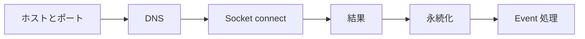

# 19 TCP Ping はポート接続確認

ICMP 到達性とアプリケーションポート接続性を区別します。

## 重要ポイント

- TCP Ping は socket.connect で指定ホストとポートへの接続を確認します。
- ICMP Echo Request は送らないため、一般的な ping とは異なります。
- DNS_ERROR、TIMEOUT、CONNECTION_REFUSED、IO_ERROR を分類します。
- 有限回の再試行を行い、tcp_ping_results に結果を保存します。
- ICMP が通っても PostgreSQL 5432 や HTTPS 443 が利用可能とは限りません。

## 実装上の境界

- 現在の実装、教材内シミュレーション、本番向け改善案を区別します。
- 図や設定ファイルの存在だけで、実環境への導入完了とは判断しません。

---

## 章末クイズ

全 5 問の単一選択問題です。通常の Markdown では先に自分で選び、その後で折りたたみを開いてください。

### 第 1 問

「TCP Ping はポート接続確認」の中心的な説明として正しいものはどれですか。

- A. Spring Data JPA Repository が永続化を担当し、関連は主に LAZY です。
- B. TCP Ping は socket.connect で指定ホストとポートへの接続を確認します。
- C. 標準 Profile は PostgreSQL、HikariCP、PostgreSQLDialect を使用します。
- D. 通知前に対象の有効性、最低レベル、既送信記録を確認します。

回答後に解答を開く

正解：B. TCP Ping は socket.connect で指定ホストとポートへの接続を確認します。

解説：TCP Ping は socket.connect で指定ホストとポートへの接続を確認します。 これは本章の図と要点に一致します。他の選択肢は別章の事実、誤った順序、または検証境界の混同です。

### 第 2 問

章の図に沿った処理順序はどれですか。

- A. Event 処理 → 永続化 → 結果 → Socket connect → DNS → ホストとポート
- B. DNS → Socket connect → 結果 → 永続化 → Event 処理 → ホストとポート
- C. ホストとポート → Event 処理 → DNS → Socket connect → 結果 → 永続化
- D. ホストとポート → DNS → Socket connect → 結果 → 永続化 → Event 処理

回答後に解答を開く

正解：D. ホストとポート → DNS → Socket connect → 結果 → 永続化 → Event 処理

解説：ホストとポート → DNS → Socket connect → 結果 → 永続化 → Event 処理 これは本章の図と要点に一致します。他の選択肢は別章の事実、誤った順序、または検証境界の混同です。

### 第 3 問

この章で説明したコンポーネントの責務として正しいものはどれですか。

- A. DNS_ERROR、TIMEOUT、CONNECTION_REFUSED、IO_ERROR を分類します。
- B. open-in-view=false によりテンプレート描画中の暗黙 SQL を防ぎます。
- C. Oracle Profile は OracleDriver と OracleDialect に切り替えます。
- D. ローカルでは MailHog を利用でき、実送信無効時は MOCKED を記録します。

回答後に解答を開く

正解：A. DNS_ERROR、TIMEOUT、CONNECTION_REFUSED、IO_ERROR を分類します。

解説：DNS_ERROR、TIMEOUT、CONNECTION_REFUSED、IO_ERROR を分類します。 これは本章の図と要点に一致します。他の選択肢は別章の事実、誤った順序、または検証境界の混同です。

### 第 4 問

実装や調査を行う際、最も適切な判断はどれですか。

- A. 図に要素があれば、本番導入済みと判断します。
- B. 未実行またはスキップされた検証も成功として報告します。
- C. 現在の実装、教材内のシミュレーション、本番向け提案を区別して確認します。
- D. 画面でボタンを隠せば、サーバー側認可は不要です。

回答後に解答を開く

正解：C. 現在の実装、教材内のシミュレーション、本番向け提案を区別して確認します。

解説：現在の実装、教材内のシミュレーション、本番向け提案を区別して確認します。 これは本章の図と要点に一致します。他の選択肢は別章の事実、誤った順序、または検証境界の混同です。

### 第 5 問

この章の代表的な誤解を避ける説明はどれですか。

- A. 実際のスキーマ変更は Flyway migration が担当します。
- B. ICMP が通っても PostgreSQL 5432 や HTTPS 443 が利用可能とは限りません。
- C. PostgreSQL と Oracle は起動時に一方を選び、同時接続する構成ではありません。
- D. 本番では Outbox や AFTER_COMMIT によりメールを DB トランザクション外へ移せます。

回答後に解答を開く

正解：B. ICMP が通っても PostgreSQL 5432 や HTTPS 443 が利用可能とは限りません。

解説：ICMP が通っても PostgreSQL 5432 や HTTPS 443 が利用可能とは限りません。 これは本章の図と要点に一致します。他の選択肢は別章の事実、誤った順序、または検証境界の混同です。

<!-- QUIZ_DATA_START
{
  "chapter": "19",
  "questions": [
    {
      "id": 1,
      "question": "「TCP Ping はポート接続確認」の中心的な説明として正しいものはどれですか。",
      "options": {
        "A": "Spring Data JPA Repository が永続化を担当し、関連は主に LAZY です。",
        "B": "TCP Ping は socket.connect で指定ホストとポートへの接続を確認します。",
        "C": "標準 Profile は PostgreSQL、HikariCP、PostgreSQLDialect を使用します。",
        "D": "通知前に対象の有効性、最低レベル、既送信記録を確認します。"
      },
      "answer": "B",
      "explanation": "TCP Ping は socket.connect で指定ホストとポートへの接続を確認します。 これは本章の図と要点に一致します。他の選択肢は別章の事実、誤った順序、または検証境界の混同です。"
    },
    {
      "id": 2,
      "question": "章の図に沿った処理順序はどれですか。",
      "options": {
        "A": "Event 処理 → 永続化 → 結果 → Socket connect → DNS → ホストとポート",
        "B": "DNS → Socket connect → 結果 → 永続化 → Event 処理 → ホストとポート",
        "C": "ホストとポート → Event 処理 → DNS → Socket connect → 結果 → 永続化",
        "D": "ホストとポート → DNS → Socket connect → 結果 → 永続化 → Event 処理"
      },
      "answer": "D",
      "explanation": "ホストとポート → DNS → Socket connect → 結果 → 永続化 → Event 処理 これは本章の図と要点に一致します。他の選択肢は別章の事実、誤った順序、または検証境界の混同です。"
    },
    {
      "id": 3,
      "question": "この章で説明したコンポーネントの責務として正しいものはどれですか。",
      "options": {
        "A": "DNS_ERROR、TIMEOUT、CONNECTION_REFUSED、IO_ERROR を分類します。",
        "B": "open-in-view=false によりテンプレート描画中の暗黙 SQL を防ぎます。",
        "C": "Oracle Profile は OracleDriver と OracleDialect に切り替えます。",
        "D": "ローカルでは MailHog を利用でき、実送信無効時は MOCKED を記録します。"
      },
      "answer": "A",
      "explanation": "DNS_ERROR、TIMEOUT、CONNECTION_REFUSED、IO_ERROR を分類します。 これは本章の図と要点に一致します。他の選択肢は別章の事実、誤った順序、または検証境界の混同です。"
    },
    {
      "id": 4,
      "question": "実装や調査を行う際、最も適切な判断はどれですか。",
      "options": {
        "A": "図に要素があれば、本番導入済みと判断します。",
        "B": "未実行またはスキップされた検証も成功として報告します。",
        "C": "現在の実装、教材内のシミュレーション、本番向け提案を区別して確認します。",
        "D": "画面でボタンを隠せば、サーバー側認可は不要です。"
      },
      "answer": "C",
      "explanation": "現在の実装、教材内のシミュレーション、本番向け提案を区別して確認します。 これは本章の図と要点に一致します。他の選択肢は別章の事実、誤った順序、または検証境界の混同です。"
    },
    {
      "id": 5,
      "question": "この章の代表的な誤解を避ける説明はどれですか。",
      "options": {
        "A": "実際のスキーマ変更は Flyway migration が担当します。",
        "B": "ICMP が通っても PostgreSQL 5432 や HTTPS 443 が利用可能とは限りません。",
        "C": "PostgreSQL と Oracle は起動時に一方を選び、同時接続する構成ではありません。",
        "D": "本番では Outbox や AFTER_COMMIT によりメールを DB トランザクション外へ移せます。"
      },
      "answer": "B",
      "explanation": "ICMP が通っても PostgreSQL 5432 や HTTPS 443 が利用可能とは限りません。 これは本章の図と要点に一致します。他の選択肢は別章の事実、誤った順序、または検証境界の混同です。"
    }
  ]
}
QUIZ_DATA_END -->
