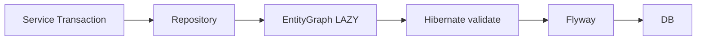

# 20 JPA、トランザクション境界、Flyway

関連取得、スキーマ検証、移行の責務を整理します。

## 重要ポイント

- Spring Data JPA Repository が永続化を担当し、関連は主に LAZY です。
- 必要な一覧では EntityGraph で関連を明示取得し、N+1 を抑えます。
- open-in-view=false によりテンプレート描画中の暗黙 SQL を防ぎます。
- ddl-auto=validate は Entity と表を検証するだけで、自動変更しません。
- 実際のスキーマ変更は Flyway migration が担当します。

## 実装上の境界

- 現在の実装、教材内シミュレーション、本番向け改善案を区別します。
- 図や設定ファイルの存在だけで、実環境への導入完了とは判断しません。

---

## 章末クイズ

全 5 問の単一選択問題です。通常の Markdown では先に自分で選び、その後で折りたたみを開いてください。

### 第 1 問

「JPA、トランザクション境界、Flyway」の中心的な説明として正しいものはどれですか。

- A. 標準 Profile は PostgreSQL、HikariCP、PostgreSQLDialect を使用します。
- B. Spring Data JPA Repository が永続化を担当し、関連は主に LAZY です。
- C. 通知前に対象の有効性、最低レベル、既送信記録を確認します。
- D. Actuator は health、info、metrics、prometheus などを公開します。

回答後に解答を開く

正解：B. Spring Data JPA Repository が永続化を担当し、関連は主に LAZY です。

解説：Spring Data JPA Repository が永続化を担当し、関連は主に LAZY です。 これは本章の図と要点に一致します。他の選択肢は別章の事実、誤った順序、または検証境界の混同です。

### 第 2 問

章の図に沿った処理順序はどれですか。

- A. DB → Flyway → Hibernate validate → EntityGraph LAZY → Repository → Service Transaction
- B. Repository → EntityGraph LAZY → Hibernate validate → Flyway → DB → Service Transaction
- C. Service Transaction → DB → Repository → EntityGraph LAZY → Hibernate validate → Flyway
- D. Service Transaction → Repository → EntityGraph LAZY → Hibernate validate → Flyway → DB

回答後に解答を開く

正解：D. Service Transaction → Repository → EntityGraph LAZY → Hibernate validate → Flyway → DB

解説：Service Transaction → Repository → EntityGraph LAZY → Hibernate validate → Flyway → DB これは本章の図と要点に一致します。他の選択肢は別章の事実、誤った順序、または検証境界の混同です。

### 第 3 問

この章で説明したコンポーネントの責務として正しいものはどれですか。

- A. open-in-view=false によりテンプレート描画中の暗黙 SQL を防ぎます。
- B. Oracle Profile は OracleDriver と OracleDialect に切り替えます。
- C. ローカルでは MailHog を利用でき、実送信無効時は MOCKED を記録します。
- D. Readiness はインスタンスが流量を受けられるか示します。

回答後に解答を開く

正解：A. open-in-view=false によりテンプレート描画中の暗黙 SQL を防ぎます。

解説：open-in-view=false によりテンプレート描画中の暗黙 SQL を防ぎます。 これは本章の図と要点に一致します。他の選択肢は別章の事実、誤った順序、または検証境界の混同です。

### 第 4 問

実装や調査を行う際、最も適切な判断はどれですか。

- A. 図に要素があれば、本番導入済みと判断します。
- B. 未実行またはスキップされた検証も成功として報告します。
- C. 現在の実装、教材内のシミュレーション、本番向け提案を区別して確認します。
- D. 画面でボタンを隠せば、サーバー側認可は不要です。

回答後に解答を開く

正解：C. 現在の実装、教材内のシミュレーション、本番向け提案を区別して確認します。

解説：現在の実装、教材内のシミュレーション、本番向け提案を区別して確認します。 これは本章の図と要点に一致します。他の選択肢は別章の事実、誤った順序、または検証境界の混同です。

### 第 5 問

この章の代表的な誤解を避ける説明はどれですか。

- A. PostgreSQL と Oracle は起動時に一方を選び、同時接続する構成ではありません。
- B. 実際のスキーマ変更は Flyway migration が担当します。
- C. 本番では Outbox や AFTER_COMMIT によりメールを DB トランザクション外へ移せます。
- D. Graceful Shutdown は終了時に処理中の要求をできるだけ完了させます。

回答後に解答を開く

正解：B. 実際のスキーマ変更は Flyway migration が担当します。

解説：実際のスキーマ変更は Flyway migration が担当します。 これは本章の図と要点に一致します。他の選択肢は別章の事実、誤った順序、または検証境界の混同です。

<!-- QUIZ_DATA_START
{
  "chapter": "20",
  "questions": [
    {
      "id": 1,
      "question": "「JPA、トランザクション境界、Flyway」の中心的な説明として正しいものはどれですか。",
      "options": {
        "A": "標準 Profile は PostgreSQL、HikariCP、PostgreSQLDialect を使用します。",
        "B": "Spring Data JPA Repository が永続化を担当し、関連は主に LAZY です。",
        "C": "通知前に対象の有効性、最低レベル、既送信記録を確認します。",
        "D": "Actuator は health、info、metrics、prometheus などを公開します。"
      },
      "answer": "B",
      "explanation": "Spring Data JPA Repository が永続化を担当し、関連は主に LAZY です。 これは本章の図と要点に一致します。他の選択肢は別章の事実、誤った順序、または検証境界の混同です。"
    },
    {
      "id": 2,
      "question": "章の図に沿った処理順序はどれですか。",
      "options": {
        "A": "DB → Flyway → Hibernate validate → EntityGraph LAZY → Repository → Service Transaction",
        "B": "Repository → EntityGraph LAZY → Hibernate validate → Flyway → DB → Service Transaction",
        "C": "Service Transaction → DB → Repository → EntityGraph LAZY → Hibernate validate → Flyway",
        "D": "Service Transaction → Repository → EntityGraph LAZY → Hibernate validate → Flyway → DB"
      },
      "answer": "D",
      "explanation": "Service Transaction → Repository → EntityGraph LAZY → Hibernate validate → Flyway → DB これは本章の図と要点に一致します。他の選択肢は別章の事実、誤った順序、または検証境界の混同です。"
    },
    {
      "id": 3,
      "question": "この章で説明したコンポーネントの責務として正しいものはどれですか。",
      "options": {
        "A": "open-in-view=false によりテンプレート描画中の暗黙 SQL を防ぎます。",
        "B": "Oracle Profile は OracleDriver と OracleDialect に切り替えます。",
        "C": "ローカルでは MailHog を利用でき、実送信無効時は MOCKED を記録します。",
        "D": "Readiness はインスタンスが流量を受けられるか示します。"
      },
      "answer": "A",
      "explanation": "open-in-view=false によりテンプレート描画中の暗黙 SQL を防ぎます。 これは本章の図と要点に一致します。他の選択肢は別章の事実、誤った順序、または検証境界の混同です。"
    },
    {
      "id": 4,
      "question": "実装や調査を行う際、最も適切な判断はどれですか。",
      "options": {
        "A": "図に要素があれば、本番導入済みと判断します。",
        "B": "未実行またはスキップされた検証も成功として報告します。",
        "C": "現在の実装、教材内のシミュレーション、本番向け提案を区別して確認します。",
        "D": "画面でボタンを隠せば、サーバー側認可は不要です。"
      },
      "answer": "C",
      "explanation": "現在の実装、教材内のシミュレーション、本番向け提案を区別して確認します。 これは本章の図と要点に一致します。他の選択肢は別章の事実、誤った順序、または検証境界の混同です。"
    },
    {
      "id": 5,
      "question": "この章の代表的な誤解を避ける説明はどれですか。",
      "options": {
        "A": "PostgreSQL と Oracle は起動時に一方を選び、同時接続する構成ではありません。",
        "B": "実際のスキーマ変更は Flyway migration が担当します。",
        "C": "本番では Outbox や AFTER_COMMIT によりメールを DB トランザクション外へ移せます。",
        "D": "Graceful Shutdown は終了時に処理中の要求をできるだけ完了させます。"
      },
      "answer": "B",
      "explanation": "実際のスキーマ変更は Flyway migration が担当します。 これは本章の図と要点に一致します。他の選択肢は別章の事実、誤った順序、または検証境界の混同です。"
    }
  ]
}
QUIZ_DATA_END -->
