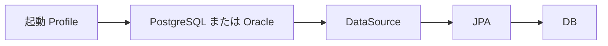

# 21 PostgreSQL と Oracle Profile

二つの DB 対応が同時書き込みではなく、起動時の選択であることを理解します。

## 重要ポイント

- 標準 Profile は PostgreSQL、HikariCP、PostgreSQLDialect を使用します。
- 接続ユーザー名とパスワードは環境変数から注入します。
- Oracle Profile は OracleDriver と OracleDialect に切り替えます。
- 資料では Oracle モードの Flyway は現在無効で、接続情報を外部提供します。
- PostgreSQL と Oracle は起動時に一方を選び、同時接続する構成ではありません。

## 実装上の境界

- 現在の実装、教材内シミュレーション、本番向け改善案を区別します。
- 図や設定ファイルの存在だけで、実環境への導入完了とは判断しません。

---

## 章末クイズ

全 5 問の単一選択問題です。通常の Markdown では先に自分で選び、その後で折りたたみを開いてください。

### 第 1 問

「PostgreSQL と Oracle Profile」の中心的な説明として正しいものはどれですか。

- A. 通知前に対象の有効性、最低レベル、既送信記録を確認します。
- B. 標準 Profile は PostgreSQL、HikariCP、PostgreSQLDialect を使用します。
- C. Actuator は health、info、metrics、prometheus などを公開します。
- D. Dockerfile は JDK 25 で構築し、Java 25 JRE Alpine で実行します。

回答後に解答を開く

正解：B. 標準 Profile は PostgreSQL、HikariCP、PostgreSQLDialect を使用します。

解説：標準 Profile は PostgreSQL、HikariCP、PostgreSQLDialect を使用します。 これは本章の図と要点に一致します。他の選択肢は別章の事実、誤った順序、または検証境界の混同です。

### 第 2 問

章の図に沿った処理順序はどれですか。

- A. DB → JPA → DataSource → PostgreSQL または Oracle → 起動 Profile
- B. PostgreSQL または Oracle → DataSource → JPA → DB → 起動 Profile
- C. 起動 Profile → DB → PostgreSQL または Oracle → DataSource → JPA
- D. 起動 Profile → PostgreSQL または Oracle → DataSource → JPA → DB

回答後に解答を開く

正解：D. 起動 Profile → PostgreSQL または Oracle → DataSource → JPA → DB

解説：起動 Profile → PostgreSQL または Oracle → DataSource → JPA → DB これは本章の図と要点に一致します。他の選択肢は別章の事実、誤った順序、または検証境界の混同です。

### 第 3 問

この章で説明したコンポーネントの責務として正しいものはどれですか。

- A. Oracle Profile は OracleDriver と OracleDialect に切り替えます。
- B. ローカルでは MailHog を利用でき、実送信無効時は MOCKED を記録します。
- C. Readiness はインスタンスが流量を受けられるか示します。
- D. Web 8080、Syslog TCP/UDP 5514、Trap UDP 1162 を公開します。

回答後に解答を開く

正解：A. Oracle Profile は OracleDriver と OracleDialect に切り替えます。

解説：Oracle Profile は OracleDriver と OracleDialect に切り替えます。 これは本章の図と要点に一致します。他の選択肢は別章の事実、誤った順序、または検証境界の混同です。

### 第 4 問

実装や調査を行う際、最も適切な判断はどれですか。

- A. 図に要素があれば、本番導入済みと判断します。
- B. 未実行またはスキップされた検証も成功として報告します。
- C. 現在の実装、教材内のシミュレーション、本番向け提案を区別して確認します。
- D. 画面でボタンを隠せば、サーバー側認可は不要です。

回答後に解答を開く

正解：C. 現在の実装、教材内のシミュレーション、本番向け提案を区別して確認します。

解説：現在の実装、教材内のシミュレーション、本番向け提案を区別して確認します。 これは本章の図と要点に一致します。他の選択肢は別章の事実、誤った順序、または検証境界の混同です。

### 第 5 問

この章の代表的な誤解を避ける説明はどれですか。

- A. 本番では Outbox や AFTER_COMMIT によりメールを DB トランザクション外へ移せます。
- B. PostgreSQL と Oracle は起動時に一方を選び、同時接続する構成ではありません。
- C. Graceful Shutdown は終了時に処理中の要求をできるだけ完了させます。
- D. 同じイメージが起動引数により Web、Receiver、Worker の論理役割を担当できます。

回答後に解答を開く

正解：B. PostgreSQL と Oracle は起動時に一方を選び、同時接続する構成ではありません。

解説：PostgreSQL と Oracle は起動時に一方を選び、同時接続する構成ではありません。 これは本章の図と要点に一致します。他の選択肢は別章の事実、誤った順序、または検証境界の混同です。

<!-- QUIZ_DATA_START
{
  "chapter": "21",
  "questions": [
    {
      "id": 1,
      "question": "「PostgreSQL と Oracle Profile」の中心的な説明として正しいものはどれですか。",
      "options": {
        "A": "通知前に対象の有効性、最低レベル、既送信記録を確認します。",
        "B": "標準 Profile は PostgreSQL、HikariCP、PostgreSQLDialect を使用します。",
        "C": "Actuator は health、info、metrics、prometheus などを公開します。",
        "D": "Dockerfile は JDK 25 で構築し、Java 25 JRE Alpine で実行します。"
      },
      "answer": "B",
      "explanation": "標準 Profile は PostgreSQL、HikariCP、PostgreSQLDialect を使用します。 これは本章の図と要点に一致します。他の選択肢は別章の事実、誤った順序、または検証境界の混同です。"
    },
    {
      "id": 2,
      "question": "章の図に沿った処理順序はどれですか。",
      "options": {
        "A": "DB → JPA → DataSource → PostgreSQL または Oracle → 起動 Profile",
        "B": "PostgreSQL または Oracle → DataSource → JPA → DB → 起動 Profile",
        "C": "起動 Profile → DB → PostgreSQL または Oracle → DataSource → JPA",
        "D": "起動 Profile → PostgreSQL または Oracle → DataSource → JPA → DB"
      },
      "answer": "D",
      "explanation": "起動 Profile → PostgreSQL または Oracle → DataSource → JPA → DB これは本章の図と要点に一致します。他の選択肢は別章の事実、誤った順序、または検証境界の混同です。"
    },
    {
      "id": 3,
      "question": "この章で説明したコンポーネントの責務として正しいものはどれですか。",
      "options": {
        "A": "Oracle Profile は OracleDriver と OracleDialect に切り替えます。",
        "B": "ローカルでは MailHog を利用でき、実送信無効時は MOCKED を記録します。",
        "C": "Readiness はインスタンスが流量を受けられるか示します。",
        "D": "Web 8080、Syslog TCP/UDP 5514、Trap UDP 1162 を公開します。"
      },
      "answer": "A",
      "explanation": "Oracle Profile は OracleDriver と OracleDialect に切り替えます。 これは本章の図と要点に一致します。他の選択肢は別章の事実、誤った順序、または検証境界の混同です。"
    },
    {
      "id": 4,
      "question": "実装や調査を行う際、最も適切な判断はどれですか。",
      "options": {
        "A": "図に要素があれば、本番導入済みと判断します。",
        "B": "未実行またはスキップされた検証も成功として報告します。",
        "C": "現在の実装、教材内のシミュレーション、本番向け提案を区別して確認します。",
        "D": "画面でボタンを隠せば、サーバー側認可は不要です。"
      },
      "answer": "C",
      "explanation": "現在の実装、教材内のシミュレーション、本番向け提案を区別して確認します。 これは本章の図と要点に一致します。他の選択肢は別章の事実、誤った順序、または検証境界の混同です。"
    },
    {
      "id": 5,
      "question": "この章の代表的な誤解を避ける説明はどれですか。",
      "options": {
        "A": "本番では Outbox や AFTER_COMMIT によりメールを DB トランザクション外へ移せます。",
        "B": "PostgreSQL と Oracle は起動時に一方を選び、同時接続する構成ではありません。",
        "C": "Graceful Shutdown は終了時に処理中の要求をできるだけ完了させます。",
        "D": "同じイメージが起動引数により Web、Receiver、Worker の論理役割を担当できます。"
      },
      "answer": "B",
      "explanation": "PostgreSQL と Oracle は起動時に一方を選び、同時接続する構成ではありません。 これは本章の図と要点に一致します。他の選択肢は別章の事実、誤った順序、または検証境界の混同です。"
    }
  ]
}
QUIZ_DATA_END -->
