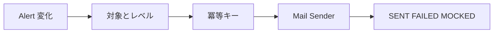

# 22 通知、冪等記録、トランザクションリスク

通知条件、冪等キー、失敗記録、非同期化の方向を確認します。

## 重要ポイント

- 通知前に対象の有効性、最低レベル、既送信記録を確認します。
- 冪等キーは alertId、eventCount、targetId で構成します。
- ローカルでは MailHog を利用でき、実送信無効時は MOCKED を記録します。
- 送信失敗は FAILED と例外種別を残し、Event の事実を失わせません。
- 本番では Outbox や AFTER_COMMIT によりメールを DB トランザクション外へ移せます。

## 実装上の境界

- 現在の実装、教材内シミュレーション、本番向け改善案を区別します。
- 図や設定ファイルの存在だけで、実環境への導入完了とは判断しません。

---

## 章末クイズ

全 5 問の単一選択問題です。通常の Markdown では先に自分で選び、その後で折りたたみを開いてください。

### 第 1 問

「通知、冪等記録、トランザクションリスク」の中心的な説明として正しいものはどれですか。

- A. Actuator は health、info、metrics、prometheus などを公開します。
- B. 通知前に対象の有効性、最低レベル、既送信記録を確認します。
- C. Dockerfile は JDK 25 で構築し、Java 25 JRE Alpine で実行します。
- D. JUnit 5、Mockito、Spring Boot Test、MockMvc、Security Test を使用します。

回答後に解答を開く

正解：B. 通知前に対象の有効性、最低レベル、既送信記録を確認します。

解説：通知前に対象の有効性、最低レベル、既送信記録を確認します。 これは本章の図と要点に一致します。他の選択肢は別章の事実、誤った順序、または検証境界の混同です。

### 第 2 問

章の図に沿った処理順序はどれですか。

- A. SENT FAILED MOCKED → Mail Sender → 冪等キー → 対象とレベル → Alert 変化
- B. 対象とレベル → 冪等キー → Mail Sender → SENT FAILED MOCKED → Alert 変化
- C. Alert 変化 → SENT FAILED MOCKED → 対象とレベル → 冪等キー → Mail Sender
- D. Alert 変化 → 対象とレベル → 冪等キー → Mail Sender → SENT FAILED MOCKED

回答後に解答を開く

正解：D. Alert 変化 → 対象とレベル → 冪等キー → Mail Sender → SENT FAILED MOCKED

解説：Alert 変化 → 対象とレベル → 冪等キー → Mail Sender → SENT FAILED MOCKED これは本章の図と要点に一致します。他の選択肢は別章の事実、誤った順序、または検証境界の混同です。

### 第 3 問

この章で説明したコンポーネントの責務として正しいものはどれですか。

- A. ローカルでは MailHog を利用でき、実送信無効時は MOCKED を記録します。
- B. Readiness はインスタンスが流量を受けられるか示します。
- C. Web 8080、Syslog TCP/UDP 5514、Trap UDP 1162 を公開します。
- D. Testcontainers PostgreSQL は実ドライバーに近い DB 挙動を検証します。

回答後に解答を開く

正解：A. ローカルでは MailHog を利用でき、実送信無効時は MOCKED を記録します。

解説：ローカルでは MailHog を利用でき、実送信無効時は MOCKED を記録します。 これは本章の図と要点に一致します。他の選択肢は別章の事実、誤った順序、または検証境界の混同です。

### 第 4 問

実装や調査を行う際、最も適切な判断はどれですか。

- A. 図に要素があれば、本番導入済みと判断します。
- B. 未実行またはスキップされた検証も成功として報告します。
- C. 現在の実装、教材内のシミュレーション、本番向け提案を区別して確認します。
- D. 画面でボタンを隠せば、サーバー側認可は不要です。

回答後に解答を開く

正解：C. 現在の実装、教材内のシミュレーション、本番向け提案を区別して確認します。

解説：現在の実装、教材内のシミュレーション、本番向け提案を区別して確認します。 これは本章の図と要点に一致します。他の選択肢は別章の事実、誤った順序、または検証境界の混同です。

### 第 5 問

この章の代表的な誤解を避ける説明はどれですか。

- A. Graceful Shutdown は終了時に処理中の要求をできるだけ完了させます。
- B. 本番では Outbox や AFTER_COMMIT によりメールを DB トランザクション外へ移せます。
- C. 同じイメージが起動引数により Web、Receiver、Worker の論理役割を担当できます。
- D. JaCoCo レポートは app/bms-app/target/site/jacoco/index.html に生成されます。

回答後に解答を開く

正解：B. 本番では Outbox や AFTER_COMMIT によりメールを DB トランザクション外へ移せます。

解説：本番では Outbox や AFTER_COMMIT によりメールを DB トランザクション外へ移せます。 これは本章の図と要点に一致します。他の選択肢は別章の事実、誤った順序、または検証境界の混同です。

<!-- QUIZ_DATA_START
{
  "chapter": "22",
  "questions": [
    {
      "id": 1,
      "question": "「通知、冪等記録、トランザクションリスク」の中心的な説明として正しいものはどれですか。",
      "options": {
        "A": "Actuator は health、info、metrics、prometheus などを公開します。",
        "B": "通知前に対象の有効性、最低レベル、既送信記録を確認します。",
        "C": "Dockerfile は JDK 25 で構築し、Java 25 JRE Alpine で実行します。",
        "D": "JUnit 5、Mockito、Spring Boot Test、MockMvc、Security Test を使用します。"
      },
      "answer": "B",
      "explanation": "通知前に対象の有効性、最低レベル、既送信記録を確認します。 これは本章の図と要点に一致します。他の選択肢は別章の事実、誤った順序、または検証境界の混同です。"
    },
    {
      "id": 2,
      "question": "章の図に沿った処理順序はどれですか。",
      "options": {
        "A": "SENT FAILED MOCKED → Mail Sender → 冪等キー → 対象とレベル → Alert 変化",
        "B": "対象とレベル → 冪等キー → Mail Sender → SENT FAILED MOCKED → Alert 変化",
        "C": "Alert 変化 → SENT FAILED MOCKED → 対象とレベル → 冪等キー → Mail Sender",
        "D": "Alert 変化 → 対象とレベル → 冪等キー → Mail Sender → SENT FAILED MOCKED"
      },
      "answer": "D",
      "explanation": "Alert 変化 → 対象とレベル → 冪等キー → Mail Sender → SENT FAILED MOCKED これは本章の図と要点に一致します。他の選択肢は別章の事実、誤った順序、または検証境界の混同です。"
    },
    {
      "id": 3,
      "question": "この章で説明したコンポーネントの責務として正しいものはどれですか。",
      "options": {
        "A": "ローカルでは MailHog を利用でき、実送信無効時は MOCKED を記録します。",
        "B": "Readiness はインスタンスが流量を受けられるか示します。",
        "C": "Web 8080、Syslog TCP/UDP 5514、Trap UDP 1162 を公開します。",
        "D": "Testcontainers PostgreSQL は実ドライバーに近い DB 挙動を検証します。"
      },
      "answer": "A",
      "explanation": "ローカルでは MailHog を利用でき、実送信無効時は MOCKED を記録します。 これは本章の図と要点に一致します。他の選択肢は別章の事実、誤った順序、または検証境界の混同です。"
    },
    {
      "id": 4,
      "question": "実装や調査を行う際、最も適切な判断はどれですか。",
      "options": {
        "A": "図に要素があれば、本番導入済みと判断します。",
        "B": "未実行またはスキップされた検証も成功として報告します。",
        "C": "現在の実装、教材内のシミュレーション、本番向け提案を区別して確認します。",
        "D": "画面でボタンを隠せば、サーバー側認可は不要です。"
      },
      "answer": "C",
      "explanation": "現在の実装、教材内のシミュレーション、本番向け提案を区別して確認します。 これは本章の図と要点に一致します。他の選択肢は別章の事実、誤った順序、または検証境界の混同です。"
    },
    {
      "id": 5,
      "question": "この章の代表的な誤解を避ける説明はどれですか。",
      "options": {
        "A": "Graceful Shutdown は終了時に処理中の要求をできるだけ完了させます。",
        "B": "本番では Outbox や AFTER_COMMIT によりメールを DB トランザクション外へ移せます。",
        "C": "同じイメージが起動引数により Web、Receiver、Worker の論理役割を担当できます。",
        "D": "JaCoCo レポートは app/bms-app/target/site/jacoco/index.html に生成されます。"
      },
      "answer": "B",
      "explanation": "本番では Outbox や AFTER_COMMIT によりメールを DB トランザクション外へ移せます。 これは本章の図と要点に一致します。他の選択肢は別章の事実、誤った順序、または検証境界の混同です。"
    }
  ]
}
QUIZ_DATA_END -->
