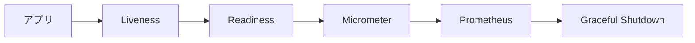

# 23 Actuator、メトリクス、Graceful Shutdown

生存、流量受付、観測、終了処理の信号を区別します。

## 重要ポイント

- Actuator は health、info、metrics、prometheus などを公開します。
- Liveness はプロセスを再起動すべきか判断する信号です。
- Readiness はインスタンスが流量を受けられるか示します。
- Micrometer Prometheus Registry が JVM、HTTP、アプリ指標を出力します。
- Graceful Shutdown は終了時に処理中の要求をできるだけ完了させます。

## 実装上の境界

- 現在の実装、教材内シミュレーション、本番向け改善案を区別します。
- 図や設定ファイルの存在だけで、実環境への導入完了とは判断しません。

---

## 章末クイズ

全 5 問の単一選択問題です。通常の Markdown では先に自分で選び、その後で折りたたみを開いてください。

### 第 1 問

「Actuator、メトリクス、Graceful Shutdown」の中心的な説明として正しいものはどれですか。

- A. Dockerfile は JDK 25 で構築し、Java 25 JRE Alpine で実行します。
- B. Actuator は health、info、metrics、prometheus などを公開します。
- C. JUnit 5、Mockito、Spring Boot Test、MockMvc、Security Test を使用します。
- D. メール送信は Outbox、AFTER_COMMIT、メッセージキューで DB トランザクション外へ移せます。

回答後に解答を開く

正解：B. Actuator は health、info、metrics、prometheus などを公開します。

解説：Actuator は health、info、metrics、prometheus などを公開します。 これは本章の図と要点に一致します。他の選択肢は別章の事実、誤った順序、または検証境界の混同です。

### 第 2 問

章の図に沿った処理順序はどれですか。

- A. Graceful Shutdown → Prometheus → Micrometer → Readiness → Liveness → アプリ
- B. Liveness → Readiness → Micrometer → Prometheus → Graceful Shutdown → アプリ
- C. アプリ → Graceful Shutdown → Liveness → Readiness → Micrometer → Prometheus
- D. アプリ → Liveness → Readiness → Micrometer → Prometheus → Graceful Shutdown

回答後に解答を開く

正解：D. アプリ → Liveness → Readiness → Micrometer → Prometheus → Graceful Shutdown

解説：アプリ → Liveness → Readiness → Micrometer → Prometheus → Graceful Shutdown これは本章の図と要点に一致します。他の選択肢は別章の事実、誤った順序、または検証境界の混同です。

### 第 3 問

この章で説明したコンポーネントの責務として正しいものはどれですか。

- A. Readiness はインスタンスが流量を受けられるか示します。
- B. Web 8080、Syslog TCP/UDP 5514、Trap UDP 1162 を公開します。
- C. Testcontainers PostgreSQL は実ドライバーに近い DB 挙動を検証します。
- D. 一意制約、原子的 UPSERT、ロック、分割キーで重複競合を抑えられます。

回答後に解答を開く

正解：A. Readiness はインスタンスが流量を受けられるか示します。

解説：Readiness はインスタンスが流量を受けられるか示します。 これは本章の図と要点に一致します。他の選択肢は別章の事実、誤った順序、または検証境界の混同です。

### 第 4 問

実装や調査を行う際、最も適切な判断はどれですか。

- A. 図に要素があれば、本番導入済みと判断します。
- B. 未実行またはスキップされた検証も成功として報告します。
- C. 現在の実装、教材内のシミュレーション、本番向け提案を区別して確認します。
- D. 画面でボタンを隠せば、サーバー側認可は不要です。

回答後に解答を開く

正解：C. 現在の実装、教材内のシミュレーション、本番向け提案を区別して確認します。

解説：現在の実装、教材内のシミュレーション、本番向け提案を区別して確認します。 これは本章の図と要点に一致します。他の選択肢は別章の事実、誤った順序、または検証境界の混同です。

### 第 5 問

この章の代表的な誤解を避ける説明はどれですか。

- A. 同じイメージが起動引数により Web、Receiver、Worker の論理役割を担当できます。
- B. Graceful Shutdown は終了時に処理中の要求をできるだけ完了させます。
- C. JaCoCo レポートは app/bms-app/target/site/jacoco/index.html に生成されます。
- D. メモリユーザーを企業 OIDC に置き換え、Java バージョン表記も統一します。

回答後に解答を開く

正解：B. Graceful Shutdown は終了時に処理中の要求をできるだけ完了させます。

解説：Graceful Shutdown は終了時に処理中の要求をできるだけ完了させます。 これは本章の図と要点に一致します。他の選択肢は別章の事実、誤った順序、または検証境界の混同です。

<!-- QUIZ_DATA_START
{
  "chapter": "23",
  "questions": [
    {
      "id": 1,
      "question": "「Actuator、メトリクス、Graceful Shutdown」の中心的な説明として正しいものはどれですか。",
      "options": {
        "A": "Dockerfile は JDK 25 で構築し、Java 25 JRE Alpine で実行します。",
        "B": "Actuator は health、info、metrics、prometheus などを公開します。",
        "C": "JUnit 5、Mockito、Spring Boot Test、MockMvc、Security Test を使用します。",
        "D": "メール送信は Outbox、AFTER_COMMIT、メッセージキューで DB トランザクション外へ移せます。"
      },
      "answer": "B",
      "explanation": "Actuator は health、info、metrics、prometheus などを公開します。 これは本章の図と要点に一致します。他の選択肢は別章の事実、誤った順序、または検証境界の混同です。"
    },
    {
      "id": 2,
      "question": "章の図に沿った処理順序はどれですか。",
      "options": {
        "A": "Graceful Shutdown → Prometheus → Micrometer → Readiness → Liveness → アプリ",
        "B": "Liveness → Readiness → Micrometer → Prometheus → Graceful Shutdown → アプリ",
        "C": "アプリ → Graceful Shutdown → Liveness → Readiness → Micrometer → Prometheus",
        "D": "アプリ → Liveness → Readiness → Micrometer → Prometheus → Graceful Shutdown"
      },
      "answer": "D",
      "explanation": "アプリ → Liveness → Readiness → Micrometer → Prometheus → Graceful Shutdown これは本章の図と要点に一致します。他の選択肢は別章の事実、誤った順序、または検証境界の混同です。"
    },
    {
      "id": 3,
      "question": "この章で説明したコンポーネントの責務として正しいものはどれですか。",
      "options": {
        "A": "Readiness はインスタンスが流量を受けられるか示します。",
        "B": "Web 8080、Syslog TCP/UDP 5514、Trap UDP 1162 を公開します。",
        "C": "Testcontainers PostgreSQL は実ドライバーに近い DB 挙動を検証します。",
        "D": "一意制約、原子的 UPSERT、ロック、分割キーで重複競合を抑えられます。"
      },
      "answer": "A",
      "explanation": "Readiness はインスタンスが流量を受けられるか示します。 これは本章の図と要点に一致します。他の選択肢は別章の事実、誤った順序、または検証境界の混同です。"
    },
    {
      "id": 4,
      "question": "実装や調査を行う際、最も適切な判断はどれですか。",
      "options": {
        "A": "図に要素があれば、本番導入済みと判断します。",
        "B": "未実行またはスキップされた検証も成功として報告します。",
        "C": "現在の実装、教材内のシミュレーション、本番向け提案を区別して確認します。",
        "D": "画面でボタンを隠せば、サーバー側認可は不要です。"
      },
      "answer": "C",
      "explanation": "現在の実装、教材内のシミュレーション、本番向け提案を区別して確認します。 これは本章の図と要点に一致します。他の選択肢は別章の事実、誤った順序、または検証境界の混同です。"
    },
    {
      "id": 5,
      "question": "この章の代表的な誤解を避ける説明はどれですか。",
      "options": {
        "A": "同じイメージが起動引数により Web、Receiver、Worker の論理役割を担当できます。",
        "B": "Graceful Shutdown は終了時に処理中の要求をできるだけ完了させます。",
        "C": "JaCoCo レポートは app/bms-app/target/site/jacoco/index.html に生成されます。",
        "D": "メモリユーザーを企業 OIDC に置き換え、Java バージョン表記も統一します。"
      },
      "answer": "B",
      "explanation": "Graceful Shutdown は終了時に処理中の要求をできるだけ完了させます。 これは本章の図と要点に一致します。他の選択肢は別章の事実、誤った順序、または検証境界の混同です。"
    }
  ]
}
QUIZ_DATA_END -->
