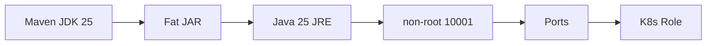

# 24 Docker、Kubernetes、ポートと役割

イメージ構築、非 root 実行、ヘルスチェック、ポート変換を理解します。

## 重要ポイント

- Dockerfile は JDK 25 で構築し、Java 25 JRE Alpine で実行します。
- 実行イメージは Maven を含まず、非 root ユーザー 10001 を使います。
- Web 8080、Syslog TCP/UDP 5514、Trap UDP 1162 を公開します。
- Docker Healthcheck は Actuator readiness を使用します。
- 同じイメージが起動引数により Web、Receiver、Worker の論理役割を担当できます。

## 実装上の境界

- 現在の実装、教材内シミュレーション、本番向け改善案を区別します。
- 図や設定ファイルの存在だけで、実環境への導入完了とは判断しません。

---

## 章末クイズ

全 5 問の単一選択問題です。通常の Markdown では先に自分で選び、その後で折りたたみを開いてください。

### 第 1 問

「Docker、Kubernetes、ポートと役割」の中心的な説明として正しいものはどれですか。

- A. JUnit 5、Mockito、Spring Boot Test、MockMvc、Security Test を使用します。
- B. Dockerfile は JDK 25 で構築し、Java 25 JRE Alpine で実行します。
- C. メール送信は Outbox、AFTER_COMMIT、メッセージキューで DB トランザクション外へ移せます。
- D. 監視経路は複数プロトコルを IngestRequest に統一して中核サービスへ渡します。

回答後に解答を開く

正解：B. Dockerfile は JDK 25 で構築し、Java 25 JRE Alpine で実行します。

解説：Dockerfile は JDK 25 で構築し、Java 25 JRE Alpine で実行します。 これは本章の図と要点に一致します。他の選択肢は別章の事実、誤った順序、または検証境界の混同です。

### 第 2 問

章の図に沿った処理順序はどれですか。

- A. K8s Role → Ports → non-root 10001 → Java 25 JRE → Fat JAR → Maven JDK 25
- B. Fat JAR → Java 25 JRE → non-root 10001 → Ports → K8s Role → Maven JDK 25
- C. Maven JDK 25 → K8s Role → Fat JAR → Java 25 JRE → non-root 10001 → Ports
- D. Maven JDK 25 → Fat JAR → Java 25 JRE → non-root 10001 → Ports → K8s Role

回答後に解答を開く

正解：D. Maven JDK 25 → Fat JAR → Java 25 JRE → non-root 10001 → Ports → K8s Role

解説：Maven JDK 25 → Fat JAR → Java 25 JRE → non-root 10001 → Ports → K8s Role これは本章の図と要点に一致します。他の選択肢は別章の事実、誤った順序、または検証境界の混同です。

### 第 3 問

この章で説明したコンポーネントの責務として正しいものはどれですか。

- A. Web 8080、Syslog TCP/UDP 5514、Trap UDP 1162 を公開します。
- B. Testcontainers PostgreSQL は実ドライバーに近い DB 挙動を検証します。
- C. 一意制約、原子的 UPSERT、ロック、分割キーで重複競合を抑えられます。
- D. 画面経路は Security、MVC、Service、Repository、Model、Thymeleaf を通ります。

回答後に解答を開く

正解：A. Web 8080、Syslog TCP/UDP 5514、Trap UDP 1162 を公開します。

解説：Web 8080、Syslog TCP/UDP 5514、Trap UDP 1162 を公開します。 これは本章の図と要点に一致します。他の選択肢は別章の事実、誤った順序、または検証境界の混同です。

### 第 4 問

実装や調査を行う際、最も適切な判断はどれですか。

- A. 図に要素があれば、本番導入済みと判断します。
- B. 未実行またはスキップされた検証も成功として報告します。
- C. 現在の実装、教材内のシミュレーション、本番向け提案を区別して確認します。
- D. 画面でボタンを隠せば、サーバー側認可は不要です。

回答後に解答を開く

正解：C. 現在の実装、教材内のシミュレーション、本番向け提案を区別して確認します。

解説：現在の実装、教材内のシミュレーション、本番向け提案を区別して確認します。 これは本章の図と要点に一致します。他の選択肢は別章の事実、誤った順序、または検証境界の混同です。

### 第 5 問

この章の代表的な誤解を避ける説明はどれですか。

- A. JaCoCo レポートは app/bms-app/target/site/jacoco/index.html に生成されます。
- B. 同じイメージが起動引数により Web、Receiver、Worker の論理役割を担当できます。
- C. メモリユーザーを企業 OIDC に置き換え、Java バージョン表記も統一します。
- D. 次の学習対象は Outbox、並行冪等、SNMPv3、企業 ID、実時間集約です。

回答後に解答を開く

正解：B. 同じイメージが起動引数により Web、Receiver、Worker の論理役割を担当できます。

解説：同じイメージが起動引数により Web、Receiver、Worker の論理役割を担当できます。 これは本章の図と要点に一致します。他の選択肢は別章の事実、誤った順序、または検証境界の混同です。

<!-- QUIZ_DATA_START
{
  "chapter": "24",
  "questions": [
    {
      "id": 1,
      "question": "「Docker、Kubernetes、ポートと役割」の中心的な説明として正しいものはどれですか。",
      "options": {
        "A": "JUnit 5、Mockito、Spring Boot Test、MockMvc、Security Test を使用します。",
        "B": "Dockerfile は JDK 25 で構築し、Java 25 JRE Alpine で実行します。",
        "C": "メール送信は Outbox、AFTER_COMMIT、メッセージキューで DB トランザクション外へ移せます。",
        "D": "監視経路は複数プロトコルを IngestRequest に統一して中核サービスへ渡します。"
      },
      "answer": "B",
      "explanation": "Dockerfile は JDK 25 で構築し、Java 25 JRE Alpine で実行します。 これは本章の図と要点に一致します。他の選択肢は別章の事実、誤った順序、または検証境界の混同です。"
    },
    {
      "id": 2,
      "question": "章の図に沿った処理順序はどれですか。",
      "options": {
        "A": "K8s Role → Ports → non-root 10001 → Java 25 JRE → Fat JAR → Maven JDK 25",
        "B": "Fat JAR → Java 25 JRE → non-root 10001 → Ports → K8s Role → Maven JDK 25",
        "C": "Maven JDK 25 → K8s Role → Fat JAR → Java 25 JRE → non-root 10001 → Ports",
        "D": "Maven JDK 25 → Fat JAR → Java 25 JRE → non-root 10001 → Ports → K8s Role"
      },
      "answer": "D",
      "explanation": "Maven JDK 25 → Fat JAR → Java 25 JRE → non-root 10001 → Ports → K8s Role これは本章の図と要点に一致します。他の選択肢は別章の事実、誤った順序、または検証境界の混同です。"
    },
    {
      "id": 3,
      "question": "この章で説明したコンポーネントの責務として正しいものはどれですか。",
      "options": {
        "A": "Web 8080、Syslog TCP/UDP 5514、Trap UDP 1162 を公開します。",
        "B": "Testcontainers PostgreSQL は実ドライバーに近い DB 挙動を検証します。",
        "C": "一意制約、原子的 UPSERT、ロック、分割キーで重複競合を抑えられます。",
        "D": "画面経路は Security、MVC、Service、Repository、Model、Thymeleaf を通ります。"
      },
      "answer": "A",
      "explanation": "Web 8080、Syslog TCP/UDP 5514、Trap UDP 1162 を公開します。 これは本章の図と要点に一致します。他の選択肢は別章の事実、誤った順序、または検証境界の混同です。"
    },
    {
      "id": 4,
      "question": "実装や調査を行う際、最も適切な判断はどれですか。",
      "options": {
        "A": "図に要素があれば、本番導入済みと判断します。",
        "B": "未実行またはスキップされた検証も成功として報告します。",
        "C": "現在の実装、教材内のシミュレーション、本番向け提案を区別して確認します。",
        "D": "画面でボタンを隠せば、サーバー側認可は不要です。"
      },
      "answer": "C",
      "explanation": "現在の実装、教材内のシミュレーション、本番向け提案を区別して確認します。 これは本章の図と要点に一致します。他の選択肢は別章の事実、誤った順序、または検証境界の混同です。"
    },
    {
      "id": 5,
      "question": "この章の代表的な誤解を避ける説明はどれですか。",
      "options": {
        "A": "JaCoCo レポートは app/bms-app/target/site/jacoco/index.html に生成されます。",
        "B": "同じイメージが起動引数により Web、Receiver、Worker の論理役割を担当できます。",
        "C": "メモリユーザーを企業 OIDC に置き換え、Java バージョン表記も統一します。",
        "D": "次の学習対象は Outbox、並行冪等、SNMPv3、企業 ID、実時間集約です。"
      },
      "answer": "B",
      "explanation": "同じイメージが起動引数により Web、Receiver、Worker の論理役割を担当できます。 これは本章の図と要点に一致します。他の選択肢は別章の事実、誤った順序、または検証境界の混同です。"
    }
  ]
}
QUIZ_DATA_END -->
