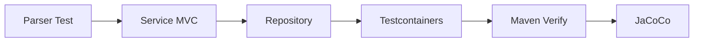

# 25 テスト構成と検証境界

各テストが証明する範囲と、実環境検証との差を理解します。

## 重要ポイント

- JUnit 5、Mockito、Spring Boot Test、MockMvc、Security Test を使用します。
- Parser、Service、MVC、Security、Scheduler、Cloud Function の境界を試験します。
- Testcontainers PostgreSQL は実ドライバーに近い DB 挙動を検証します。
- 完全な Maven 検証コマンドは ./mvnw clean verify です。
- JaCoCo レポートは app/bms-app/target/site/jacoco/index.html に生成されます。

## 実装上の境界

- 現在の実装、教材内シミュレーション、本番向け改善案を区別します。
- 図や設定ファイルの存在だけで、実環境への導入完了とは判断しません。

---

## 章末クイズ

全 5 問の単一選択問題です。通常の Markdown では先に自分で選び、その後で折りたたみを開いてください。

### 第 1 問

「テスト構成と検証境界」の中心的な説明として正しいものはどれですか。

- A. メール送信は Outbox、AFTER_COMMIT、メッセージキューで DB トランザクション外へ移せます。
- B. JUnit 5、Mockito、Spring Boot Test、MockMvc、Security Test を使用します。
- C. 監視経路は複数プロトコルを IngestRequest に統一して中核サービスへ渡します。
- D. バックエンドは Spring Boot によるサーバーサイドレンダリング型のモジュラーモノリスです。

回答後に解答を開く

正解：B. JUnit 5、Mockito、Spring Boot Test、MockMvc、Security Test を使用します。

解説：JUnit 5、Mockito、Spring Boot Test、MockMvc、Security Test を使用します。 これは本章の図と要点に一致します。他の選択肢は別章の事実、誤った順序、または検証境界の混同です。

### 第 2 問

章の図に沿った処理順序はどれですか。

- A. JaCoCo → Maven Verify → Testcontainers → Repository → Service MVC → Parser Test
- B. Service MVC → Repository → Testcontainers → Maven Verify → JaCoCo → Parser Test
- C. Parser Test → JaCoCo → Service MVC → Repository → Testcontainers → Maven Verify
- D. Parser Test → Service MVC → Repository → Testcontainers → Maven Verify → JaCoCo

回答後に解答を開く

正解：D. Parser Test → Service MVC → Repository → Testcontainers → Maven Verify → JaCoCo

解説：Parser Test → Service MVC → Repository → Testcontainers → Maven Verify → JaCoCo これは本章の図と要点に一致します。他の選択肢は別章の事実、誤った順序、または検証境界の混同です。

### 第 3 問

この章で説明したコンポーネントの責務として正しいものはどれですか。

- A. Testcontainers PostgreSQL は実ドライバーに近い DB 挙動を検証します。
- B. 一意制約、原子的 UPSERT、ロック、分割キーで重複競合を抑えられます。
- C. 画面経路は Security、MVC、Service、Repository、Model、Thymeleaf を通ります。
- D. 各プロトコルは個別のアラートロジックを持たず、共通の業務処理へ合流します。

回答後に解答を開く

正解：A. Testcontainers PostgreSQL は実ドライバーに近い DB 挙動を検証します。

解説：Testcontainers PostgreSQL は実ドライバーに近い DB 挙動を検証します。 これは本章の図と要点に一致します。他の選択肢は別章の事実、誤った順序、または検証境界の混同です。

### 第 4 問

実装や調査を行う際、最も適切な判断はどれですか。

- A. 図に要素があれば、本番導入済みと判断します。
- B. 未実行またはスキップされた検証も成功として報告します。
- C. 現在の実装、教材内のシミュレーション、本番向け提案を区別して確認します。
- D. 画面でボタンを隠せば、サーバー側認可は不要です。

回答後に解答を開く

正解：C. 現在の実装、教材内のシミュレーション、本番向け提案を区別して確認します。

解説：現在の実装、教材内のシミュレーション、本番向け提案を区別して確認します。 これは本章の図と要点に一致します。他の選択肢は別章の事実、誤った順序、または検証境界の混同です。

### 第 5 問

この章の代表的な誤解を避ける説明はどれですか。

- A. メモリユーザーを企業 OIDC に置き換え、Java バージョン表記も統一します。
- B. JaCoCo レポートは app/bms-app/target/site/jacoco/index.html に生成されます。
- C. 次の学習対象は Outbox、並行冪等、SNMPv3、企業 ID、実時間集約です。
- D. Visual Explorer は独立した Vue 教材であり、ブラウザー内のシミュレーションは実運用を意味しません。

回答後に解答を開く

正解：B. JaCoCo レポートは app/bms-app/target/site/jacoco/index.html に生成されます。

解説：JaCoCo レポートは app/bms-app/target/site/jacoco/index.html に生成されます。 これは本章の図と要点に一致します。他の選択肢は別章の事実、誤った順序、または検証境界の混同です。

<!-- QUIZ_DATA_START
{
  "chapter": "25",
  "questions": [
    {
      "id": 1,
      "question": "「テスト構成と検証境界」の中心的な説明として正しいものはどれですか。",
      "options": {
        "A": "メール送信は Outbox、AFTER_COMMIT、メッセージキューで DB トランザクション外へ移せます。",
        "B": "JUnit 5、Mockito、Spring Boot Test、MockMvc、Security Test を使用します。",
        "C": "監視経路は複数プロトコルを IngestRequest に統一して中核サービスへ渡します。",
        "D": "バックエンドは Spring Boot によるサーバーサイドレンダリング型のモジュラーモノリスです。"
      },
      "answer": "B",
      "explanation": "JUnit 5、Mockito、Spring Boot Test、MockMvc、Security Test を使用します。 これは本章の図と要点に一致します。他の選択肢は別章の事実、誤った順序、または検証境界の混同です。"
    },
    {
      "id": 2,
      "question": "章の図に沿った処理順序はどれですか。",
      "options": {
        "A": "JaCoCo → Maven Verify → Testcontainers → Repository → Service MVC → Parser Test",
        "B": "Service MVC → Repository → Testcontainers → Maven Verify → JaCoCo → Parser Test",
        "C": "Parser Test → JaCoCo → Service MVC → Repository → Testcontainers → Maven Verify",
        "D": "Parser Test → Service MVC → Repository → Testcontainers → Maven Verify → JaCoCo"
      },
      "answer": "D",
      "explanation": "Parser Test → Service MVC → Repository → Testcontainers → Maven Verify → JaCoCo これは本章の図と要点に一致します。他の選択肢は別章の事実、誤った順序、または検証境界の混同です。"
    },
    {
      "id": 3,
      "question": "この章で説明したコンポーネントの責務として正しいものはどれですか。",
      "options": {
        "A": "Testcontainers PostgreSQL は実ドライバーに近い DB 挙動を検証します。",
        "B": "一意制約、原子的 UPSERT、ロック、分割キーで重複競合を抑えられます。",
        "C": "画面経路は Security、MVC、Service、Repository、Model、Thymeleaf を通ります。",
        "D": "各プロトコルは個別のアラートロジックを持たず、共通の業務処理へ合流します。"
      },
      "answer": "A",
      "explanation": "Testcontainers PostgreSQL は実ドライバーに近い DB 挙動を検証します。 これは本章の図と要点に一致します。他の選択肢は別章の事実、誤った順序、または検証境界の混同です。"
    },
    {
      "id": 4,
      "question": "実装や調査を行う際、最も適切な判断はどれですか。",
      "options": {
        "A": "図に要素があれば、本番導入済みと判断します。",
        "B": "未実行またはスキップされた検証も成功として報告します。",
        "C": "現在の実装、教材内のシミュレーション、本番向け提案を区別して確認します。",
        "D": "画面でボタンを隠せば、サーバー側認可は不要です。"
      },
      "answer": "C",
      "explanation": "現在の実装、教材内のシミュレーション、本番向け提案を区別して確認します。 これは本章の図と要点に一致します。他の選択肢は別章の事実、誤った順序、または検証境界の混同です。"
    },
    {
      "id": 5,
      "question": "この章の代表的な誤解を避ける説明はどれですか。",
      "options": {
        "A": "メモリユーザーを企業 OIDC に置き換え、Java バージョン表記も統一します。",
        "B": "JaCoCo レポートは app/bms-app/target/site/jacoco/index.html に生成されます。",
        "C": "次の学習対象は Outbox、並行冪等、SNMPv3、企業 ID、実時間集約です。",
        "D": "Visual Explorer は独立した Vue 教材であり、ブラウザー内のシミュレーションは実運用を意味しません。"
      },
      "answer": "B",
      "explanation": "JaCoCo レポートは app/bms-app/target/site/jacoco/index.html に生成されます。 これは本章の図と要点に一致します。他の選択肢は別章の事実、誤った順序、または検証境界の混同です。"
    }
  ]
}
QUIZ_DATA_END -->
