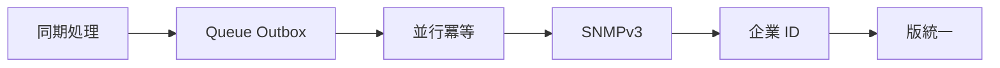

# 26 本番化に向けた改善経路

現在の学習実装のリスクを、段階的な改善案へ変換します。

## 重要ポイント

- メール送信は Outbox、AFTER_COMMIT、メッセージキューで DB トランザクション外へ移せます。
- UDP 受信と DB 処理の間に有界キューを置き、負荷変動を吸収できます。
- 一意制約、原子的 UPSERT、ロック、分割キーで重複競合を抑えられます。
- 本番の SNMP v2c は SNMPv3 authPriv と送信元制限への移行を検討します。
- メモリユーザーを企業 OIDC に置き換え、Java バージョン表記も統一します。

## 実装上の境界

- 現在の実装、教材内シミュレーション、本番向け改善案を区別します。
- 図や設定ファイルの存在だけで、実環境への導入完了とは判断しません。

---

## 章末クイズ

全 5 問の単一選択問題です。通常の Markdown では先に自分で選び、その後で折りたたみを開いてください。

### 第 1 問

「本番化に向けた改善経路」の中心的な説明として正しいものはどれですか。

- A. 監視経路は複数プロトコルを IngestRequest に統一して中核サービスへ渡します。
- B. メール送信は Outbox、AFTER_COMMIT、メッセージキューで DB トランザクション外へ移せます。
- C. バックエンドは Spring Boot によるサーバーサイドレンダリング型のモジュラーモノリスです。
- D. 提供資料における現在の基準は Java 25 と Spring Boot 3.5.14 です。

回答後に解答を開く

正解：B. メール送信は Outbox、AFTER_COMMIT、メッセージキューで DB トランザクション外へ移せます。

解説：メール送信は Outbox、AFTER_COMMIT、メッセージキューで DB トランザクション外へ移せます。 これは本章の図と要点に一致します。他の選択肢は別章の事実、誤った順序、または検証境界の混同です。

### 第 2 問

章の図に沿った処理順序はどれですか。

- A. 版統一 → 企業 ID → SNMPv3 → 並行冪等 → Queue Outbox → 同期処理
- B. Queue Outbox → 並行冪等 → SNMPv3 → 企業 ID → 版統一 → 同期処理
- C. 同期処理 → 版統一 → Queue Outbox → 並行冪等 → SNMPv3 → 企業 ID
- D. 同期処理 → Queue Outbox → 並行冪等 → SNMPv3 → 企業 ID → 版統一

回答後に解答を開く

正解：D. 同期処理 → Queue Outbox → 並行冪等 → SNMPv3 → 企業 ID → 版統一

解説：同期処理 → Queue Outbox → 並行冪等 → SNMPv3 → 企業 ID → 版統一 これは本章の図と要点に一致します。他の選択肢は別章の事実、誤った順序、または検証境界の混同です。

### 第 3 問

この章で説明したコンポーネントの責務として正しいものはどれですか。

- A. 一意制約、原子的 UPSERT、ロック、分割キーで重複競合を抑えられます。
- B. 画面経路は Security、MVC、Service、Repository、Model、Thymeleaf を通ります。
- C. 各プロトコルは個別のアラートロジックを持たず、共通の業務処理へ合流します。
- D. app/bms-app が Spring Boot の主アプリケーションです。

回答後に解答を開く

正解：A. 一意制約、原子的 UPSERT、ロック、分割キーで重複競合を抑えられます。

解説：一意制約、原子的 UPSERT、ロック、分割キーで重複競合を抑えられます。 これは本章の図と要点に一致します。他の選択肢は別章の事実、誤った順序、または検証境界の混同です。

### 第 4 問

実装や調査を行う際、最も適切な判断はどれですか。

- A. 図に要素があれば、本番導入済みと判断します。
- B. 未実行またはスキップされた検証も成功として報告します。
- C. 現在の実装、教材内のシミュレーション、本番向け提案を区別して確認します。
- D. 画面でボタンを隠せば、サーバー側認可は不要です。

回答後に解答を開く

正解：C. 現在の実装、教材内のシミュレーション、本番向け提案を区別して確認します。

解説：現在の実装、教材内のシミュレーション、本番向け提案を区別して確認します。 これは本章の図と要点に一致します。他の選択肢は別章の事実、誤った順序、または検証境界の混同です。

### 第 5 問

この章の代表的な誤解を避ける説明はどれですか。

- A. 次の学習対象は Outbox、並行冪等、SNMPv3、企業 ID、実時間集約です。
- B. メモリユーザーを企業 OIDC に置き換え、Java バージョン表記も統一します。
- C. Visual Explorer は独立した Vue 教材であり、ブラウザー内のシミュレーションは実運用を意味しません。
- D. 古い Java 21 表記より、現在の pom.xml と Dockerfile にある Java 25 を優先します。

回答後に解答を開く

正解：B. メモリユーザーを企業 OIDC に置き換え、Java バージョン表記も統一します。

解説：メモリユーザーを企業 OIDC に置き換え、Java バージョン表記も統一します。 これは本章の図と要点に一致します。他の選択肢は別章の事実、誤った順序、または検証境界の混同です。

<!-- QUIZ_DATA_START
{
  "chapter": "26",
  "questions": [
    {
      "id": 1,
      "question": "「本番化に向けた改善経路」の中心的な説明として正しいものはどれですか。",
      "options": {
        "A": "監視経路は複数プロトコルを IngestRequest に統一して中核サービスへ渡します。",
        "B": "メール送信は Outbox、AFTER_COMMIT、メッセージキューで DB トランザクション外へ移せます。",
        "C": "バックエンドは Spring Boot によるサーバーサイドレンダリング型のモジュラーモノリスです。",
        "D": "提供資料における現在の基準は Java 25 と Spring Boot 3.5.14 です。"
      },
      "answer": "B",
      "explanation": "メール送信は Outbox、AFTER_COMMIT、メッセージキューで DB トランザクション外へ移せます。 これは本章の図と要点に一致します。他の選択肢は別章の事実、誤った順序、または検証境界の混同です。"
    },
    {
      "id": 2,
      "question": "章の図に沿った処理順序はどれですか。",
      "options": {
        "A": "版統一 → 企業 ID → SNMPv3 → 並行冪等 → Queue Outbox → 同期処理",
        "B": "Queue Outbox → 並行冪等 → SNMPv3 → 企業 ID → 版統一 → 同期処理",
        "C": "同期処理 → 版統一 → Queue Outbox → 並行冪等 → SNMPv3 → 企業 ID",
        "D": "同期処理 → Queue Outbox → 並行冪等 → SNMPv3 → 企業 ID → 版統一"
      },
      "answer": "D",
      "explanation": "同期処理 → Queue Outbox → 並行冪等 → SNMPv3 → 企業 ID → 版統一 これは本章の図と要点に一致します。他の選択肢は別章の事実、誤った順序、または検証境界の混同です。"
    },
    {
      "id": 3,
      "question": "この章で説明したコンポーネントの責務として正しいものはどれですか。",
      "options": {
        "A": "一意制約、原子的 UPSERT、ロック、分割キーで重複競合を抑えられます。",
        "B": "画面経路は Security、MVC、Service、Repository、Model、Thymeleaf を通ります。",
        "C": "各プロトコルは個別のアラートロジックを持たず、共通の業務処理へ合流します。",
        "D": "app/bms-app が Spring Boot の主アプリケーションです。"
      },
      "answer": "A",
      "explanation": "一意制約、原子的 UPSERT、ロック、分割キーで重複競合を抑えられます。 これは本章の図と要点に一致します。他の選択肢は別章の事実、誤った順序、または検証境界の混同です。"
    },
    {
      "id": 4,
      "question": "実装や調査を行う際、最も適切な判断はどれですか。",
      "options": {
        "A": "図に要素があれば、本番導入済みと判断します。",
        "B": "未実行またはスキップされた検証も成功として報告します。",
        "C": "現在の実装、教材内のシミュレーション、本番向け提案を区別して確認します。",
        "D": "画面でボタンを隠せば、サーバー側認可は不要です。"
      },
      "answer": "C",
      "explanation": "現在の実装、教材内のシミュレーション、本番向け提案を区別して確認します。 これは本章の図と要点に一致します。他の選択肢は別章の事実、誤った順序、または検証境界の混同です。"
    },
    {
      "id": 5,
      "question": "この章の代表的な誤解を避ける説明はどれですか。",
      "options": {
        "A": "次の学習対象は Outbox、並行冪等、SNMPv3、企業 ID、実時間集約です。",
        "B": "メモリユーザーを企業 OIDC に置き換え、Java バージョン表記も統一します。",
        "C": "Visual Explorer は独立した Vue 教材であり、ブラウザー内のシミュレーションは実運用を意味しません。",
        "D": "古い Java 21 表記より、現在の pom.xml と Dockerfile にある Java 25 を優先します。"
      },
      "answer": "B",
      "explanation": "メモリユーザーを企業 OIDC に置き換え、Java バージョン表記も統一します。 これは本章の図と要点に一致します。他の選択肢は別章の事実、誤った順序、または検証境界の混同です。"
    }
  ]
}
QUIZ_DATA_END -->
