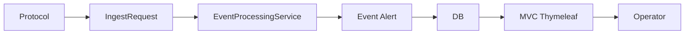

# 27 総まとめ：二つの経路と一つの中核

監視経路、画面経路、ドメインモデル、検証境界を一枚に統合します。

## 重要ポイント

- 監視経路は複数プロトコルを IngestRequest に統一して中核サービスへ渡します。
- Event は事実、Alert は継続障害で、確認、復旧、終了は異なる状態です。
- 画面経路は Security、MVC、Service、Repository、Model、Thymeleaf を通ります。
- Actuator、テスト、コンテナ設定は検証基盤ですが、本番導入完了の証明ではありません。
- 次の学習対象は Outbox、並行冪等、SNMPv3、企業 ID、実時間集約です。

## 実装上の境界

- 現在の実装、教材内シミュレーション、本番向け改善案を区別します。
- 図や設定ファイルの存在だけで、実環境への導入完了とは判断しません。

---

## 章末クイズ

全 5 問の単一選択問題です。通常の Markdown では先に自分で選び、その後で折りたたみを開いてください。

### 第 1 問

「総まとめ：二つの経路と一つの中核」の中心的な説明として正しいものはどれですか。

- A. バックエンドは Spring Boot によるサーバーサイドレンダリング型のモジュラーモノリスです。
- B. 監視経路は複数プロトコルを IngestRequest に統一して中核サービスへ渡します。
- C. 提供資料における現在の基準は Java 25 と Spring Boot 3.5.14 です。
- D. 画面要求は Spring Security Filter を通ってから Controller に入ります。

回答後に解答を開く

正解：B. 監視経路は複数プロトコルを IngestRequest に統一して中核サービスへ渡します。

解説：監視経路は複数プロトコルを IngestRequest に統一して中核サービスへ渡します。 これは本章の図と要点に一致します。他の選択肢は別章の事実、誤った順序、または検証境界の混同です。

### 第 2 問

章の図に沿った処理順序はどれですか。

- A. Operator → MVC Thymeleaf → DB → Event Alert → EventProcessingService → IngestRequest → Protocol
- B. IngestRequest → EventProcessingService → Event Alert → DB → MVC Thymeleaf → Operator → Protocol
- C. Protocol → Operator → IngestRequest → EventProcessingService → Event Alert → DB → MVC Thymeleaf
- D. Protocol → IngestRequest → EventProcessingService → Event Alert → DB → MVC Thymeleaf → Operator

回答後に解答を開く

正解：D. Protocol → IngestRequest → EventProcessingService → Event Alert → DB → MVC Thymeleaf → Operator

解説：Protocol → IngestRequest → EventProcessingService → Event Alert → DB → MVC Thymeleaf → Operator これは本章の図と要点に一致します。他の選択肢は別章の事実、誤った順序、または検証境界の混同です。

### 第 3 問

この章で説明したコンポーネントの責務として正しいものはどれですか。

- A. 画面経路は Security、MVC、Service、Repository、Model、Thymeleaf を通ります。
- B. 各プロトコルは個別のアラートロジックを持たず、共通の業務処理へ合流します。
- C. app/bms-app が Spring Boot の主アプリケーションです。
- D. Controller は Model にデータを格納し、テンプレートの論理名を返します。

回答後に解答を開く

正解：A. 画面経路は Security、MVC、Service、Repository、Model、Thymeleaf を通ります。

解説：画面経路は Security、MVC、Service、Repository、Model、Thymeleaf を通ります。 これは本章の図と要点に一致します。他の選択肢は別章の事実、誤った順序、または検証境界の混同です。

### 第 4 問

実装や調査を行う際、最も適切な判断はどれですか。

- A. 図に要素があれば、本番導入済みと判断します。
- B. 未実行またはスキップされた検証も成功として報告します。
- C. 現在の実装、教材内のシミュレーション、本番向け提案を区別して確認します。
- D. 画面でボタンを隠せば、サーバー側認可は不要です。

回答後に解答を開く

正解：C. 現在の実装、教材内のシミュレーション、本番向け提案を区別して確認します。

解説：現在の実装、教材内のシミュレーション、本番向け提案を区別して確認します。 これは本章の図と要点に一致します。他の選択肢は別章の事実、誤った順序、または検証境界の混同です。

### 第 5 問

この章の代表的な誤解を避ける説明はどれですか。

- A. Visual Explorer は独立した Vue 教材であり、ブラウザー内のシミュレーションは実運用を意味しません。
- B. 次の学習対象は Outbox、並行冪等、SNMPv3、企業 ID、実時間集約です。
- C. 古い Java 21 表記より、現在の pom.xml と Dockerfile にある Java 25 を優先します。
- D. ブラウザーが受け取るのは、サーバーで組み立てられた HTML です。

回答後に解答を開く

正解：B. 次の学習対象は Outbox、並行冪等、SNMPv3、企業 ID、実時間集約です。

解説：次の学習対象は Outbox、並行冪等、SNMPv3、企業 ID、実時間集約です。 これは本章の図と要点に一致します。他の選択肢は別章の事実、誤った順序、または検証境界の混同です。

<!-- QUIZ_DATA_START
{
  "chapter": "27",
  "questions": [
    {
      "id": 1,
      "question": "「総まとめ：二つの経路と一つの中核」の中心的な説明として正しいものはどれですか。",
      "options": {
        "A": "バックエンドは Spring Boot によるサーバーサイドレンダリング型のモジュラーモノリスです。",
        "B": "監視経路は複数プロトコルを IngestRequest に統一して中核サービスへ渡します。",
        "C": "提供資料における現在の基準は Java 25 と Spring Boot 3.5.14 です。",
        "D": "画面要求は Spring Security Filter を通ってから Controller に入ります。"
      },
      "answer": "B",
      "explanation": "監視経路は複数プロトコルを IngestRequest に統一して中核サービスへ渡します。 これは本章の図と要点に一致します。他の選択肢は別章の事実、誤った順序、または検証境界の混同です。"
    },
    {
      "id": 2,
      "question": "章の図に沿った処理順序はどれですか。",
      "options": {
        "A": "Operator → MVC Thymeleaf → DB → Event Alert → EventProcessingService → IngestRequest → Protocol",
        "B": "IngestRequest → EventProcessingService → Event Alert → DB → MVC Thymeleaf → Operator → Protocol",
        "C": "Protocol → Operator → IngestRequest → EventProcessingService → Event Alert → DB → MVC Thymeleaf",
        "D": "Protocol → IngestRequest → EventProcessingService → Event Alert → DB → MVC Thymeleaf → Operator"
      },
      "answer": "D",
      "explanation": "Protocol → IngestRequest → EventProcessingService → Event Alert → DB → MVC Thymeleaf → Operator これは本章の図と要点に一致します。他の選択肢は別章の事実、誤った順序、または検証境界の混同です。"
    },
    {
      "id": 3,
      "question": "この章で説明したコンポーネントの責務として正しいものはどれですか。",
      "options": {
        "A": "画面経路は Security、MVC、Service、Repository、Model、Thymeleaf を通ります。",
        "B": "各プロトコルは個別のアラートロジックを持たず、共通の業務処理へ合流します。",
        "C": "app/bms-app が Spring Boot の主アプリケーションです。",
        "D": "Controller は Model にデータを格納し、テンプレートの論理名を返します。"
      },
      "answer": "A",
      "explanation": "画面経路は Security、MVC、Service、Repository、Model、Thymeleaf を通ります。 これは本章の図と要点に一致します。他の選択肢は別章の事実、誤った順序、または検証境界の混同です。"
    },
    {
      "id": 4,
      "question": "実装や調査を行う際、最も適切な判断はどれですか。",
      "options": {
        "A": "図に要素があれば、本番導入済みと判断します。",
        "B": "未実行またはスキップされた検証も成功として報告します。",
        "C": "現在の実装、教材内のシミュレーション、本番向け提案を区別して確認します。",
        "D": "画面でボタンを隠せば、サーバー側認可は不要です。"
      },
      "answer": "C",
      "explanation": "現在の実装、教材内のシミュレーション、本番向け提案を区別して確認します。 これは本章の図と要点に一致します。他の選択肢は別章の事実、誤った順序、または検証境界の混同です。"
    },
    {
      "id": 5,
      "question": "この章の代表的な誤解を避ける説明はどれですか。",
      "options": {
        "A": "Visual Explorer は独立した Vue 教材であり、ブラウザー内のシミュレーションは実運用を意味しません。",
        "B": "次の学習対象は Outbox、並行冪等、SNMPv3、企業 ID、実時間集約です。",
        "C": "古い Java 21 表記より、現在の pom.xml と Dockerfile にある Java 25 を優先します。",
        "D": "ブラウザーが受け取るのは、サーバーで組み立てられた HTML です。"
      },
      "answer": "B",
      "explanation": "次の学習対象は Outbox、並行冪等、SNMPv3、企業 ID、実時間集約です。 これは本章の図と要点に一致します。他の選択肢は別章の事実、誤った順序、または検証境界の混同です。"
    }
  ]
}
QUIZ_DATA_END -->
