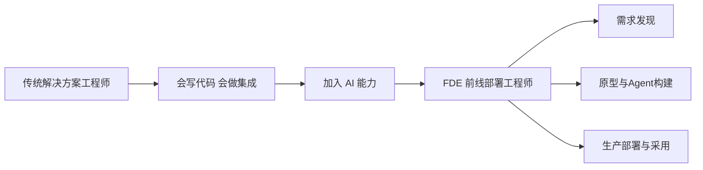

# FDE 是谁：从解决方案工程师到 AI 全栈角色

当企业说“我们想做一个 AI 项目”时，谁来把这句话变成一个真正上线的系统？

## 核心要点

* FDE 全称 Forward Deployed Engineer，直译为前线部署工程师或客户现场工程师
* FDE 不是单纯的 AI 开发者，而是高级软件工程师 + AI Agent 工程师 + 架构师 + 顾问 + 部分产品经理和项目经理的综合角色
* FDE 的职责覆盖需求发现、原型、Agent 构建、企业数据接入、权限安全、评估、生产部署、用户采用、ROI 全流程
* 衡量 FDE 成功与否的标准不是模型能不能跑起来，而是实际生产使用率和业务工作流是否真的改善

---

## 本章测验

本章共 5 道单项选择题。

### 第 1 题

FDE（Forward Deployed Engineer）最准确的角色定位是什么？

- A. 高级软件工程师、AI Agent 工程师、架构师、顾问与部分产品/项目经理能力的综合角色
- B. 专门负责调用大模型 API 的初级开发者
- C. 只负责编写 Prompt 的提示词工程师
- D. 只负责客户售前演示的销售工程师

选择答案后查看结果

正确答案：A

答案解析：FDE 是一个综合性角色，覆盖工程实现、架构设计、客户沟通和项目推进多个维度，不是单一职能岗位。

### 第 2 题

衡量一个 FDE 项目是否成功的核心标准是什么？

- A. 模型的准确率是否达到 99% 以上
- B. 系统是否真正被生产使用，业务工作流是否被可衡量地改善
- C. 使用的技术栈是否足够新潮
- D. Demo 演示时观众是否觉得惊艳

选择答案后查看结果

正确答案：B

答案解析：文中明确指出，成功指标是实际生产使用率和业务工作流改善，而不仅是模型跑起来或者演示效果好。

### 第 3 题

FDE 的职责链条大致覆盖以下哪个完整流程？

- A. 只负责模型训练与调参
- B. 只负责撰写需求文档并转交给开发团队
- C. 需求发现 → 原型 → Agent 构建 → 企业数据接入 → 权限安全 → 评估 → 生产部署 → 用户采用 → ROI
- D. 只负责服务器运维和监控告警

选择答案后查看结果

正确答案：C

答案解析：这是本章重点描述的 FDE 全流程职责链，体现了角色的宽度和端到端属性。

### 第 4 题

FDE 与传统解决方案工程师最主要的区别是什么？

- A. FDE 完全不需要写代码
- B. FDE 只负责与客户签合同
- C. FDE 不需要理解企业业务流程
- D. FDE 的职责边界向前延伸到需求发现，向后延伸到生产上线和用户采用

选择答案后查看结果

正确答案：D

答案解析：传统解决方案工程师通常聚焦在集成交付环节，而 FDE 的职责边界更宽，前后都有延伸。

### 第 5 题

下列哪种说法最符合本章对 FDE 角色定位的描述？

- A. FDE 需要同时具备工程能力和业务理解能力，才能把模糊需求转化为可上线的系统
- B. FDE 只需要精通 Prompt Engineering 即可胜任全部工作
- C. FDE 主要工作是维护数据库
- D. FDE 不需要与客户直接沟通

选择答案后查看结果

正确答案：A

答案解析：本章强调 FDE 是工程与业务的结合体，单一维度的能力不足以支撑其完整职责。

<!-- QUIZ_DATA_START
{
  "chapter": "01",
  "questions": [
    {
      "id": 1,
      "question": "FDE（Forward Deployed Engineer）最准确的角色定位是什么？",
      "options": {
        "A": "高级软件工程师、AI Agent 工程师、架构师、顾问与部分产品/项目经理能力的综合角色",
        "B": "专门负责调用大模型 API 的初级开发者",
        "C": "只负责编写 Prompt 的提示词工程师",
        "D": "只负责客户售前演示的销售工程师"
      },
      "answer": "A",
      "explanation": "FDE 是一个综合性角色，覆盖工程实现、架构设计、客户沟通和项目推进多个维度，不是单一职能岗位。"
    },
    {
      "id": 2,
      "question": "衡量一个 FDE 项目是否成功的核心标准是什么？",
      "options": {
        "A": "模型的准确率是否达到 99% 以上",
        "B": "系统是否真正被生产使用，业务工作流是否被可衡量地改善",
        "C": "使用的技术栈是否足够新潮",
        "D": "Demo 演示时观众是否觉得惊艳"
      },
      "answer": "B",
      "explanation": "文中明确指出，成功指标是实际生产使用率和业务工作流改善，而不仅是模型跑起来或者演示效果好。"
    },
    {
      "id": 3,
      "question": "FDE 的职责链条大致覆盖以下哪个完整流程？",
      "options": {
        "A": "只负责模型训练与调参",
        "B": "只负责撰写需求文档并转交给开发团队",
        "C": "需求发现 → 原型 → Agent 构建 → 企业数据接入 → 权限安全 → 评估 → 生产部署 → 用户采用 → ROI",
        "D": "只负责服务器运维和监控告警"
      },
      "answer": "C",
      "explanation": "这是本章重点描述的 FDE 全流程职责链，体现了角色的宽度和端到端属性。"
    },
    {
      "id": 4,
      "question": "FDE 与传统解决方案工程师最主要的区别是什么？",
      "options": {
        "A": "FDE 完全不需要写代码",
        "B": "FDE 只负责与客户签合同",
        "C": "FDE 不需要理解企业业务流程",
        "D": "FDE 的职责边界向前延伸到需求发现，向后延伸到生产上线和用户采用"
      },
      "answer": "D",
      "explanation": "传统解决方案工程师通常聚焦在集成交付环节，而 FDE 的职责边界更宽，前后都有延伸。"
    },
    {
      "id": 5,
      "question": "下列哪种说法最符合本章对 FDE 角色定位的描述？",
      "options": {
        "A": "FDE 需要同时具备工程能力和业务理解能力，才能把模糊需求转化为可上线的系统",
        "B": "FDE 只需要精通 Prompt Engineering 即可胜任全部工作",
        "C": "FDE 主要工作是维护数据库",
        "D": "FDE 不需要与客户直接沟通"
      },
      "answer": "A",
      "explanation": "本章强调 FDE 是工程与业务的结合体，单一维度的能力不足以支撑其完整职责。"
    }
  ]
}
QUIZ_DATA_END -->
