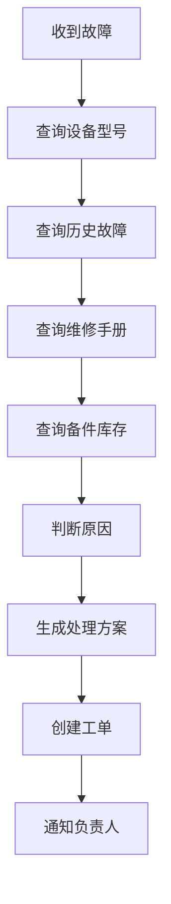

# 不要从模型出发，要从企业 workflow 出发

客户说“我们想要一个 AI 帮工程师解决设备故障”，第一件该做的事是写代码吗？

## 核心要点

* 面对模糊需求时，FDE 第一步不是写代码，而是提问：用户是谁、现有流程是什么、数据在哪里、怎样算回答正确
* 很多看似“知识搜索”的需求，拆解之后发现真正需要的是一整套端到端的企业工作流自动化
* 当需求从单一问答升级为多步骤、多系统协同的流程时，问题的本质已经从 RAG 变成 Enterprise AI Agent
* FDE 的第一原则：不要从模型出发，要从企业 workflow 出发

---

## 本章测验

本章共 5 道单项选择题。

### 第 1 题

面对客户模糊的 AI 需求时，FDE 应该采取的第一步是什么？

- A. 立刻搭建一个 RAG 系统原型
- B. 通过提问搞清楚使用者、现有流程、数据分布和成功标准
- C. 直接向客户报价并签订合同
- D. 先选定一个大模型厂商再讨论需求

选择答案后查看结果

正确答案：B

答案解析：本章强调需求发现优先于技术实现，必须先理解业务背景再动手。

### 第 2 题

在设备故障处理的例子中，为什么最终判断这不是一个简单的知识搜索问题？

- A. 因为文档数量太多，向量数据库存不下
- B. 因为客户预算有限，只能做搜索功能
- C. 因为完整流程涉及多个系统的查询、判断、决策与执行，构成了端到端工作流
- D. 因为设备型号信息无法用文字表示

选择答案后查看结果

正确答案：C

答案解析：流程包含查询设备型号、历史故障、维修手册、备件库存，并进一步判断原因、生成方案、创建工单、通知负责人，这已经超出了单纯搜索的范畴。

### 第 3 题

本章提出的 FDE 第一原则是什么？

- A. 优先选择参数量最大的模型
- B. 优先使用最新发布的框架
- C. 优先满足开发者的技术偏好
- D. 不要从模型出发，要从企业 workflow 出发

选择答案后查看结果

正确答案：D

答案解析：这是本章的核心结论，强调以业务流程为起点而非以技术选型为起点。

### 第 4 题

当一个需求从“单一问答”演变为“多步骤、多系统协同”时，其技术本质发生了什么变化？

- A. 从传统 RAG 问题演变为 Enterprise AI Agent 问题
- B. 从软件工程问题演变为纯前端问题
- C. 从数据库问题演变为网络问题
- D. 从安全问题演变为运维问题

选择答案后查看结果

正确答案：A

答案解析：当流程涉及多个系统的协同操作和决策执行时，单纯的检索问答已不足以覆盖需求，需要 Agent 架构。

### 第 5 题

在需求发现阶段，为什么要询问“不同部门的数据权限是否相同”？

- A. 因为这决定了 UI 界面的颜色风格
- B. 因为这会直接影响后续系统的权限设计与数据安全边界
- C. 因为这决定了服务器放在哪个国家
- D. 因为这与模型选型无关，可以忽略

选择答案后查看结果

正确答案：B

答案解析：权限差异是企业级系统设计中必须提前确认的重要因素，直接关系到后续的安全架构设计。

<!-- QUIZ_DATA_START
{
  "chapter": "02",
  "questions": [
    {
      "id": 1,
      "question": "面对客户模糊的 AI 需求时，FDE 应该采取的第一步是什么？",
      "options": {
        "A": "立刻搭建一个 RAG 系统原型",
        "B": "通过提问搞清楚使用者、现有流程、数据分布和成功标准",
        "C": "直接向客户报价并签订合同",
        "D": "先选定一个大模型厂商再讨论需求"
      },
      "answer": "B",
      "explanation": "本章强调需求发现优先于技术实现，必须先理解业务背景再动手。"
    },
    {
      "id": 2,
      "question": "在设备故障处理的例子中，为什么最终判断这不是一个简单的知识搜索问题？",
      "options": {
        "A": "因为文档数量太多，向量数据库存不下",
        "B": "因为客户预算有限，只能做搜索功能",
        "C": "因为完整流程涉及多个系统的查询、判断、决策与执行，构成了端到端工作流",
        "D": "因为设备型号信息无法用文字表示"
      },
      "answer": "C",
      "explanation": "流程包含查询设备型号、历史故障、维修手册、备件库存，并进一步判断原因、生成方案、创建工单、通知负责人，这已经超出了单纯搜索的范畴。"
    },
    {
      "id": 3,
      "question": "本章提出的 FDE 第一原则是什么？",
      "options": {
        "A": "优先选择参数量最大的模型",
        "B": "优先使用最新发布的框架",
        "C": "优先满足开发者的技术偏好",
        "D": "不要从模型出发，要从企业 workflow 出发"
      },
      "answer": "D",
      "explanation": "这是本章的核心结论，强调以业务流程为起点而非以技术选型为起点。"
    },
    {
      "id": 4,
      "question": "当一个需求从“单一问答”演变为“多步骤、多系统协同”时，其技术本质发生了什么变化？",
      "options": {
        "A": "从传统 RAG 问题演变为 Enterprise AI Agent 问题",
        "B": "从软件工程问题演变为纯前端问题",
        "C": "从数据库问题演变为网络问题",
        "D": "从安全问题演变为运维问题"
      },
      "answer": "A",
      "explanation": "当流程涉及多个系统的协同操作和决策执行时，单纯的检索问答已不足以覆盖需求，需要 Agent 架构。"
    },
    {
      "id": 5,
      "question": "在需求发现阶段，为什么要询问“不同部门的数据权限是否相同”？",
      "options": {
        "A": "因为这决定了 UI 界面的颜色风格",
        "B": "因为这会直接影响后续系统的权限设计与数据安全边界",
        "C": "因为这决定了服务器放在哪个国家",
        "D": "因为这与模型选型无关，可以忽略"
      },
      "answer": "B",
      "explanation": "权限差异是企业级系统设计中必须提前确认的重要因素，直接关系到后续的安全架构设计。"
    }
  ]
}
QUIZ_DATA_END -->
