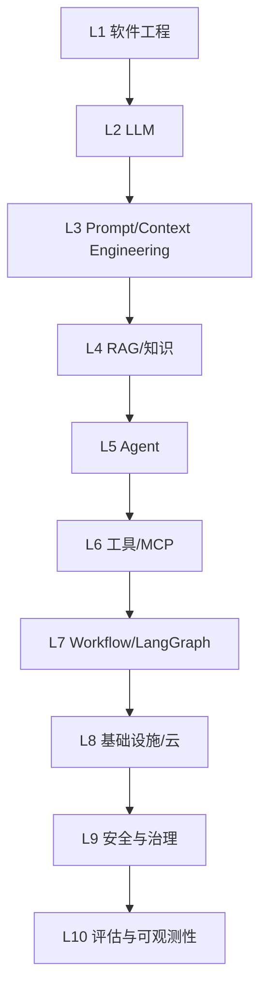

# FDE 技术栈全景：十个层次如何组合成生产系统

要成为合格的 FDE，是不是每一层技术都要做到专家水平？

## 核心要点

* FDE 技术栈可以拆解为十层：软件工程、LLM、Prompt/Context Engineering、RAG、Agent、工具/MCP、Workflow、基础设施、安全治理、评估与可观测性
* 并不要求每一层都达到专家水平，但至少需要理解其中八层，并能够把它们组合成可用的生产系统
* 十层技术栈不是孤立的知识点，而是一条从底层工程能力到上层业务价值的连续链条
* 后续章节会按照这十层的逻辑顺序逐一展开，帮助建立系统化的知识地图

---

## 本章测验

本章共 5 道单项选择题。

### 第 1 题

FDE 技术栈被拆解为几个层次？

- A. 五层
- B. 十五层
- C. 十层
- D. 三层

选择答案后查看结果

正确答案：C

答案解析：本章明确将 FDE 技术栈划分为十层，从软件工程到评估与可观测性。

### 第 2 题

根据本章说法，FDE 需要在十层技术栈中达到怎样的掌握程度？

- A. 必须十层全部达到专家水平
- B. 只需要精通其中一层即可
- C. 完全不需要理解底层技术细节
- D. 不要求每层都是专家，但至少要理解其中八层并能组合成生产系统

选择答案后查看结果

正确答案：D

答案解析：本章强调广度优先于单点深度，关键在于组合能力而非每层都精通。

### 第 3 题

十层技术栈中，位于最底层的是什么？

- A. 软件工程（L1）
- B. 评估与可观测性（L10）
- C. Agent（L5）
- D. 安全与治理（L9）

选择答案后查看结果

正确答案：A

答案解析：软件工程被列为 L1，是整个技术栈的地基层。

### 第 4 题

十层技术栈中，负责“把智能变成行动”的核心层大致包括哪些？

- A. 只包括基础设施和云
- B. LLM、RAG、Agent、工具与 MCP、Workflow
- C. 只包括安全与治理
- D. 只包括评估与可观测性

选择答案后查看结果

正确答案：B

答案解析：这些层次共同构成了将模型能力转化为实际业务行动的核心链路。

### 第 5 题

为什么评估与可观测性被放在技术栈的顶层？

- A. 因为它们是最先需要学习的内容
- B. 因为它们与其他层完全无关
- C. 因为它们是保证系统在生产环境中持续可靠运行的最后一道防线
- D. 因为它们只在开发阶段使用，上线后不再需要

选择答案后查看结果

正确答案：C

答案解析：本章将评估与可观测性定位为保障系统长期稳定运行的关键支撑，因此放在技术栈的最上层。

<!-- QUIZ_DATA_START
{
  "chapter": "03",
  "questions": [
    {
      "id": 1,
      "question": "FDE 技术栈被拆解为几个层次？",
      "options": {
        "A": "五层",
        "B": "十五层",
        "C": "十层",
        "D": "三层"
      },
      "answer": "C",
      "explanation": "本章明确将 FDE 技术栈划分为十层，从软件工程到评估与可观测性。"
    },
    {
      "id": 2,
      "question": "根据本章说法，FDE 需要在十层技术栈中达到怎样的掌握程度？",
      "options": {
        "A": "必须十层全部达到专家水平",
        "B": "只需要精通其中一层即可",
        "C": "完全不需要理解底层技术细节",
        "D": "不要求每层都是专家，但至少要理解其中八层并能组合成生产系统"
      },
      "answer": "D",
      "explanation": "本章强调广度优先于单点深度，关键在于组合能力而非每层都精通。"
    },
    {
      "id": 3,
      "question": "十层技术栈中，位于最底层的是什么？",
      "options": {
        "A": "软件工程（L1）",
        "B": "评估与可观测性（L10）",
        "C": "Agent（L5）",
        "D": "安全与治理（L9）"
      },
      "answer": "A",
      "explanation": "软件工程被列为 L1，是整个技术栈的地基层。"
    },
    {
      "id": 4,
      "question": "十层技术栈中，负责“把智能变成行动”的核心层大致包括哪些？",
      "options": {
        "A": "只包括基础设施和云",
        "B": "LLM、RAG、Agent、工具与 MCP、Workflow",
        "C": "只包括安全与治理",
        "D": "只包括评估与可观测性"
      },
      "answer": "B",
      "explanation": "这些层次共同构成了将模型能力转化为实际业务行动的核心链路。"
    },
    {
      "id": 5,
      "question": "为什么评估与可观测性被放在技术栈的顶层？",
      "options": {
        "A": "因为它们是最先需要学习的内容",
        "B": "因为它们与其他层完全无关",
        "C": "因为它们是保证系统在生产环境中持续可靠运行的最后一道防线",
        "D": "因为它们只在开发阶段使用，上线后不再需要"
      },
      "answer": "C",
      "explanation": "本章将评估与可观测性定位为保障系统长期稳定运行的关键支撑，因此放在技术栈的最上层。"
    }
  ]
}
QUIZ_DATA_END -->
