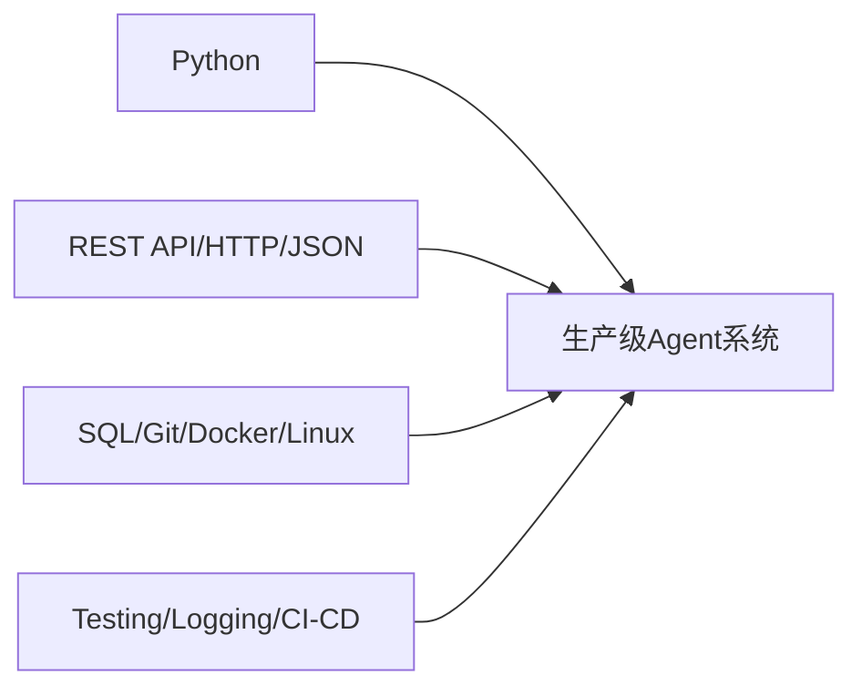

# 软件工程基础：企业不会因为你会 Prompt 就让你碰生产系统

为什么很多“AI 工程师”能做出漂亮的 Demo，却始终无法把系统交付到生产环境？

## 核心要点

* 软件工程能力是很多“AI 工程师”最大的短板，企业不会因为你会写 Prompt 就允许你接触生产系统
* 基础必备技能包括 Python、REST API、HTTP、JSON、SQL、Git、Docker、Linux、身份认证、测试、日志、CI/CD
* 进阶技能包括 FastAPI、Pydantic、asyncio、WebSocket、Redis、PostgreSQL、React/Next.js、TypeScript
* 整个 Agent 生态基本围绕 Python 展开，例如 FastAPI、LangChain、LangGraph、LlamaIndex、PyTorch 等都是 Python 生态
* 但 FDE 不应只有 Python 一门语言，企业实际招聘也强调具备 Python、JavaScript 或同类技术栈的能力

---

## 本章测验

本章共 5 道单项选择题。

### 第 1 题

本章认为很多“AI 工程师”最大的短板是什么？

- A. Prompt 写作能力
- B. 对最新模型名称的了解
- C. PPT 制作能力
- D. 扎实的软件工程能力

选择答案后查看结果

正确答案：D

答案解析：本章明确指出软件工程能力是很多 AI 工程师最容易被忽视、但企业最看重的基础能力。

### 第 2 题

下列哪一组属于本章列出的“至少需要非常扎实掌握”的基础技能？

- A. Python、REST API、HTTP、JSON、SQL、Git、Docker、Linux
- B. Photoshop、Illustrator、After Effects
- C. Excel 宏、VBA、Access
- D. 仅仅是 Prompt 写作技巧

选择答案后查看结果

正确答案：A

答案解析：这些是本章明确列出的必备基础技能清单。

### 第 3 题

为什么说整个 Agent 生态基本围绕 Python 展开？

- A. 因为 Python 是唯一能连接互联网的语言
- B. 因为 FastAPI、LangChain、LangGraph、LlamaIndex、PyTorch 等核心工具都属于 Python 生态
- C. 因为大模型只能用 Python 调用
- D. 因为 Python 运行速度最快

选择答案后查看结果

正确答案：B

答案解析：本章列举的核心 Agent 相关库均基于 Python 生态，因此软件工程基础与 Python 紧密相关。

### 第 4 题

以下哪一项属于本章提到的“进阶但实用”的技能，而非最基础的必备技能？

- A. Python 基础语法
- B. Git 版本控制
- C. FastAPI、Pydantic、asyncio、Redis、React/Next.js
- D. Linux 基本操作

选择答案后查看结果

正确答案：C

答案解析：FastAPI、Pydantic、asyncio、Redis、React/Next.js 属于本章描述的“最好还会”的进阶技能层次。

### 第 5 题

根据本章引用的 OpenAI FDE 招聘描述，对技术语言广度的要求是什么？

- A. 只允许使用 Python，不接受其他语言
- B. 完全不要求编程能力，只需要沟通能力
- C. 只要求掌握前端技术，不涉及后端
- D. 要求能编写、审查生产级代码，并接受 Python、JavaScript 或同类技术栈

选择答案后查看结果

正确答案：D

答案解析：本章提到 OpenAI 的 FDE 岗位强调生产级全栈代码能力，并明确接受 Python、JavaScript 等技术栈。

<!-- QUIZ_DATA_START
{
  "chapter": "04",
  "questions": [
    {
      "id": 1,
      "question": "本章认为很多“AI 工程师”最大的短板是什么？",
      "options": {
        "A": "Prompt 写作能力",
        "B": "对最新模型名称的了解",
        "C": "PPT 制作能力",
        "D": "扎实的软件工程能力"
      },
      "answer": "D",
      "explanation": "本章明确指出软件工程能力是很多 AI 工程师最容易被忽视、但企业最看重的基础能力。"
    },
    {
      "id": 2,
      "question": "下列哪一组属于本章列出的“至少需要非常扎实掌握”的基础技能？",
      "options": {
        "A": "Python、REST API、HTTP、JSON、SQL、Git、Docker、Linux",
        "B": "Photoshop、Illustrator、After Effects",
        "C": "Excel 宏、VBA、Access",
        "D": "仅仅是 Prompt 写作技巧"
      },
      "answer": "A",
      "explanation": "这些是本章明确列出的必备基础技能清单。"
    },
    {
      "id": 3,
      "question": "为什么说整个 Agent 生态基本围绕 Python 展开？",
      "options": {
        "A": "因为 Python 是唯一能连接互联网的语言",
        "B": "因为 FastAPI、LangChain、LangGraph、LlamaIndex、PyTorch 等核心工具都属于 Python 生态",
        "C": "因为大模型只能用 Python 调用",
        "D": "因为 Python 运行速度最快"
      },
      "answer": "B",
      "explanation": "本章列举的核心 Agent 相关库均基于 Python 生态，因此软件工程基础与 Python 紧密相关。"
    },
    {
      "id": 4,
      "question": "以下哪一项属于本章提到的“进阶但实用”的技能，而非最基础的必备技能？",
      "options": {
        "A": "Python 基础语法",
        "B": "Git 版本控制",
        "C": "FastAPI、Pydantic、asyncio、Redis、React/Next.js",
        "D": "Linux 基本操作"
      },
      "answer": "C",
      "explanation": "FastAPI、Pydantic、asyncio、Redis、React/Next.js 属于本章描述的“最好还会”的进阶技能层次。"
    },
    {
      "id": 5,
      "question": "根据本章引用的 OpenAI FDE 招聘描述，对技术语言广度的要求是什么？",
      "options": {
        "A": "只允许使用 Python，不接受其他语言",
        "B": "完全不要求编程能力，只需要沟通能力",
        "C": "只要求掌握前端技术，不涉及后端",
        "D": "要求能编写、审查生产级代码，并接受 Python、JavaScript 或同类技术栈"
      },
      "answer": "D",
      "explanation": "本章提到 OpenAI 的 FDE 岗位强调生产级全栈代码能力，并明确接受 Python、JavaScript 等技术栈。"
    }
  ]
}
QUIZ_DATA_END -->
