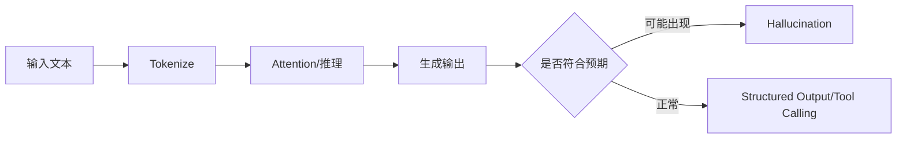

# 必须真正理解 LLM：不训练模型，但要懂它为什么这样工作

FDE 不训练模型，那为什么还要理解 Token、Attention、Hallucination 这些概念？

## 核心要点

* FDE 不一定训练模型，但必须理解模型为什么这样工作，包括 Token、Context Window、Temperature、Top-p 等基础概念
* 还需理解 System Prompt、Tool Calling、Structured Output、Function Calling、Streaming、Embeddings、Attention、Hallucination、Reasoning、Latency、Token Cost
* 需要了解不同模型的特点，例如 GPT、Claude、Gemini、Qwen、Llama、Mistral、DeepSeek 等
* 需要理解 Cloud LLM 与 Local LLM 之间的差异与取舍

---

## 本章测验

本章共 5 道单项选择题。

### 第 1 题

本章认为 FDE 需要理解 LLM 底层概念的主要原因是什么？

- A. 便于判断问题出在检索、模型还是其他环节，从而做出正确的架构决策
- B. 因为 FDE 需要亲自训练大模型
- C. 因为客户要求现场演示反向传播算法
- D. 因为这是获得认证证书的必要条件

选择答案后查看结果

正确答案：A

答案解析：本章强调理解原理是为了更好地排查问题和做架构决策，而不是为了训练模型本身。

### 第 2 题

下列哪一组概念属于本章列出的 FDE 应理解的 LLM 基础概念？

- A. CSS 选择器、DOM 树、浏览器渲染
- B. Token、Context Window、Temperature、Top-p、Hallucination
- C. TCP 三次握手、UDP 协议头
- D. SQL 索引结构、B+ 树

选择答案后查看结果

正确答案：B

答案解析：这些是本章明确列出的 LLM 核心概念清单。

### 第 3 题

为什么 FDE 需要了解 GPT、Claude、Gemini、Qwen 等不同模型的特点？

- A. 因为需要向客户推销某个特定品牌的模型
- B. 因为不同模型的价格完全相同，可以随意选择
- C. 因为不同模型在能力、上下文长度、工具调用支持上存在差异，直接影响项目选型
- D. 因为这些模型互相不兼容，必须全部学会训练

选择答案后查看结果

正确答案：C

答案解析：模型选型是架构决策的重要一环，了解各模型差异有助于做出适合项目的技术选择。

### 第 4 题

Cloud LLM 与 Local LLM 的选择在企业项目中主要受什么因素影响？

- A. 开发者个人喜好
- B. 模型的发布时间早晚
- C. UI 界面的美观程度
- D. 数据是否允许出境、合规与隐私要求

选择答案后查看结果

正确答案：D

答案解析：本章提到企业常因数据不能出公司而要求本地部署，这是选择 Cloud 还是 Local 的关键考量。

### 第 5 题

以下说法哪一项最符合本章对“理解 LLM”重要性的描述？

- A. 理解 LLM 是为了更好地设计系统的容错、验证机制和架构决策，而非亲自训练模型
- B. 理解 LLM 只是为了应付面试问题，实际工作用不到
- C. 理解 LLM 意味着必须掌握深度学习的全部数学推导
- D. 理解 LLM 与 RAG、Agent 等上层能力毫无关系

选择答案后查看结果

正确答案：A

答案解析：本章将 LLM 理解定位为支撑上层 RAG、Agent 能力的基础认知层，直接服务于工程决策。

<!-- QUIZ_DATA_START
{
  "chapter": "05",
  "questions": [
    {
      "id": 1,
      "question": "本章认为 FDE 需要理解 LLM 底层概念的主要原因是什么？",
      "options": {
        "A": "便于判断问题出在检索、模型还是其他环节，从而做出正确的架构决策",
        "B": "因为 FDE 需要亲自训练大模型",
        "C": "因为客户要求现场演示反向传播算法",
        "D": "因为这是获得认证证书的必要条件"
      },
      "answer": "A",
      "explanation": "本章强调理解原理是为了更好地排查问题和做架构决策，而不是为了训练模型本身。"
    },
    {
      "id": 2,
      "question": "下列哪一组概念属于本章列出的 FDE 应理解的 LLM 基础概念？",
      "options": {
        "A": "CSS 选择器、DOM 树、浏览器渲染",
        "B": "Token、Context Window、Temperature、Top-p、Hallucination",
        "C": "TCP 三次握手、UDP 协议头",
        "D": "SQL 索引结构、B+ 树"
      },
      "answer": "B",
      "explanation": "这些是本章明确列出的 LLM 核心概念清单。"
    },
    {
      "id": 3,
      "question": "为什么 FDE 需要了解 GPT、Claude、Gemini、Qwen 等不同模型的特点？",
      "options": {
        "A": "因为需要向客户推销某个特定品牌的模型",
        "B": "因为不同模型的价格完全相同，可以随意选择",
        "C": "因为不同模型在能力、上下文长度、工具调用支持上存在差异，直接影响项目选型",
        "D": "因为这些模型互相不兼容，必须全部学会训练"
      },
      "answer": "C",
      "explanation": "模型选型是架构决策的重要一环，了解各模型差异有助于做出适合项目的技术选择。"
    },
    {
      "id": 4,
      "question": "Cloud LLM 与 Local LLM 的选择在企业项目中主要受什么因素影响？",
      "options": {
        "A": "开发者个人喜好",
        "B": "模型的发布时间早晚",
        "C": "UI 界面的美观程度",
        "D": "数据是否允许出境、合规与隐私要求"
      },
      "answer": "D",
      "explanation": "本章提到企业常因数据不能出公司而要求本地部署，这是选择 Cloud 还是 Local 的关键考量。"
    },
    {
      "id": 5,
      "question": "以下说法哪一项最符合本章对“理解 LLM”重要性的描述？",
      "options": {
        "A": "理解 LLM 是为了更好地设计系统的容错、验证机制和架构决策，而非亲自训练模型",
        "B": "理解 LLM 只是为了应付面试问题，实际工作用不到",
        "C": "理解 LLM 意味着必须掌握深度学习的全部数学推导",
        "D": "理解 LLM 与 RAG、Agent 等上层能力毫无关系"
      },
      "answer": "A",
      "explanation": "本章将 LLM 理解定位为支撑上层 RAG、Agent 能力的基础认知层，直接服务于工程决策。"
    }
  ]
}
QUIZ_DATA_END -->
