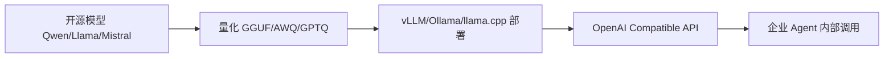

# 本地大模型部署：当客户说“数据不能出公司”

如果客户明确要求数据不能出境，企业 Agent 还能正常访问外部模型 API 吗？

## 核心要点

* 当客户要求数据不能出公司、需要 On-Premise 部署时，本地大模型能力就变得非常重要
* 常用本地部署工具包括 Ollama、vLLM、LM Studio、llama.cpp、Hugging Face，以及模型格式 GGUF、AWQ、GPTQ
* 需要理解部署相关的基础知识：GPU 显存（VRAM）、量化（Quantization）、FP16/BF16/INT8/INT4、KV Cache、Batch、吞吐量与延迟
* 典型路径是：Qwen/Llama/Mistral 等模型部署到 GPU 服务器，通过 vLLM 提供 OpenAI 兼容 API，供 Agent 内部调用，从而避免访问外部模型 API

---

## 本章测验

本章共 5 道单项选择题。

### 第 1 题

企业客户要求“数据不能出公司”时，通常会考虑哪种部署方式？

- A. 直接放弃 AI 项目
- B. On-Premise 本地部署
- C. 把数据加密后发送到任意云端模型
- D. 让员工手动处理所有请求

选择答案后查看结果

正确答案：B

答案解析：本章明确指出这种需求对应 On-Premise 本地部署的解决方案。

### 第 2 题

下列哪一组属于本章提到的本地大模型部署常用工具？

- A. Photoshop、Illustrator、Figma
- B. Excel、PowerPoint、Word
- C. Ollama、vLLM、LM Studio、llama.cpp
- D. Jenkins、GitLab CI、CircleCI

选择答案后查看结果

正确答案：C

答案解析：这些是本章列举的本地大模型部署相关工具。

### 第 3 题

量化（Quantization）技术在本地大模型部署中的主要作用是什么？

- A. 提高模型的训练准确率
- B. 增加模型的参数量
- C. 替代模型的 Tokenizer
- D. 压缩模型体积、降低显存占用，从而提升推理速度

选择答案后查看结果

正确答案：D

答案解析：本章提到通过 FP16 到 INT8/INT4 等量化方式，可以让模型在有限的 GPU 资源下运行。

### 第 4 题

典型的本地模型部署路径中，vLLM 在其中扮演什么角色？

- A. 作为推理框架，对外提供 OpenAI 兼容的 API 接口
- B. 作为前端框架，负责渲染用户界面
- C. 作为数据库，负责存储向量数据
- D. 作为版本控制工具，负责代码管理

选择答案后查看结果

正确答案：A

答案解析：本章描述的典型路径中，vLLM 负责将模型包装为可供 Agent 调用的兼容 API 服务。

### 第 5 题

本地部署相比调用外部云端 API，最直接解决了什么问题？

- A. 自动提升模型的推理准确率
- B. 避免企业数据流出内部网络，满足数据合规要求
- C. 免除所有硬件采购成本
- D. 自动完成模型的持续训练

选择答案后查看结果

正确答案：B

答案解析：本章强调本地部署的核心价值在于数据不出公司，满足合规和安全要求，而非直接提升准确率或降低成本。

<!-- QUIZ_DATA_START
{
  "chapter": "06",
  "questions": [
    {
      "id": 1,
      "question": "企业客户要求“数据不能出公司”时，通常会考虑哪种部署方式？",
      "options": {
        "A": "直接放弃 AI 项目",
        "B": "On-Premise 本地部署",
        "C": "把数据加密后发送到任意云端模型",
        "D": "让员工手动处理所有请求"
      },
      "answer": "B",
      "explanation": "本章明确指出这种需求对应 On-Premise 本地部署的解决方案。"
    },
    {
      "id": 2,
      "question": "下列哪一组属于本章提到的本地大模型部署常用工具？",
      "options": {
        "A": "Photoshop、Illustrator、Figma",
        "B": "Excel、PowerPoint、Word",
        "C": "Ollama、vLLM、LM Studio、llama.cpp",
        "D": "Jenkins、GitLab CI、CircleCI"
      },
      "answer": "C",
      "explanation": "这些是本章列举的本地大模型部署相关工具。"
    },
    {
      "id": 3,
      "question": "量化（Quantization）技术在本地大模型部署中的主要作用是什么？",
      "options": {
        "A": "提高模型的训练准确率",
        "B": "增加模型的参数量",
        "C": "替代模型的 Tokenizer",
        "D": "压缩模型体积、降低显存占用，从而提升推理速度"
      },
      "answer": "D",
      "explanation": "本章提到通过 FP16 到 INT8/INT4 等量化方式，可以让模型在有限的 GPU 资源下运行。"
    },
    {
      "id": 4,
      "question": "典型的本地模型部署路径中，vLLM 在其中扮演什么角色？",
      "options": {
        "A": "作为推理框架，对外提供 OpenAI 兼容的 API 接口",
        "B": "作为前端框架，负责渲染用户界面",
        "C": "作为数据库，负责存储向量数据",
        "D": "作为版本控制工具，负责代码管理"
      },
      "answer": "A",
      "explanation": "本章描述的典型路径中，vLLM 负责将模型包装为可供 Agent 调用的兼容 API 服务。"
    },
    {
      "id": 5,
      "question": "本地部署相比调用外部云端 API，最直接解决了什么问题？",
      "options": {
        "A": "自动提升模型的推理准确率",
        "B": "避免企业数据流出内部网络，满足数据合规要求",
        "C": "免除所有硬件采购成本",
        "D": "自动完成模型的持续训练"
      },
      "answer": "B",
      "explanation": "本章强调本地部署的核心价值在于数据不出公司，满足合规和安全要求，而非直接提升准确率或降低成本。"
    }
  ]
}
QUIZ_DATA_END -->
