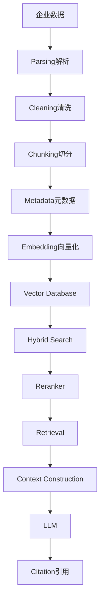

# 企业 RAG 远不止“PDF 转向量再问模型”

很多教程里的 RAG 就是 PDF 到 Embedding 到向量库到 LLM 四步，企业里真的这么简单吗？

## 核心要点

* 简化版 RAG 流程是 PDF → Embedding → Vector DB → LLM，但这远不是企业生产级的做法
* 生产级 RAG 完整流程包括：解析、清洗、切分、元数据、向量化、向量数据库、混合检索、重排序、检索、上下文构建、LLM 生成、引用溯源
* 每一个环节都可能成为整体效果的瓶颈，任何一步做得不好都会拖累最终答案质量
* 后续几章会逐一拆解这条流程中的关键环节：数据处理、Chunking、Embedding、向量库、Hybrid Search、Reranker、权限感知

---

## 本章测验

本章共 5 道单项选择题。

### 第 1 题

本章提到的“简化版 RAG 流程”是什么？

- A. Parsing → Reranker → Citation → LLM
- B. Chunking → Metadata → Hybrid Search → LLM
- C. PDF → Embedding → Vector DB → LLM
- D. Cleaning → Vector DB → Reranker → LLM

选择答案后查看结果

正确答案：C

答案解析：本章开头明确指出这是很多教程中常见但过于简化的 RAG 流程。

### 第 2 题

生产级企业 RAG 流程中，Reranker 处于检索流程的哪个位置？

- A. 在数据解析之前
- B. 在向量化之前
- C. 在 LLM 生成答案之后
- D. 在检索结果初步召回之后、构建最终上下文之前

选择答案后查看结果

正确答案：D

答案解析：根据本章的完整流程图，Reranker 位于 Hybrid Search 之后、Retrieval/Context Construction 之前。

### 第 3 题

本章认为决定 RAG 最终效果好坏的关键环节主要在哪里？

- A. 前面的数据处理和检索优化流程，而非最后调用 LLM 生成答案
- B. 完全取决于最后选择哪个大模型
- C. 完全取决于服务器的网络带宽
- D. 完全取决于前端界面设计

选择答案后查看结果

正确答案：A

答案解析：本章强调调用 LLM 生成答案相对简单，真正的难点在于数据解析、清洗、切分、检索等前置环节。

### 第 4 题

如果表格类文档解析环节出现问题，最可能导致什么后果？

- A. 模型的 Token 价格会自动上涨
- B. 表格数据在后续处理中出现混乱或丢失，影响检索与回答质量
- C. 向量数据库会自动崩溃且无法恢复
- D. LLM 会拒绝处理任何请求

选择答案后查看结果

正确答案：B

答案解析：解析质量直接影响后续数据的准确性，本章提到解析不当会导致表格数据混乱。

### 第 5 题

本章将企业 RAG 的本质总结为什么？

- A. 单纯的提示词工程问题
- B. 单纯的前端展示问题
- C. 数据工程、检索工程与生成能力的综合体
- D. 单纯的模型训练问题

选择答案后查看结果

正确答案：C

答案解析：本章明确指出企业 RAG 不是单一技术问题，而是多个工程领域的综合体现。

<!-- QUIZ_DATA_START
{
  "chapter": "07",
  "questions": [
    {
      "id": 1,
      "question": "本章提到的“简化版 RAG 流程”是什么？",
      "options": {
        "A": "Parsing → Reranker → Citation → LLM",
        "B": "Chunking → Metadata → Hybrid Search → LLM",
        "C": "PDF → Embedding → Vector DB → LLM",
        "D": "Cleaning → Vector DB → Reranker → LLM"
      },
      "answer": "C",
      "explanation": "本章开头明确指出这是很多教程中常见但过于简化的 RAG 流程。"
    },
    {
      "id": 2,
      "question": "生产级企业 RAG 流程中，Reranker 处于检索流程的哪个位置？",
      "options": {
        "A": "在数据解析之前",
        "B": "在向量化之前",
        "C": "在 LLM 生成答案之后",
        "D": "在检索结果初步召回之后、构建最终上下文之前"
      },
      "answer": "D",
      "explanation": "根据本章的完整流程图，Reranker 位于 Hybrid Search 之后、Retrieval/Context Construction 之前。"
    },
    {
      "id": 3,
      "question": "本章认为决定 RAG 最终效果好坏的关键环节主要在哪里？",
      "options": {
        "A": "前面的数据处理和检索优化流程，而非最后调用 LLM 生成答案",
        "B": "完全取决于最后选择哪个大模型",
        "C": "完全取决于服务器的网络带宽",
        "D": "完全取决于前端界面设计"
      },
      "answer": "A",
      "explanation": "本章强调调用 LLM 生成答案相对简单，真正的难点在于数据解析、清洗、切分、检索等前置环节。"
    },
    {
      "id": 4,
      "question": "如果表格类文档解析环节出现问题，最可能导致什么后果？",
      "options": {
        "A": "模型的 Token 价格会自动上涨",
        "B": "表格数据在后续处理中出现混乱或丢失，影响检索与回答质量",
        "C": "向量数据库会自动崩溃且无法恢复",
        "D": "LLM 会拒绝处理任何请求"
      },
      "answer": "B",
      "explanation": "解析质量直接影响后续数据的准确性，本章提到解析不当会导致表格数据混乱。"
    },
    {
      "id": 5,
      "question": "本章将企业 RAG 的本质总结为什么？",
      "options": {
        "A": "单纯的提示词工程问题",
        "B": "单纯的前端展示问题",
        "C": "数据工程、检索工程与生成能力的综合体",
        "D": "单纯的模型训练问题"
      },
      "answer": "C",
      "explanation": "本章明确指出企业 RAG 不是单一技术问题，而是多个工程领域的综合体现。"
    }
  ]
}
QUIZ_DATA_END -->
