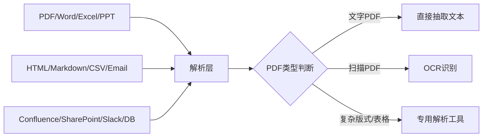

# 企业知识库的第一道难关：数据本身

为什么很多人说，做企业 RAG，数据清洗往往比调用大模型更费时间？

## 核心要点

* 企业数据来源极其多样：PDF、Word、Excel、PowerPoint、HTML、Markdown、CSV、Email、Confluence、SharePoint、Google Drive、Slack、Teams、数据库
* PDF 本身就非常复杂，包含普通文字 PDF、扫描 PDF、两栏排版 PDF、表格 PDF、图像 PDF、复杂版式 PDF 等多种类型，需要分别处理
* 常用工具包括 Unstructured、PyMuPDF、pdfplumber、Docling、OCR、Document AI 等
* 在真实企业项目中，数据清洗往往比调用大模型本身更耗费时间和精力

---

## 本章测验

本章共 5 道单项选择题。

### 第 1 题

下列哪一组属于本章列出的企业常见数据来源？

- A. 仅限于纯文本 txt 文件
- B. 仅限于图片格式如 jpg、png
- C. 仅限于视频文件如 mp4
- D. PDF、Word、Excel、PowerPoint、Confluence、SharePoint、Slack、数据库

选择答案后查看结果

正确答案：D

答案解析：本章列出的企业数据来源非常广泛，涵盖多种文档格式和协作平台。

### 第 2 题

为什么本章特别强调 PDF 文件处理的复杂性？

- A. 因为 PDF 本身分为普通文字、扫描、两栏、表格、图像、复杂版式等多种类型，需要不同处理方式
- B. 因为 PDF 文件不能被计算机读取
- C. 因为 PDF 格式已经被行业淘汰
- D. 因为 PDF 只能在特定操作系统上打开

选择答案后查看结果

正确答案：A

答案解析：本章列举了 PDF 内部多种子类型，说明其处理复杂度远超普通文本文件。

### 第 3 题

面对扫描版 PDF，通常需要采用什么处理方式才能提取文字内容？

- A. 直接使用 pdfplumber 抽取纯文本
- B. OCR 光学字符识别
- C. 无需处理，扫描件天然是文本格式
- D. 使用向量数据库直接读取

选择答案后查看结果

正确答案：B

答案解析：扫描版 PDF 本质是图像，需要通过 OCR 技术识别出文字内容。

### 第 4 题

本章提到的常用文档解析工具中，不包括以下哪一个？

- A. Unstructured
- B. PyMuPDF
- C. TensorFlow
- D. Docling

选择答案后查看结果

正确答案：C

答案解析：TensorFlow 是深度学习框架，与本章列举的文档解析工具（Unstructured、PyMuPDF、pdfplumber、Docling）不属于同一类别。

### 第 5 题

本章对“数据清洗与调用大模型相比孰轻孰重”的结论是什么？

- A. 调用大模型永远是项目中最耗时的环节
- B. 数据清洗可以完全自动化，不需要额外投入时间
- C. 数据清洗和调用大模型的时间投入总是相等
- D. 在真实企业项目中，数据清洗往往比调用大模型本身更耗费时间

选择答案后查看结果

正确答案：D

答案解析：本章明确指出企业项目中数据清洗环节常常比想象中更耗费时间和精力。

<!-- QUIZ_DATA_START
{
  "chapter": "08",
  "questions": [
    {
      "id": 1,
      "question": "下列哪一组属于本章列出的企业常见数据来源？",
      "options": {
        "A": "仅限于纯文本 txt 文件",
        "B": "仅限于图片格式如 jpg、png",
        "C": "仅限于视频文件如 mp4",
        "D": "PDF、Word、Excel、PowerPoint、Confluence、SharePoint、Slack、数据库"
      },
      "answer": "D",
      "explanation": "本章列出的企业数据来源非常广泛，涵盖多种文档格式和协作平台。"
    },
    {
      "id": 2,
      "question": "为什么本章特别强调 PDF 文件处理的复杂性？",
      "options": {
        "A": "因为 PDF 本身分为普通文字、扫描、两栏、表格、图像、复杂版式等多种类型，需要不同处理方式",
        "B": "因为 PDF 文件不能被计算机读取",
        "C": "因为 PDF 格式已经被行业淘汰",
        "D": "因为 PDF 只能在特定操作系统上打开"
      },
      "answer": "A",
      "explanation": "本章列举了 PDF 内部多种子类型，说明其处理复杂度远超普通文本文件。"
    },
    {
      "id": 3,
      "question": "面对扫描版 PDF，通常需要采用什么处理方式才能提取文字内容？",
      "options": {
        "A": "直接使用 pdfplumber 抽取纯文本",
        "B": "OCR 光学字符识别",
        "C": "无需处理，扫描件天然是文本格式",
        "D": "使用向量数据库直接读取"
      },
      "answer": "B",
      "explanation": "扫描版 PDF 本质是图像，需要通过 OCR 技术识别出文字内容。"
    },
    {
      "id": 4,
      "question": "本章提到的常用文档解析工具中，不包括以下哪一个？",
      "options": {
        "A": "Unstructured",
        "B": "PyMuPDF",
        "C": "TensorFlow",
        "D": "Docling"
      },
      "answer": "C",
      "explanation": "TensorFlow 是深度学习框架，与本章列举的文档解析工具（Unstructured、PyMuPDF、pdfplumber、Docling）不属于同一类别。"
    },
    {
      "id": 5,
      "question": "本章对“数据清洗与调用大模型相比孰轻孰重”的结论是什么？",
      "options": {
        "A": "调用大模型永远是项目中最耗时的环节",
        "B": "数据清洗可以完全自动化，不需要额外投入时间",
        "C": "数据清洗和调用大模型的时间投入总是相等",
        "D": "在真实企业项目中，数据清洗往往比调用大模型本身更耗费时间"
      },
      "answer": "D",
      "explanation": "本章明确指出企业项目中数据清洗环节常常比想象中更耗费时间和精力。"
    }
  ]
}
QUIZ_DATA_END -->
