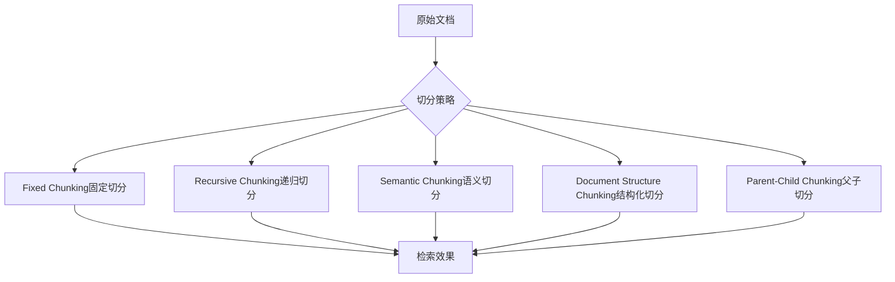

# Chunking 不是 chunk_size=1000 就结束了

很多初级工程师写完 chunk_size=1000, chunk_overlap=200 就觉得大功告成，这样真的够用吗？

## 核心要点

* 很多初级实现只是简单设置 chunk_size=1000、chunk_overlap=200，这种做法在企业场景中往往不够用
* 需要理解并根据场景选择不同切分策略：固定切分、递归切分、语义切分、文档结构切分、父子切分
* 对于层级结构明显的技术文档（例如“产品-型号-模块-故障-解决方案”），应尽量保留其语义结构，而不是机械地按字符数切分
* Chunking 质量直接影响后续检索的准确性，是容易被低估但影响巨大的环节

---

## 本章测验

本章共 5 道单项选择题。

### 第 1 题

本章批评的常见初级做法是什么？

- A. 不考虑文档结构，简单粗暴地设置固定的 chunk_size 和 chunk_overlap
- B. 使用了过多的语义切分策略
- C. 对每种文档都单独定制切分逻辑
- D. 完全不对文档进行切分处理

选择答案后查看结果

正确答案：A

答案解析：本章开头明确批评了仅凭 chunk_size=1000、chunk_overlap=200 就结束的做法。

### 第 2 题

下列哪一组是本章提到的 Chunking 策略？

- A. 冒泡切分、快速切分、归并切分
- B. 固定切分、递归切分、语义切分、文档结构切分、父子切分
- C. 深度优先切分、广度优先切分、二分切分
- D. 同步切分、异步切分、并发切分

选择答案后查看结果

正确答案：B

答案解析：这些是本章列举的针对不同场景的 Chunking 策略。

### 第 3 题

对于层级结构明显的技术文档（如“产品-型号-模块-故障-解决方案”），本章建议采用什么切分思路？

- A. 一律使用固定长度切分以保证一致性
- B. 完全跳过 Chunking，直接整篇输入模型
- C. 尽量保留文档原有的语义结构，而不是机械按字符数切分
- D. 只保留标题，删除所有正文内容

选择答案后查看结果

正确答案：C

答案解析：本章强调应保留结构化文档的语义层级，避免机械切分破坏故障与解决方案之间的关联。

### 第 4 题

如果固定切分把“故障描述”和“对应解决方案”切到了不同片段，会导致什么问题？

- A. 向量数据库会自动报错并拒绝存储
- B. 模型会自动合并两个片段，不受影响
- C. 该问题只影响存储空间，不影响回答质量
- D. 检索结果可能只包含故障描述而缺失解决方案，导致模型回答不完整

选择答案后查看结果

正确答案：D

答案解析：本章明确指出这种切分错误会导致关键信息丢失，直接影响回答的完整性和质量。

### 第 5 题

本章认为 Chunking 环节质量不佳，可能导致什么整体后果？

- A. 即使使用了优秀的 Embedding 模型和向量数据库，检索效果依然不理想
- B. 完全不影响最终检索效果，只影响存储成本
- C. 只会影响系统的响应速度，不影响准确性
- D. 只在文档数量极少时才会产生影响

选择答案后查看结果

正确答案：A

答案解析：本章总结指出很多团队效果不佳的根源在于 Chunking 没做好，而非其他环节。

<!-- QUIZ_DATA_START
{
  "chapter": "09",
  "questions": [
    {
      "id": 1,
      "question": "本章批评的常见初级做法是什么？",
      "options": {
        "A": "不考虑文档结构，简单粗暴地设置固定的 chunk_size 和 chunk_overlap",
        "B": "使用了过多的语义切分策略",
        "C": "对每种文档都单独定制切分逻辑",
        "D": "完全不对文档进行切分处理"
      },
      "answer": "A",
      "explanation": "本章开头明确批评了仅凭 chunk_size=1000、chunk_overlap=200 就结束的做法。"
    },
    {
      "id": 2,
      "question": "下列哪一组是本章提到的 Chunking 策略？",
      "options": {
        "A": "冒泡切分、快速切分、归并切分",
        "B": "固定切分、递归切分、语义切分、文档结构切分、父子切分",
        "C": "深度优先切分、广度优先切分、二分切分",
        "D": "同步切分、异步切分、并发切分"
      },
      "answer": "B",
      "explanation": "这些是本章列举的针对不同场景的 Chunking 策略。"
    },
    {
      "id": 3,
      "question": "对于层级结构明显的技术文档（如“产品-型号-模块-故障-解决方案”），本章建议采用什么切分思路？",
      "options": {
        "A": "一律使用固定长度切分以保证一致性",
        "B": "完全跳过 Chunking，直接整篇输入模型",
        "C": "尽量保留文档原有的语义结构，而不是机械按字符数切分",
        "D": "只保留标题，删除所有正文内容"
      },
      "answer": "C",
      "explanation": "本章强调应保留结构化文档的语义层级，避免机械切分破坏故障与解决方案之间的关联。"
    },
    {
      "id": 4,
      "question": "如果固定切分把“故障描述”和“对应解决方案”切到了不同片段，会导致什么问题？",
      "options": {
        "A": "向量数据库会自动报错并拒绝存储",
        "B": "模型会自动合并两个片段，不受影响",
        "C": "该问题只影响存储空间，不影响回答质量",
        "D": "检索结果可能只包含故障描述而缺失解决方案，导致模型回答不完整"
      },
      "answer": "D",
      "explanation": "本章明确指出这种切分错误会导致关键信息丢失，直接影响回答的完整性和质量。"
    },
    {
      "id": 5,
      "question": "本章认为 Chunking 环节质量不佳，可能导致什么整体后果？",
      "options": {
        "A": "即使使用了优秀的 Embedding 模型和向量数据库，检索效果依然不理想",
        "B": "完全不影响最终检索效果，只影响存储成本",
        "C": "只会影响系统的响应速度，不影响准确性",
        "D": "只在文档数量极少时才会产生影响"
      },
      "answer": "A",
      "explanation": "本章总结指出很多团队效果不佳的根源在于 Chunking 没做好，而非其他环节。"
    }
  ]
}
QUIZ_DATA_END -->
